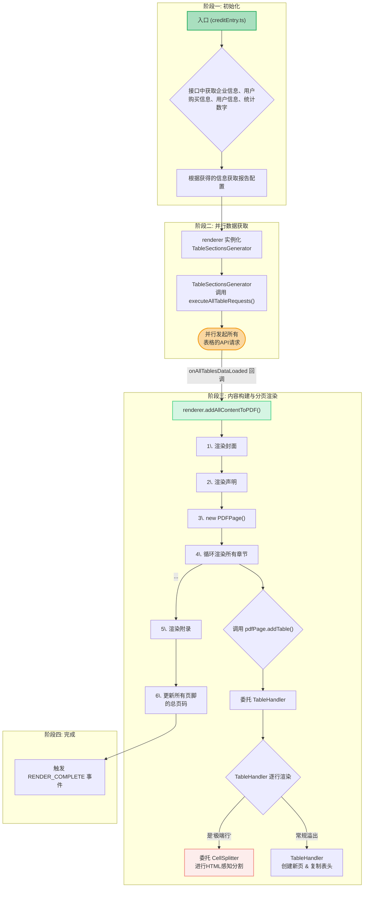
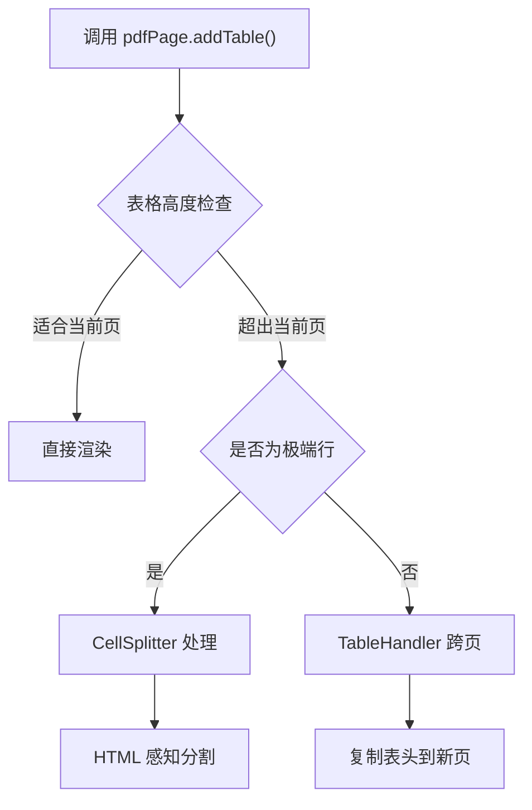

# 核心渲染流程

## 流程概述

下图描绘了从应用入口到最终 PDF 渲染的完整工作流程，体现了数据加载、配置处理和多阶段内容构建的真实顺序。

## 阶段详解

### 阶段一：初始化
- **入口文件**: `src/pages/creditEntry.ts`
- **核心任务**: 获取基础数据
  - 企业信息
  - 用户购买信息
  - 用户信息
  - 统计数字
- **输出**: 报告配置

### 阶段二：并行数据获取
- **核心组件**: `TableSectionsGenerator`
- **关键方法**: `executeAllTableRequests()`
- **特点**: 并行发起所有表格的 API 请求，提高效率
- **回调**: `onAllTablesDataLoaded`

### 阶段三：内容构建与分页渲染
1. **渲染封面**: 生成报告封面页
2. **渲染声明**: 添加法律声明和免责条款
3. **创建新页面**: `new PDFPage()` 开始新页面
4. **循环渲染章节**: 逐个处理报告章节
5. **表格处理**:
   - 委托给 `TableHandler`
   - 逐行渲染，处理跨页
   - 极端行委托给 `CellSplitter`
6. **渲染附录**: 添加附录内容
7. **更新页码**: 统一更新所有页脚的总页码

### 阶段四：完成
- **事件**: 触发 `RENDER_COMPLETE` 事件
- **状态**: 标记渲染流程完成

## 关键决策点

### 表格渲染决策

### 极端行识别
- **定义**: 单行内容超过一页高度
- **处理**: 使用 `CellSplitter` 进行细粒度的 HTML 感知分割
- **策略**: 保持内容完整性，避免截断重要信息

## 相关文档
- [Core Architecture](./core-architecture.md)
- [PDF Pagination Design](./pdf-pagination-design.md)
- [DOM-based Row Splitting](./dom-based-row-splitting.md)