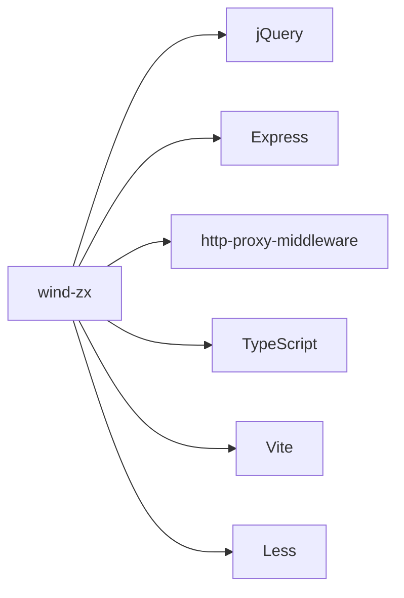

# wind-zx - 风险咨询网站

风险咨询网站，基于Vite构建的多页面静态网站，提供企业风险管理和咨询服务信息展示。

## 目录结构

```
apps/wind-zx/
├── src/                      # 主要资源文件
│   ├── assets/               # 静态资源
│   │   ├── images/           # 图片资源
│   │   └── static/           # 静态文件
│   ├── components/           # 组件目录
│   │   ├── about/            # 关于页面组件
│   │   ├── contact/          # 联系页面组件
│   │   ├── footer/           # 页脚组件
│   │   ├── header/           # 页头组件
│   │   ├── home/             # 首页组件
│   │   └── risk/             # 风险页面组件
│   ├── entries/              # 页面入口文件
│   │   ├── contact.ts        # 联系页面入口
│   │   ├── index.ts          # 首页入口
│   │   ├── other.ts          # 其他页面入口
│   │   └── risk.ts           # 风险页面入口
│   ├── styles/               # 样式文件
│   ├── types/                # 类型定义
│   └── utils/                # 工具函数
│       ├── intl.ts           # 国际化工具
│       ├── link.ts           # 链接工具
│       ├── locales/          # 国际化语言包
│       ├── misc.ts           # 杂项工具
│       └── moveToZX.ts       # 迁移到ZX工具
├── public/                   # 公共静态资源
├── docs/                     # 文档目录
├── index.html                # 网站首页
├── contact.html              # 联系页面
├── other.html                # 其他页面
├── risk.html                 # 风险页面
├── vite.config.ts            # Vite构建配置文件
├── package.json              # 项目依赖和脚本配置
└── tsconfig.json             # TypeScript配置文件
```

## 关键文件说明

| 文件 | 作用 |
|------|------|
| `src/components/index.ts` | 组件统一导出文件 |
| `src/components/loadHeaderFooter.ts` | 页头页脚加载工具 |
| `src/entries/` | 各页面的入口文件，定义页面逻辑 |
| `src/utils/intl.ts` | 国际化工具函数 |
| `src/utils/moveToZX.ts` | 迁移到ZX相关工具 |
| `vite.config.ts` | Vite构建配置，定义多页面应用构建规则 |

## 依赖关系



## 相关文档

- [架构设计](./architecture.md) - 系统架构和设计决策
- [入门指南](./docs/getting-started.md) - 项目入门指南
- [部署文档](./docs/deployment.md) - 项目部署指南
- [国际化使用](./docs/INTL_USAGE.md) - 国际化功能使用说明
- [开发规范](../../docs/rule/) - TypeScript、React、样式等开发规范