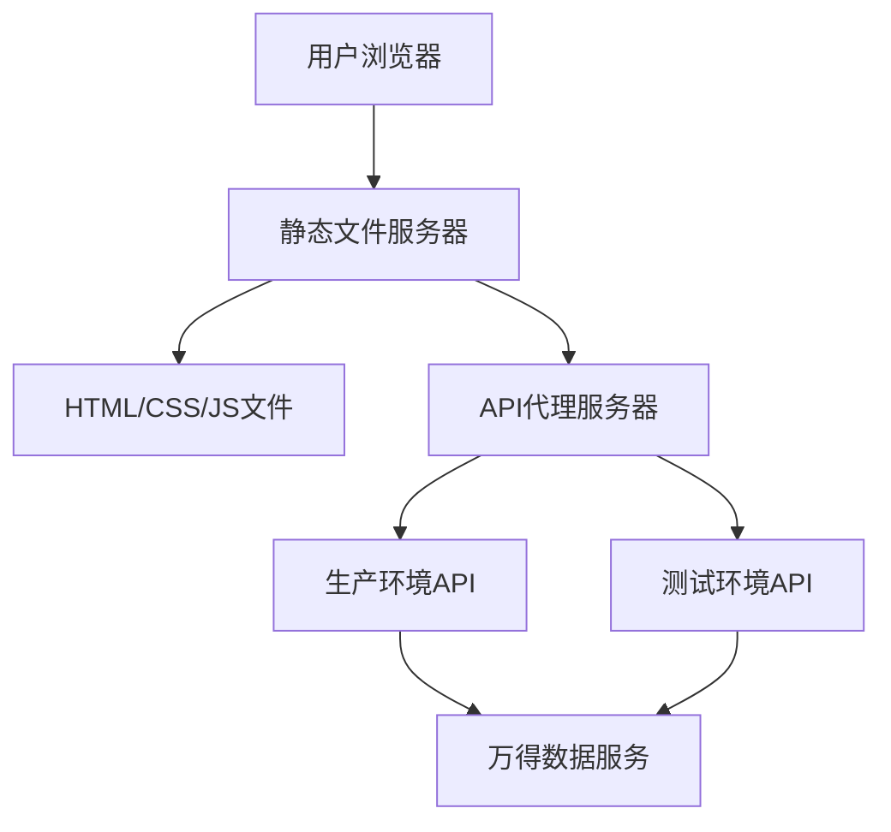

# 万得征信 (Wind-ZX) 项目文档

## 项目概述

万得征信是一个企业大数据分析平台，专注于为企业提供全面的征信数据服务。该项目采用静态网站架构，提供企业信息查询、股权穿透、关联关系分析等核心功能。

## 项目定位

万得征信平台致力于通过大数据技术，为金融机构、政府组织、大型企业等提供企业征信数据服务，支持尽职调查、营销获客、商机发现、数据赋能等业务场景。

## 核心功能

### 数据服务
- **全球企业库**：覆盖超过2亿家工商企业及2.7亿位高管法人
- **深度信息查询**：查公司、查人物、查集团、查风险、查关系
- **股权穿透**：支持全国上亿家企业股权穿透信息
- **关联关系分析**：通过多维度视角发现企业间关联路径

### 业务功能
- **金融行为分析**：并购、担保、授信、补贴等30年历史信息
- **集团系解析**：基于投资、参股、控股关系的集团分析
- **报告生成**：企业全景报告、股权穿透报告等系列报告
- **新企发现**：实时更新新增企业动态和画像分析
- **企业榜单名录**：覆盖领军企业、高成长企业等领域
- **万寻地图**：按行政区划展示地区企业信息
- **企业动态**：监测企业重要事项变动
- **招投标信息**：项目视角的动态跟踪

## 技术架构

### 前端技术栈
- **HTML5**：页面结构和语义化
- **CSS3**：样式设计和响应式布局
- **JavaScript**：交互逻辑和动态功能
- **jQuery**：DOM操作和AJAX请求

### 开发工具
- **Express.js**：本地开发服务器
- **Gulp**：构建工具和版本管理
- **http-proxy-middleware**：API代理中间件

### 部署架构


## 项目结构

```
wind-zx/
├── docs/                    # 项目文档
│   ├── README.md           # 项目概述
│   ├── architecture.md     # 技术架构
│   ├── getting-started.md  # 快速上手指南
│   └── deployment.md       # 部署指南
├── resource/               # 静态资源
│   ├── css/               # 样式文件
│   ├── js/                # JavaScript文件
│   ├── images/            # 图片资源
│   └── static/            # 其他静态资源
├── about/                  # 关于页面
├── index.html             # 首页
├── contact.html           # 联系页面
├── other.html             # 其他页面
├── risk.html              # 风险页面
├── proxy.js               # 开发代理服务器
├── gulpfile.js            # 构建配置
└── package.json           # 项目配置
```

## 快速开始

### 环境要求
- Node.js 14+
- pnpm 或 npm

### 安装依赖
```bash
pnpm install
```

### 启动开发服务器
```bash
pnpm start
```

### 构建项目
```bash
pnpm run build
```

## 相关文档

- [技术架构](./architecture.md) - 详细的技术架构设计
- [快速上手指南](./getting-started.md) - 新成员的开发环境搭建
- [部署指南](./deployment.md) - 项目部署和发布流程
- [API文档](./api.md) - 接口规范和调用说明
- [组件文档](./components.md) - 前端组件使用指南

## 开发规范

- 遵循HTML5语义化标准
- 使用CSS3响应式设计
- JavaScript代码遵循ES6+规范
- 静态资源使用版本号管理
- API请求通过代理服务器转发

## 版本管理

项目使用Gulp自动化构建工具进行版本管理，每次构建会自动生成包含时间戳和随机数的版本号，确保静态资源的缓存更新。

## 联系方式

如有技术问题或建议，请联系开发团队。 