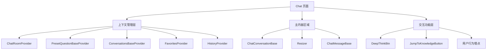
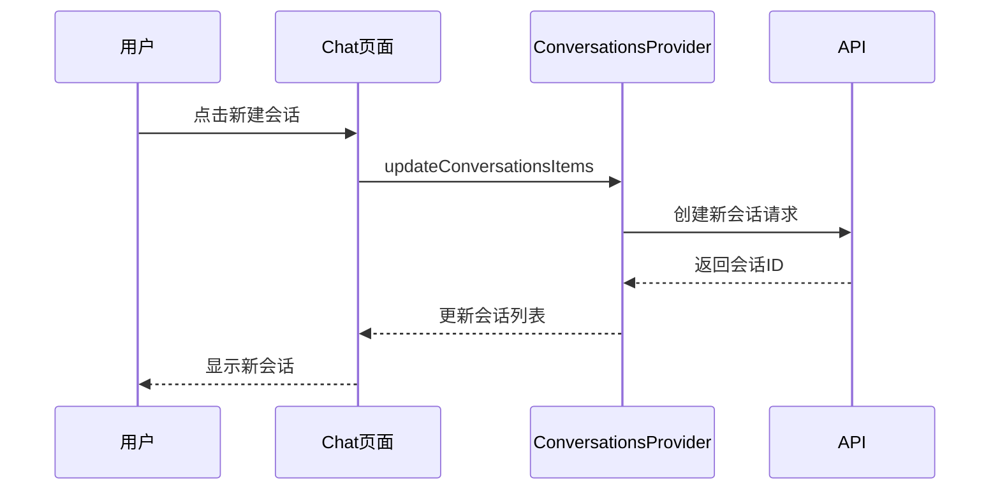
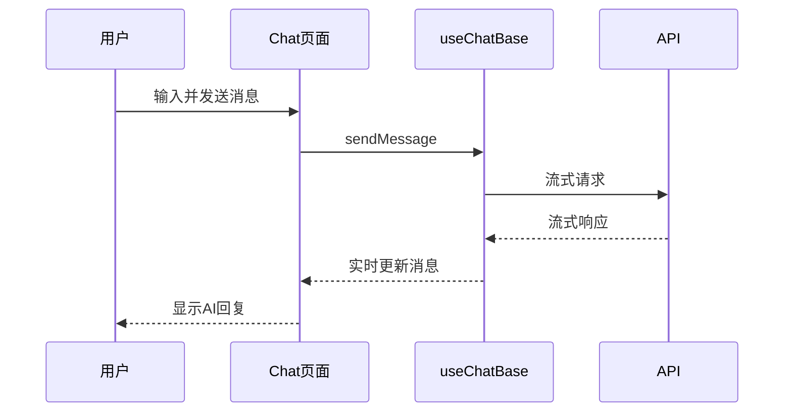
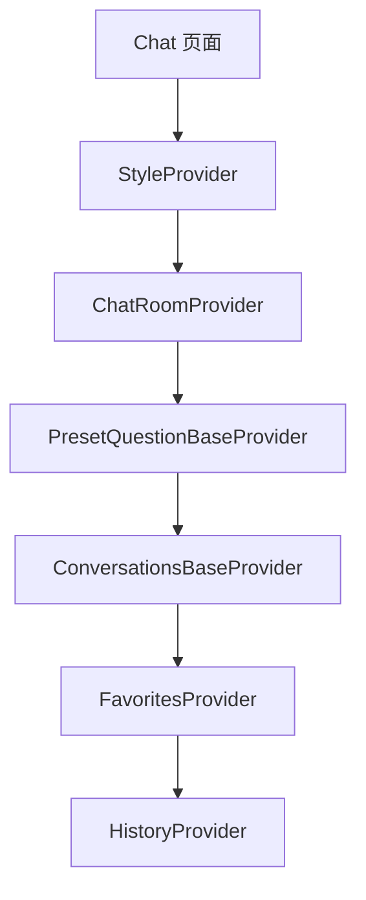

# Chat 页面技术文档

## 一句话定位
AI 聊天应用的核心页面，提供完整的聊天会话管理、消息交互和历史记录功能。

## 概览
- **功能范围**：会话管理、消息收发、历史记录、收藏夹、预设问题
- **目标用户**：AI 聊天应用的用户
- **关键用例**：
  1. 创建和管理聊天会话
  2. 与 AI 进行实时对话
  3. 查看历史记录和收藏内容

## 信息架构



## 页面蓝图

### 主要区域职责
| 区域 | 显示内容 | 可操作 | 可见条件 |
|------|----------|--------|----------|
| 左侧会话列表 | 会话列表、新建按钮 | 切换会话、新建、重命名、删除 | 默认显示，可折叠 |
| 右侧消息区域 | 聊天消息、输入框 | 发送消息、滚动查看 | 默认显示 |
| 收藏夹面板 | 收藏的消息列表 | 查看收藏、移除收藏 | 点击收藏按钮显示 |
| 历史记录面板 | 历史会话记录 | 查看历史、恢复会话 | 点击历史按钮显示 |

## 核心组件职责

| 组件 | 主要职责 | 状态管理 | 依赖 |
|------|----------|----------|------|
| `Chat` | 主页面容器 | 协调各个 Provider | AI-UI 组件库 |
| `ChatConversationBase` | 会话列表 | 会话状态、无限滚动 | ConversationsBaseProvider |
| `ChatMessageBase` | 消息显示 | 消息状态、流式更新 | ChatRoomProvider |
| `JumpToKnowledgeButton` | 知识库跳转 | 导航状态 | 路由系统 |

## 数据流设计

### 会话管理流程


### 消息发送流程


## 状态管理架构

### Context 层级结构


### 状态数据表
| Context | 核心状态 | 更新方式 | 影响范围 |
|----------|----------|----------|----------|
| `ChatRoomContext` | `roomId`, `chatId`, `isChating` | `updateRoomId` | 全局聊天状态 |
| `ConversationsBase` | `conversationsItems` | `updateConversationsItems` | 会话列表显示 |
| `Favorites` | `favoritesList`, `showFavorites` | `addFavorite`, `removeFavorite` | 收藏夹面板 |
| `History` | `historyList`, `showHistory` | 历史记录API | 历史记录面板 |

## 关键特性

### 1. 会话管理
- [x] **无限滚动**：支持大量会话的高效加载
- [x] **会话操作**：创建、重命名、删除、切换
- [x] **状态持久化**：刷新页面保持当前会话

### 2. 消息处理
- [x] **流式响应**：实时显示 AI 回复过程
- [x] **历史恢复**：自动加载历史消息
- [x] **消息解析**：支持多种消息类型渲染

### 3. 用户体验
- [x] **分栏调整**：可拖拽调整左右面板宽度
- [x] **快速操作**：预设问题、收藏、历史记录
- [x] **行为埋点**：用户行为数据收集

## 技术实现要点

### 1. 路由参数处理
```typescript
// 支持 URL 参数传递初始状态
const initialMsg = searchParams.get('initialMsg');
const entityType = searchParams.get('entityType');
const entityName = searchParams.get('entityName');
```

### 2. 浏览器兼容性
```typescript
// 针对老旧浏览器的降级处理
const needsBrowserCompat = isIE() || isOldEdge();
```

### 3. 性能优化
- **组件懒加载**：按需加载历史记录和收藏夹
- **无限滚动**：使用 Intersection Observer 实现高效滚动
- **状态优化**：useCallback 避免不必要的重渲染

## API 集成

| 功能 | API 端点 | 请求方式 | 说明 |
|------|----------|----------|------|
| 获取预设问题 | `getQuestion` | GET | 获取推荐问题列表 |
| 获取历史会话 | `selectChatAIConversation` | GET | 分页获取会话列表 |
| 获取历史消息 | `selectChatAIRecord` | GET | 恢复指定会话的消息 |
| 删除会话 | `delChatGroup` | POST | 批量删除会话 |
| 重命名会话 | `updateChatGroup` | POST | 修改会话标题 |

## 使用示例

```typescript
// 基础使用 - Chat 页面入口
<Chat />

// 高级配置 - 带初始参数
/chat?initialMsg=你好&entityType=stock&entityName=苹果
```

## 扩展点

1. **自定义预设问题**：扩展 PresetQuestionBaseProvider
2. **新的消息类型**：扩展 ChatMessageBase 组件
3. **埋点事件**：添加新的用户行为追踪
4. **主题定制**：通过 StyleProvider 扩展样式

## 相关文档
- [Chat Hooks 设计文档](../../../packages/ai-ui/docs/chat-hooks.md)
- [Chat Messages 设计文档](../../../packages/ai-ui/docs/chat-messages.md)
- [Chat Roles 设计文档](../../../packages/ai-ui/docs/chat-roles.md)
- @see apps/ai-chat/src/pages/Chat/index.tsx