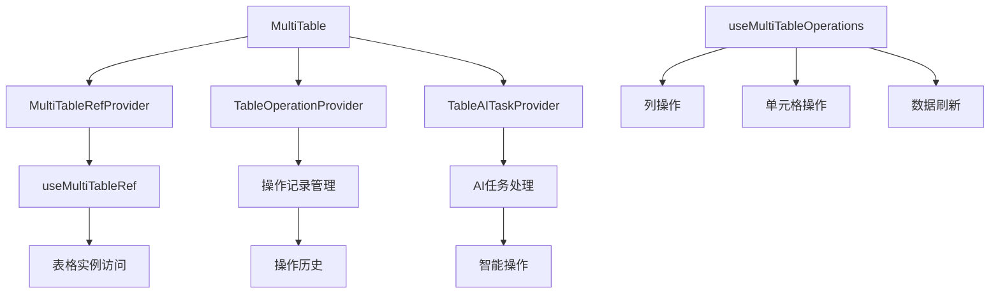
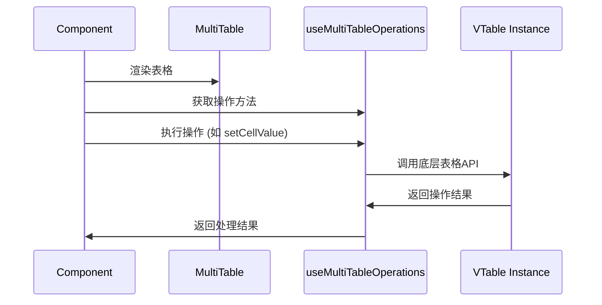

# MultiTable 组件设计文档

## 概述
基于 VTable 的高性能表格组件，提供虚拟滚动和复杂操作支持。通过 Context API 构建模块化系统，支持表格引用管理、操作记录和 AI 任务处理。

## 功能架构



## 核心功能
- ✅ **表格引用管理**: 统一访问表格实例
- ✅ **操作记录**: 完整的操作历史追踪
- ✅ **AI 任务集成**: 智能表格操作
- ✅ **虚拟滚动**: 大数据量高性能渲染
- ✅ **事件处理**: 完整的表格事件支持

## 组件结构
```
MultiTable/
├── components/      # 子组件
├── context/         # 上下文管理
│   ├── MultiTableRefContext.tsx
│   ├── TableOperationContext.tsx
│   └── TableAITaskContext.tsx
├── hooks/           # 自定义 hooks
├── types/           # 类型定义
├── utils/           # 工具函数
└── index.tsx        # 主组件
```

## 接口说明

### 主要参数
| 参数 | 类型 | 说明 |
|------|------|------|
| id | string | 表格唯一标识 |
| style | CSSProperties | 表格容器样式 |
| handleRecordOperation | (operation) => void | 操作记录回调 |
| onCellClickBySource | (value) => void | 单元格点击处理 |

### 核心 Hooks

#### useMultiTableOperations
提供表格操作方法：
- `getColumns()` - 获取列定义
- `getSelectedCells()` - 获取选中单元格
- `setCellValue(col, row, value)` - 设置单元格值
- `refresh()` - 刷新表格
- `getTableInstance()` - 获取原始实例

## 使用流程



## 关联文件
- @see apps/ai-chat/src/components/MultiTable/index.tsx
- @see apps/ai-chat/src/components/MultiTable/hooks/useMultiTableOperations.ts
- @see [VisTable design](../VisTable/design.md)
