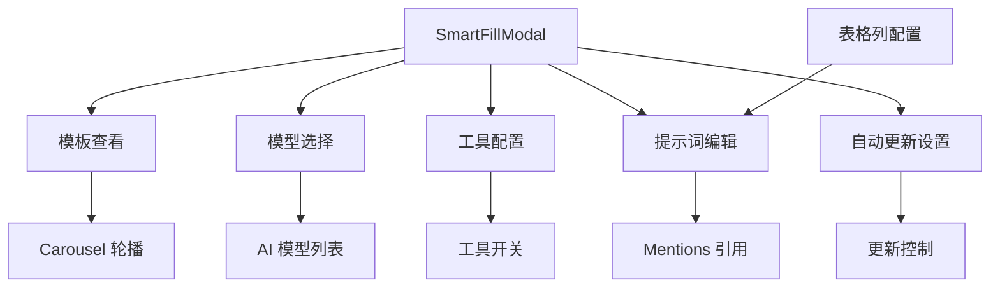
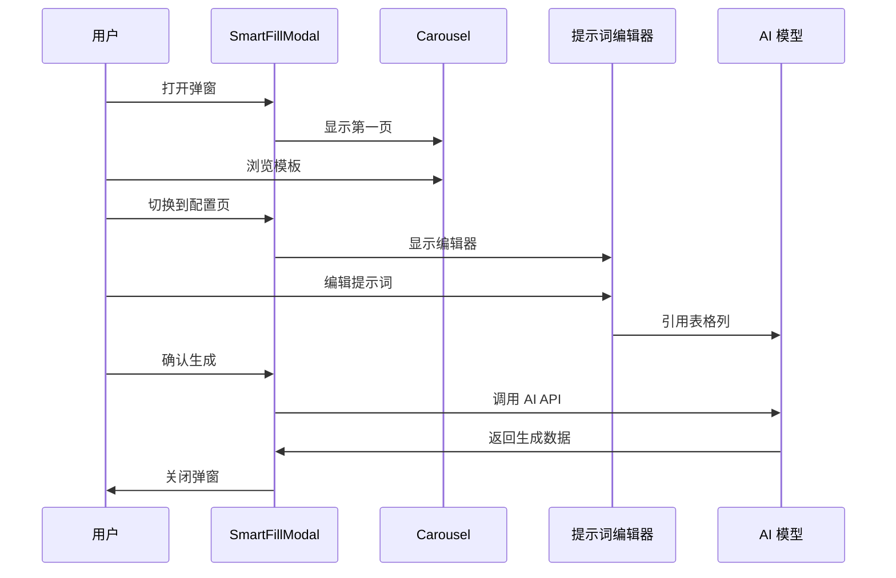

# SmartFillModal 组件设计文档

## 概述
AI 生成表格数据的弹窗组件，提供模型选择、工具配置、提示词编辑等功能，帮助用户通过 AI 模型自动填充表格数据。

## 功能架构

## 核心功能
- ✅ **模板浏览**: Carousel 轮播展示模板
- ✅ **模型选择**: 支持多种 AI 模型
- ✅ **工具配置**: 可选工具开关控制
- ✅ **智能提示词**: 引用表格列生成精准提示
- ✅ **自动更新**: 支持数据自动刷新

## 交互流程

## 接口说明

### 主要参数
| 参数 | 类型 | 说明 |
|------|------|------|
| open | boolean | 控制弹窗显示 |
| onCancel | () => void | 关闭回调 |
| onOk | () => void | 确认回调 |
| columns | ExtendedColumnDefine[] | 表格列配置 |

## 关联文件
- @see apps/ai-chat/src/components/modal/SmartFillModal.tsx
- @see [MultiTable design](../MultiTable/design.md)
