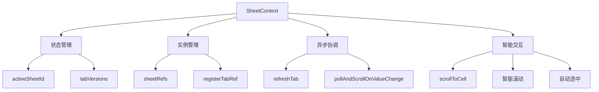
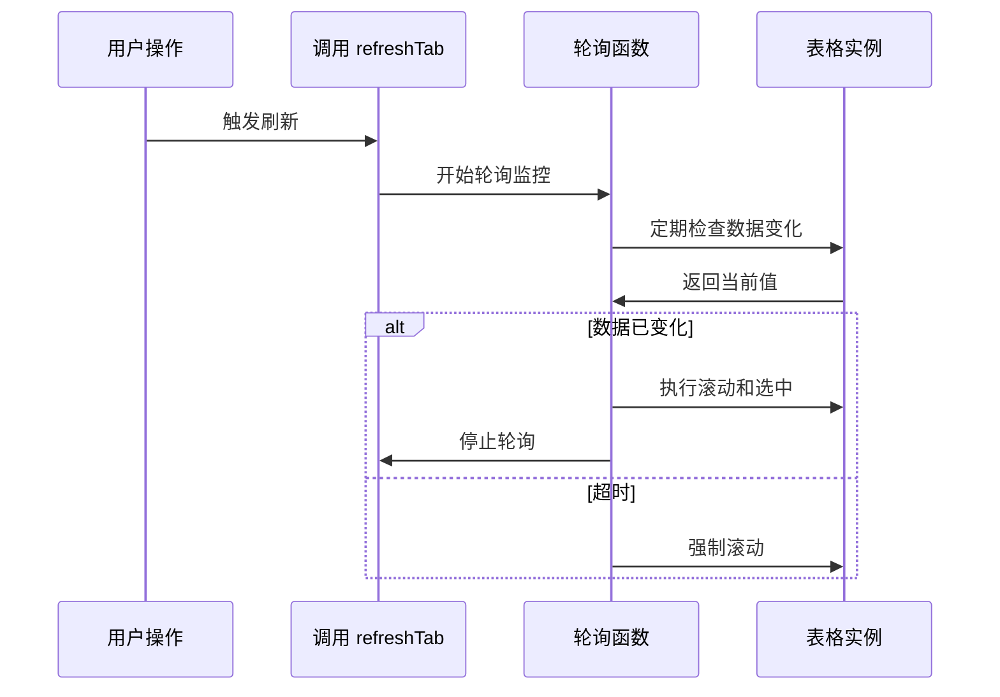

# SheetContext 设计文档

## 概述
专为多标签页表格场景设计的 React Context，提供完整的状态管理和交互逻辑，处理标签页激活、实例引用、异步刷新、智能滚动等复杂功能。

## 核心架构



## 核心功能
- ✅ **多标签管理**: 统一管理多个表格标签页状态
- ✅ **实例引用**: 集中管理表格实例，支持跨标签操作
- ✅ **异步刷新**: 支持版本驱动的表格刷新机制
- ✅ **智能滚动**: 基于轮询的精准滚动定位
- ✅ **请求管理**: 支持异步请求取消和清理

## 智能滚动优化

### 问题背景
传统表格在异步加载新数据后，滚动定位存在时机问题：
- 数据未完全渲染就滚动 → 新内容不可见
- 滚动位置计算不准确 → 用户体验差

### 解决方案
通过 `pollAndScrollOnValueChange` 实现智能滚动：



## API 接口

### useSheetContext Hook
| 属性/方法 | 类型 | 描述 |
|----------|------|------|
| `activeSheetId` | string | 当前激活的标签页 ID |
| `setActiveSheetId` | (sheetId: string) => void | 设置激活标签页 |
| `sheetRefs` | Record<string, ListTable \| null> | 表格实例引用映射 |
| `registerTabRef` | (tabKey: string, node: ListTable \| null) => void | 注册/注销表格实例 |
| `refreshTab` | (sheetId: string, placement?: 'right' \| 'bottom') => boolean | 刷新表格并触发智能滚动 |
| `scrollToCell` | (tabKey: string, cellAddress: CellAddress) => boolean | 滚动到指定单元格 |

## 使用场景

### 1. 标签页切换管理
```typescript
const { activeSheetId, setActiveSheetId } = useSheetContext()

// 切换标签页
const handleTabChange = (tabId: string) => {
  setActiveSheetId(tabId)
}
```

### 2. 异步数据刷新
```typescript
const { refreshTab } = useSheetContext()

// 添加新列并智能滚动
const addColumn = async () => {
  await api.addColumn()
  refreshTab(sheetId, 'right') // 向右滚动到新列
}
```

### 3. 实例操作协调
```typescript
const { sheetRefs, scrollToCell } = useSheetContext()

// 跨标签页操作
const scrollToSpecificCell = (sheetId: string, row: number, col: number) => {
  scrollToCell(sheetId, { row, col })
}
```

## 技术亮点

### 轮询优化算法
- **智能检测**: 监控数据变化而非固定延时
- **超时保护**: 避免无限等待，提供兜底方案
- **资源管理**: 及时清理轮询，防止内存泄漏

### 状态同步机制
- **版本驱动**: 通过版本号触发组件更新
- **队列操作**: 支持未挂载组件的操作排队
- **生命周期协调**: 组件卸载时自动清理资源

## 关联文件
- @see apps/ai-chat/src/contexts/SuperChat/SheetContext.tsx
- @see [contexts README](../../README.md)
- @see [MultiTable design](../../../components/MultiTable/design.md)
