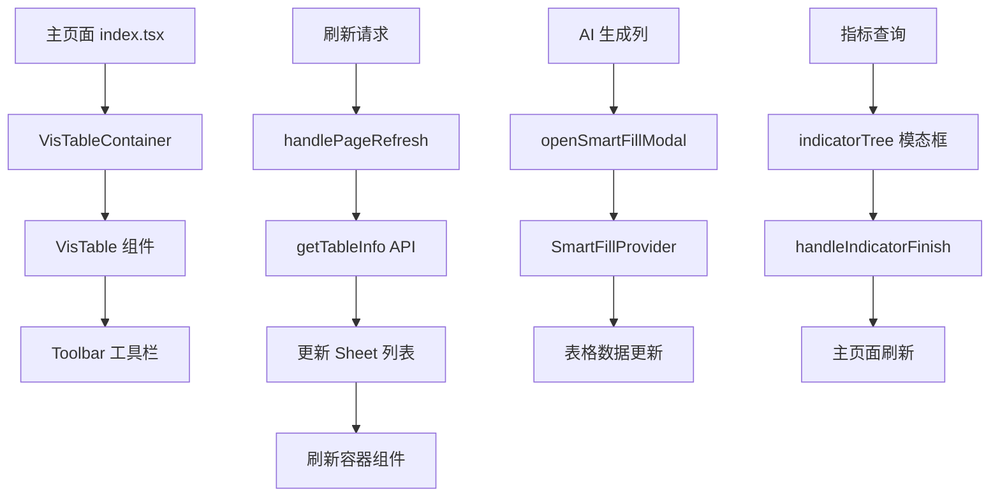

# VisTable 页面文档

## 📋 概述

VisTable 是一个用于管理和展示表格数据的复合页面组件，提供了完整的表格管理功能，包括多 Sheet 管理、数据刷新、AI 生成列、指标查询等核心功能。

## 🏗️ 目录结构

```
src/pages/VisTable/
├── components/                    # 组件目录
│   ├── VisTableContainer.tsx     # 表格容器组件
│   ├── TableNameEditor.tsx      # 表格名称编辑器
│   ├── toolbar/                  # 工具栏组件
│   │   ├── index.tsx            # 工具栏主组件
│   │   ├── index.module.less    # 工具栏样式
│   │   └── SubscribeButton/     # 订阅按钮子组件
│   │       └── index.tsx        # 订阅按钮实现
│   └── TableActionsDropdown/    # 表格操作下拉菜单
│       └── index.tsx            # 下载等操作
├── hooks/                       # 自定义 Hook
│   └── useTableName.ts         # 表格名称管理 Hook
├── utils/                       # 工具函数
│   └── localStorage.ts         # 本地存储工具
├── mock/                        # 模拟数据
│   └── data.tsx                # 表格模拟数据
├── index.tsx                    # 主页面组件
├── index.less                   # 主页面样式
├── README.md                    # 当前文档
└── 改造.md                      # 改造说明文档
```

## 🎯 核心功能

### 1. 多 Sheet 管理

- 支持多个 Sheet 标签页管理
- 动态添加/删除 Sheet
- Sheet 重命名功能
- 活跃 Sheet 状态持久化

### 2. 数据刷新机制

- 主页面级别的全局刷新
- 容器级别的局部刷新
- 基于 Sheet ID 的精确刷新
- 刷新状态管理和回调机制

### 3. AI 智能功能

- AI 生成列功能
- 智能数据填充
- 指标查询和分析

### 4. 表格操作

- 表格名称编辑
- 数据导出下载
- 订阅和通知管理
- 自动换行和布局调整

## 📁 组件详细说明

### 主页面组件 (`index.tsx`)

**职责：**

- 管理表格的整体状态和生命周期
- 处理多 Sheet 标签页的切换和管理
- 提供统一的刷新接口和数据获取机制
- 管理表格的 localStorage 状态持久化

**核心功能：**

- **表格信息获取**：通过 `getTableInfo` 方法获取表格的 Sheet 信息
- **Sheet 管理**：增删改查 Sheet，支持动态创建和删除
- **活跃状态管理**：记录和恢复用户最后操作的 Sheet
- **刷新方法暴露**：通过 `useImperativeHandle` 暴露给父组件调用
- **数据导入处理**：处理外部数据导入后的 Sheet 刷新

**关键方法：**

- `getTableInfo()` - 获取表格基本信息
- `handleDataImported()` - 处理数据导入完成
- `handlePageRefresh()` - 主页面刷新逻辑
- `addSheetApi()` - 添加新 Sheet
- `updateSheetApi()` - 更新 Sheet 信息

### 容器组件 (`components/VisTableContainer.tsx`)

**职责：**

- 作为 VisTable 组件的包装容器
- 提供多个 Context 的组合和管理
- 实现刷新方法的传递和调用链
- 管理表格组件的生命周期

**核心功能：**

- **Context 组合**：组合 SmartFillProvider、VisTableContextProvider 等
- **刷新方法传递**：将主页面的刷新方法传递给 VisTable 组件
- **引用管理**：通过 `useImperativeHandle` 暴露刷新接口

**Context 层次：**

```typescript
SmartFillProvider
  └── VisTableContextProvider
      └── VisTableOperationProvider
          └── TableAITaskProvider
              └── VisTable
```

### 工具栏组件 (`components/toolbar/`)

**职责：**

- 提供表格操作的统一入口
- 管理各种功能按钮的状态和交互
- 处理 AI 功能、指标查询等高级操作

**核心按钮功能：**

#### AI 生成列按钮 (`AiGenerateColumnButton`)

- 触发 AI 智能列生成功能
- 集成 SmartFill 智能填充机制
- 提供渐变边框的特殊样式

#### 查询指标按钮 (`QueryIndicatorButton`)

- 开启指标查询模态框
- 支持企业数据的智能分析
- 与 CDE 系统集成

#### 自动换行按钮 (`AutoWrapButton`)

- 控制表格的自动换行模式
- 动态调整表格高度和文本显示
- 支持状态切换和视觉反馈

#### 刷新按钮

- 直接调用主页面刷新方法
- 支持指定 Sheet 的精确刷新
- 提供即时的数据更新

#### 订阅按钮 (`SubscribeButton`)

- 管理表格数据的订阅设置
- 提供订阅状态查看和动态管理
- 支持下拉菜单的复杂交互

### 表格名称编辑器 (`components/TableNameEditor.tsx`)

**职责：**

- 提供表格名称的编辑功能
- 集成名称验证和保存机制
- 支持内联编辑的用户体验

**核心功能：**

- **内联编辑**：使用 `EditableLabel` 组件实现
- **数据验证**：通过 `useTableName` Hook 进行验证
- **自动保存**：编辑完成后自动保存到后端

### 表格操作下拉菜单 (`components/TableActionsDropdown/`)

**职责：**

- 提供表格的辅助操作功能
- 管理文件下载和导出
- 处理异步操作的状态管理

**核心功能：**

- **文件下载**：支持 Excel 格式的表格导出
- **下载状态**：提供下载进度和状态反馈
- **文件管理**：与文件系统集成，支持下载后跳转

## 🔧 自定义 Hook

### useTableName (`hooks/useTableName.ts`)

**职责：**

- 管理表格名称的状态和操作
- 提供名称验证和更新机制
- 处理名称变更的回调通知

**核心功能：**

- **状态管理**：维护表格名称的本地状态
- **验证机制**：提供名称格式和长度验证
- **异步更新**：支持异步的名称更新操作
- **回调通知**：支持名称变更的外部回调

**验证规则：**

- 名称不能为空
- 长度不能超过 50 个字符
- 不能包含特殊字符 `<>\\`

## 🛠️ 工具函数

### localStorage 工具 (`utils/localStorage.ts`)

**职责：**

- 管理表格状态的本地持久化
- 提供活跃 Sheet 的保存和恢复
- 处理 localStorage 的异常情况

**核心功能：**

- **状态保存**：`saveActiveSheet()` 保存当前活跃的 Sheet
- **状态恢复**：`getActiveSheet()` 恢复之前的活跃状态
- **异常处理**：提供健壮的错误处理机制

## 🎨 样式系统

### 主页面样式 (`index.less`)

- 使用 BEM 命名规范
- 响应式布局设计
- 固定高度的容器管理

### 工具栏样式 (`components/toolbar/index.module.less`)

- 模块化 CSS 方案
- 渐变边框的 AI 按钮样式
- 弹性布局的按钮组织

## 📊 数据流图



## 🔄 刷新机制详解

### 刷新层次结构

1. **主页面刷新** (`handlePageRefresh`)

   - 重新获取表格信息
   - 更新 Sheet 列表
   - 切换到指定的 Sheet

2. **容器级刷新** (`VisTableContainer.refresh`)

   - 调用主页面的刷新方法
   - 提供降级的内部刷新机制

3. **组件级刷新** (`VisTable.refreshRef`)
   - 表格内部的数据刷新
   - 支持位置参数的精确刷新

### 刷新参数接口

```typescript
interface RefreshParams {
  sheets?: number[] // 指定要刷新的 Sheet ID 列表
  row?: string[] // 指定要刷新的行
  position?: 'right' | 'bottom' // 刷新位置
}
```

## 🚀 使用示例

### 基本使用

```typescript
import VisTablePage from '@/pages/VisTable'

const App = () => {
  const visTableRef = useRef<VisTableRefType>(null)

  const handleRefresh = () => {
    visTableRef.current?.refresh({ sheets: [1, 2] })
  }

  return (
    <div>
      <button onClick={handleRefresh}>刷新表格</button>
      <VisTablePage ref={visTableRef} tableId="table_123" />
    </div>
  )
}
```

### 监听数据变化

```typescript
const handleDataImported = (sheetId: number) => {
  console.log(`Sheet ${sheetId} 数据导入完成`)
  // 执行后续操作
}
```

## 🐛 错误处理

### 常见错误类型

1. **网络错误**：API 请求失败的处理
2. **数据格式错误**：后端返回数据格式不正确
3. **权限错误**：用户权限不足的处理
4. **本地存储错误**：localStorage 操作失败

### 错误处理机制

- 统一的错误提示组件
- 错误状态的 UI 展示
- 降级处理和重试机制
- 详细的错误日志记录

## 📈 性能优化

### 已实现的优化

1. **React.memo**：避免不必要的重渲染
2. **useCallback**：缓存回调函数
3. **懒加载**：按需加载组件和模块
4. **虚拟滚动**：大量数据的性能优化

### 性能监控

- 组件渲染时间监控
- API 请求性能追踪
- 内存使用情况监控
- 用户交互响应时间

## 🔮 扩展性设计

### 插件系统

- 支持自定义工具栏按钮
- 可扩展的数据处理管道
- 模块化的功能组件

### 主题系统

- 支持多主题切换
- 自定义样式变量
- 响应式设计适配

## 🧪 测试策略

### 测试覆盖

- 单元测试：组件功能测试
- 集成测试：数据流测试
- E2E 测试：用户场景测试
- 性能测试：负载和压力测试

### 测试工具

- Jest：单元测试框架
- React Testing Library：组件测试
- Cypress：端到端测试
- MSW：API 模拟测试

## 📝 开发规范

### 代码风格

- 使用 TypeScript 进行类型检查
- 遵循 ESLint 和 Prettier 规范
- 采用函数式编程风格
- 使用 const 声明组件

### 提交规范

- 使用 Conventional Commits 格式
- 提交前执行代码检查
- 包含详细的变更说明
- 关联相关的 Issue 和 PR

## 📚 相关文档

- [VisTable 组件文档](../../components/VisTable/README.md)
- [MultiTable 组件文档](../../components/MultiTable/README.md)
- [API 接口文档](../../api/README.md)
- [样式系统文档](../../styles/README.md)

## 🤝 贡献指南

1. Fork 项目到个人仓库
2. 创建功能分支进行开发
3. 编写测试用例并确保通过
4. 提交代码并创建 Pull Request
5. 等待代码审查和合并

## 📞 联系方式

- 项目负责人：[项目负责人姓名]
- 技术支持：[技术支持邮箱]
- 项目地址：[项目仓库地址]
- 文档地址：[文档网站地址]

---

_最后更新时间：2024-01-XX_
_文档版本：v1.0.0_
