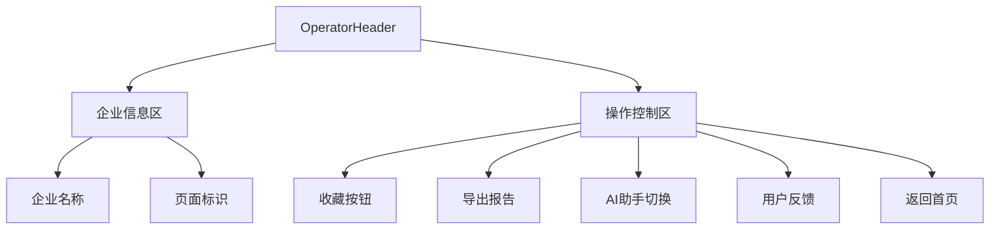
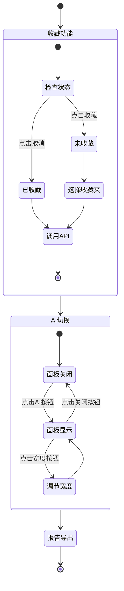

# 企业详情页顶部操作栏设计

## 概述

顶部操作栏提供企业信息展示、收藏管理、报告导出和AI助手控制功能，横跨整个页面宽度，为用户提供便捷的操作入口。

**功能边界**：企业信息展示、全局操作控制、状态管理
**目标人群**：企业尽调人员、投资分析师、业务用户
**关键场景**：收藏企业、导出报告、切换AI面板、返回导航

## 信息架构

## 页面蓝图

| 区域 | 显示内容 | 可交互动作 | 可见条件 |
|------|----------|------------|----------|
| **企业信息** | 企业名称、页面类型 | 无操作 | 始终显示 |
| **收藏按钮** | 收藏状态图标 | 收藏/取消收藏 | 始终显示 |
| **导出报告** | 下载图标 | 生成并下载报告 | 企业数据完整时 |
| **AI助手** | AI图标、开关状态 | 显示/隐藏AI面板 | AI功能可用时 |
| **用户反馈** | 反馈图标 | 打开反馈弹窗 | 始终显示 |
| **返回首页** | 首页图标 | 跳转到首页 | 始终显示 |

## 任务流程

## 数据与状态

### 核心数据字段

| 字段 | 来源 | 用途 | 刷新策略 |
|------|------|------|----------|
| `entityName` | 企业基本信息 | 企业名称显示 | 实时同步 |
| `collectState` | 收藏API | 收藏状态 | 实时同步 |
| `showRight` | 主容器状态 | AI助手按钮状态 | 用户操作 |
| `companyCode` | 企业基本信息 | 操作参数 | 页面级 |

### 缓存策略

- **企业基本信息**：Redux全局缓存，页面刷新时更新
- **收藏状态**：组件状态缓存，用户操作时实时同步
- **收藏夹列表**：按需加载，弹窗关闭时清空

## 组件复用

### 核心组件

- **OperatorHeader**：顶部操作栏主组件
- **ToolsBar**：工具栏基础组件
- **CompanyReportModal**：报告生成弹窗
- **Collect**：收藏功能弹窗

**@see apps/company/src/views/CompanyDetailAIRight/comp/OperatorHeader/index.tsx**

### 组件边界

- **OperatorHeader**：企业信息展示、操作按钮管理、状态同步
- **Collect**：收藏夹选择、收藏操作
- **CompanyReportModal**：报告格式选择、生成和下载

## 错误处理

| 错误类型 | 处理方式 | 用户反馈 |
|----------|----------|----------|
| **收藏失败** | 显示错误提示，提供重试 | "收藏失败，请重试" |
| **报告生成失败** | 显示错误状态 | "报告生成失败" |
| **AI服务异常** | 显示错误提示 | "AI服务暂时不可用" |
| **网络异常** | 显示网络错误 | "网络连接异常" |

## 相关文档

- [总体设计文档](./design.md) - 整体架构
- [主容器布局设计](./layout-container.md) - 布局管理
- [左侧区域设计](./layout-left.md) - 内容区布局

## 检查清单

- [x] 功能区域职责明确
- [x] 收藏功能流程完整
- [x] AI切换机制清晰
- [x] 错误处理策略完善
- [x] 文档长度控制在1页内