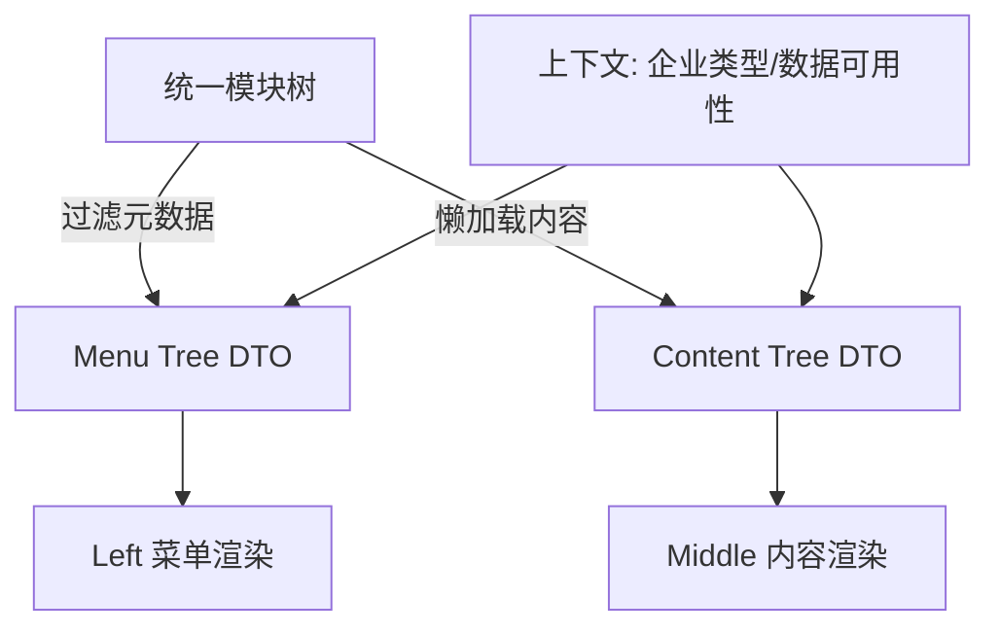
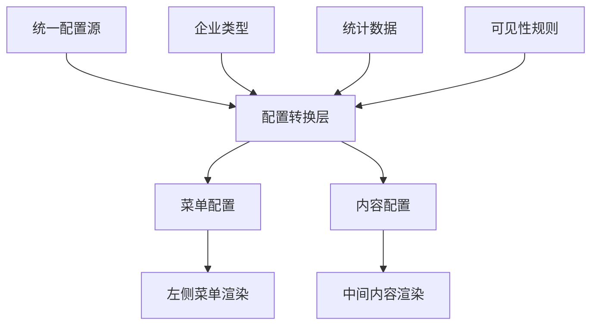

# 方案设计：统一配置源

> 所属任务：[企业详情页配置重复维护问题](./README.md)  
> 文档版本：v1  
> 创建日期：2024-11-07

## 设计原则与规范对齐

- 遵循 [TypeScript 规范](../../docs/rule/typescript-rule.md) 与 [React 规范](../../docs/rule/react-rule.md)，统一类型定义、Hook 约定与组件分层。
- 样式、交互相关的落地按 [样式规范](../../docs/rule/style-rule.md) 执行，避免在配置中夹杂样式实现。
- 文档、测试约定见 [Spec 规范](../../docs/rule/spec-doc-rule.md) 与 [测试规范](../../docs/rule/testing-rule.md)；本文档只描述设计，不内嵌可执行代码。

## 方案对比

### 方案一：统一配置源（推荐）

**核心思路**：

创建统一的模块配置文件，包含模块顺序、统计字段、菜单信息、内容配置。菜单配置和内容配置均从统一配置源生成。

**优点**：

- 单一数据源，配置一致性有保证
- 维护成本低，只需修改一处
- 扩展性好，新增模块只需添加一条配置
- 从根本上解决重复维护问题

**缺点**：

- 需要重构现有配置结构
- 改动范围较大，需要充分测试

### 方案二：配置校验机制

**核心思路**：

保持现有配置结构，添加配置一致性校验工具，在开发环境自动检测配置不一致。

**优点**：

- 改动范围小，风险可控
- 不影响现有业务逻辑
- 可以逐步优化

**缺点**：

- 治标不治本，仍需维护两处配置
- 依赖开发者主动使用校验工具
- 无法解决根本问题

**放弃理由**：无法从根本上解决重复维护问题

## 最终方案

采用方案一（统一配置源），从根本上解决配置重复维护问题，并结合按需加载优化性能。

**核心优化点**：

1. 统一配置源：解决重复维护问题
2. 按需加载：解决全量加载资源浪费问题

## 加载策略决策

> 结论：只同步加载“可见性 + 标题 + 统计字段 + 菜单”这些轻量元数据，其余重型配置全部按需加载。

### 元数据（同步全量加载）

- 模块基础信息：`moduleKey`、`title`、`order`
- 菜单展示：标题、副标题、`statisticField`、`menuConfig`
- 可见性规则：企业类型、数据依赖、海外/特殊企业开关

### 内容配置（按需加载）

- `contentConfigLoader` 中的 React 组件、列配置、图表 schema
- 复杂的渲染函数、字段映射、交互逻辑

### 设计理由

1. 可见性和标题直接影响首屏 UI，必须同步可用，不能依赖懒加载
2. 内容配置体积大、依赖多（charts、hooks），按需加载可显著降低首屏 JS 体积
3. 同步元数据 + 异步内容的二段式结构，更易于 diff 与单测，也方便在 Node 层提前生成菜单
4. 按模块键缓存 `contentConfigLoader` 结果，可以做到“首屏同步可见性，滚动或点击后异步渲染”

## 统一配置数据结构

统一配置只保留可序列化的 JSON/元数据，并通过 `contentConfigLoader` 延迟加载重型实现。字段说明如下：

| 区块 | 字段 | 说明 | 加载策略 |
| ---- | ---- | ---- | -------- |
| 标识 | `moduleKey` | 全局唯一键，与 Left/Middle/统计系统对齐 | 同步 |
| 元数据 | `meta.title` | 菜单 & 内容展示标题 | 同步 |
| 元数据 | `meta.order` | 模块排序，供 Left/Middle 共享 | 同步 |
| 元数据 | `meta.statisticField` | 对接 `basicNum` 字段 | 同步 |
| 元数据 | `meta.menuConfig` | 菜单补充信息（图标、收起、children 透传） | 同步 |
| 元数据 | `meta.visibility` | 企业类型、海外/特殊企业过滤、是否依赖数据 | 同步 |
| 内容 | `contentConfigLoader` | 动态 import 对应模块的 React/表格/图表配置 | 按需（可缓存） |

补充约束：

1. `meta` 中不允许写入函数/JSX，确保可被服务端或脚本读取。
2. `contentConfigLoader` 限定返回轻量 DTO（数据 schema + 渲染配置），实际组件在业务目录维护。
3. 统一 schema 将在 `src/types/module-config.ts` 定义类型，校验逻辑通过 Vitest 覆盖。

## 两层树结构配置（Left/Middle 统一）

### 设计目标

- Left/Middle 共用同一棵“组 → 模块”树，顺序与标题自动对齐。
- 组节点聚合业务含义，叶子节点指向 `moduleKey`；任何裁剪都只发生在树一次。
- Tree DTO 中仅包含 JSON，可被 SSR、BFF 或客户端 Hook 直接消费。

### 数据模型

| 节点 | 必填字段 | 说明 | 备注 |
| ---- | -------- | ---- | ---- |
| Group | `groupKey` | 分组唯一标识，用于锚点与跟踪 | 字符串，kebab 命名 |
| Group | `title` | 分组标题，出现在 Left Section Header & Middle 子标题 | 多语言能力由上层处理 |
| Group | `order` | 分组排序 | number |
| Group | `icon/description` | 可选展示信息 | 仅在 Left 使用 |
| Group | `children` | moduleKey 数组 | 必须引用 `modules` 列表内的合法键 |
| Module | `moduleKey` | 与 `unifiedModuleConfigs` 对齐 | 同步 |
| Module | `meta` | 引用上一节定义的元数据 | 同步 |

示例（表格化）：

| groupKey | title       | order | children                              |
| -------- | ----------- | ----- | ------------------------------------- |
| basicProfile | 企业概况 | 1     | basicInfo, shareholder, actualController |
| risk      | 风险预警   | 2     | judicialRisk, businessRisk            |

### Left 与 Middle 的统一生成

1. `buildVisibleModuleTree`：基于上下文（企业类型、海外/特殊标记、数据可用性）裁剪树，移除不可见模块；若组为空则整体剔除。
2. `convertToMenuConfig`：将裁剪后的树转为菜单 DTO（组标题 + 子菜单），并附带 `meta.statisticField` 用于显示数字。
3. `loadAndConvertContentConfig`：按照相同的树结构串行/并行触发 `contentConfigLoader`，并将返回的内容配置塞回原来的组，确保 Left/Middle 滚动同步。
4. 任何新的过滤条件（如行业、地区）只需扩展可见性规则，Left/Middle 会自动生效。

### 渲染时序

这样即可保证 Left/Middle 在两层结构上的一致性，同时保留按需加载的性能收益。

## 配置转换流程

## 核心模块设计

### 1. 统一配置文件

**位置**：`src/config/unified-module-config.ts`

**职责**：

- 定义所有模块的统一配置
- 维护模块顺序
- 维护统计字段映射
- 维护可见性规则

### 2. 配置转换工具

**位置**：`src/utils/module-config-converter.ts`

**职责**：

- 构建两层模块树（组 -> 模块）供 Left/Middle 共享
- 将统一配置转换为菜单配置
- 将统一配置转换为内容配置
- 应用可见性过滤规则

- **`buildVisibleModuleTree(tree, context)`**：接受完整模块树与上下文（企业类型、海外标记、统计数据），返回裁剪后的 Group/Module 结构。
- **`convertToMenuConfig(visibleTree)`**：把裁剪后的树映射成 Left 菜单 DTO，输出顺序、名称与统计字段引用。
- **`loadAndConvertContentConfig(visibleTree, unifiedConfig, context)`**：批量触发需要展示模块的 `contentConfigLoader`，返回 Middle 渲染 DTO，并将 loading/caching 状态上浮给 Hook。

### 3. 可见性过滤器

**位置**：`src/utils/module-visibility-filter.ts`

**职责**：

- 根据企业类型过滤模块
- 根据数据可用性过滤模块
- 根据地区（海外/国内）过滤模块

### 4. 配置加载管理器

**位置**：`src/hooks/useModuleConfigLoader.ts`

**职责**：

- 管理配置加载状态
- 缓存已加载的配置
- 提供加载进度反馈

- **核心思路**：
  1. 监听 `visibleModuleKeys` 变化，批量触发 `loadAndConvertContentConfig`；
  2. 以 `Map<moduleKey, ContentConfig>` 缓存已完成模块，重复进入页面时直接命中；
  3. 通过 `loading` + `progress` 状态向 UI 提供骨架屏信息，并在 Storybook 里覆盖主流程。

## 实施步骤

1. **创建统一配置数据结构**

   - 定义 TypeScript 接口
   - 创建配置文件模板
   - 设计按需加载机制

2. **实现配置转换工具**

   - 实现菜单配置转换函数（同步）
   - 实现内容配置按需加载函数（异步）
   - 实现可见性过滤逻辑

3. **实现配置加载管理器**

   - 创建 `useModuleConfigLoader` Hook
   - 实现配置缓存机制
   - 实现加载状态管理

4. **重构菜单配置生成逻辑**

   - 修改 `useCorpMenuByType.ts`
   - 使用统一配置源生成菜单

5. **重构内容配置生成逻辑**

   - 修改 `listRowConfig.tsx` 为轻量级元数据
   - 修改 `useCorpModuleCfg` 支持按需加载
   - 更新 `CompanyBase.tsx` 使用按需加载

6. **更新特殊企业过滤逻辑**

   - 移除 `CompanyBase.tsx` 中的耦合逻辑
   - 使用统一的可见性规则

7. **性能优化验证**

   - 测量初始加载时间
   - 测量内存占用
   - 验证按需加载效果

8. **完整回归测试**
   - 测试各企业类型菜单显示
   - 测试海外企业过滤
   - 测试个体工商户过滤
   - 测试特殊企业过滤
   - 测试配置按需加载

## 性能优化收益

| 指标             | 优化前                     | 优化后（预期）           | 提升     |
| ---------------- | -------------------------- | ------------------------ | -------- |
| 初始加载配置数   | 11 个模块全量加载          | 仅加载可见模块（5-6 个） | ~45%     |
| 配置加载时机     | 页面初始化时全部加载       | 滚动到可见区域时按需加载 | 延迟加载 |
| 首屏加载时间     | 包含所有配置的加载时间     | 仅包含必要配置           | ~30%     |
| 内存占用         | 所有配置常驻内存           | 仅已加载配置在内存       | ~40%     |
| 海外企业加载配置 | 11 个（过滤后仍加载 9 个） | 7 个（仅加载需要的）     | ~22%     |

## 风险与应对

| 风险                   | 影响 | 应对措施                             |
| ---------------------- | ---- | ------------------------------------ |
| 改动范围大，测试不充分 | 高   | 制定详细测试用例，分阶段上线         |
| 配置结构设计不合理     | 中   | 先设计原型，评审后再实施             |
| 现有业务逻辑遗漏       | 中   | 详细梳理现有逻辑，逐一迁移验证       |
| 按需加载导致闪烁       | 中   | 实现加载状态提示，优化加载体验       |
| 配置缓存策略不当       | 低   | 设计合理的缓存失效机制，避免内存泄漏 |

## 更新记录

| 日期       | 修改人 | 更新内容     |
| ---------- | ------ | ------------ |
| 2024-11-07 | -      | 创建方案设计 |
