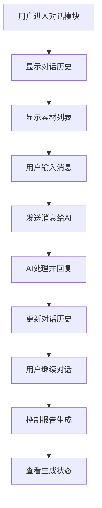
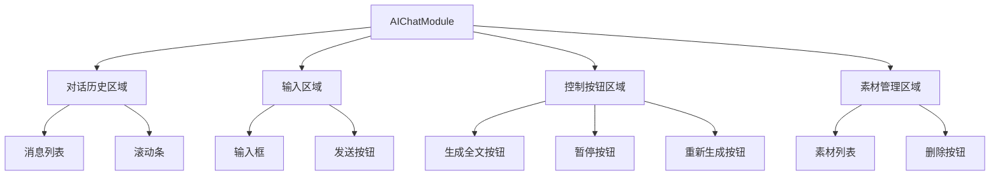

# AI对话需求文档

## 功能概述

AI对话模块是报告详情页面左侧面板的核心交互区域，提供用户与AI的实时对话功能，支持报告生成控制、素材管理和对话历史查看。用户可以通过此模块与AI进行实时交互，获取报告生成的帮助和建议。

## 用户故事

### 主要用户故事

1. **实时对话交互**

   - 作为用户，我希望能够与AI进行实时对话，以便获取报告生成的帮助和建议
   - 作为用户，我希望看到完整的对话历史，以便了解之前的交互内容

2. **报告生成控制**

   - 作为用户，我希望能够控制报告的生成过程，包括开始、暂停、重新生成
   - 作为用户，我希望看到生成进度和状态，以便了解当前的处理情况

3. **素材管理**
   - 作为用户，我希望能够查看和管理上传的素材
   - 作为用户，我希望能够删除不需要的素材

## 功能流程图

## 界面设计

### 布局结构

### 交互设计

- **消息显示**: 用户消息右对齐，AI消息左对齐
- **时间戳**: 每条消息显示发送时间
- **状态指示**: 显示消息发送状态（发送中、已发送、发送失败）
- **滚动行为**: 新消息自动滚动到底部
- **输入框**: 支持多行输入，Enter发送，Shift+Enter换行

## 功能特性

### 对话功能

- **实时对话**: 支持与AI的实时对话交互
- **历史记录**: 保存并显示完整的对话历史
- **消息状态**: 显示消息的发送状态和处理状态
- **错误处理**: 网络错误时显示重试选项

### 生成控制

- **生成全文**: 点击按钮开始生成完整报告
- **暂停生成**: 生成过程中可随时暂停
- **重新生成**: 支持重新生成全文或指定章节
- **进度显示**: 显示生成进度和当前状态

### 素材管理

- **素材列表**: 显示所有上传的素材
- **素材预览**: 点击素材可预览内容
- **删除功能**: 点击"X"按钮删除素材
- **素材状态**: 显示素材的使用状态

## 业务规则

### 对话规则

- **消息长度**: 单条消息最大1000字符
- **历史保存**: 对话历史保存最近50条消息
- **发送频率**: 限制发送频率，防止刷屏
- **超时处理**: 消息发送超时30秒

### 生成控制规则

- **生成状态**: 生成中时禁用其他生成操作
- **暂停恢复**: 暂停后可恢复生成
- **重新生成**: 重新生成会清空当前内容
- **进度更新**: 实时更新生成进度

### 素材管理规则

- **素材类型**: 支持文档、图片、数据等格式
- **文件大小**: 单个文件最大10MB
- **删除确认**: 删除素材需要确认
- **关联检查**: 删除前检查是否被引用

## 异常处理

### 网络异常

- **连接失败**: 显示"网络连接失败，请检查网络"
- **超时错误**: 显示"请求超时，请重试"
- **重试机制**: 提供重试按钮，最多重试3次

### 生成异常

- **生成失败**: 显示"生成失败，请重试"
- **服务异常**: 显示"AI服务暂时不可用，请稍后重试"
- **内容错误**: 显示"生成内容有误，请重新生成"

### 素材异常

- **上传失败**: 显示"素材上传失败，请重试"
- **格式错误**: 显示"文件格式不支持，请选择其他文件"
- **大小超限**: 显示"文件过大，请选择小于10MB的文件"

## 性能要求

### 响应时间

- **页面加载**: < 1秒
- **消息发送**: < 500ms
- **AI回复**: < 3秒
- **历史加载**: < 2秒

### 并发处理

- **多用户**: 支持多用户同时使用
- **消息队列**: 消息发送使用队列处理
- **状态同步**: 实时同步对话状态

## 验收标准

### 功能完整性

- [ ] 对话功能正常工作
- [ ] 生成控制功能完整
- [ ] 素材管理功能正常
- [ ] 历史记录保存正确

### 交互体验

- [ ] 对话界面流畅自然
- [ ] 消息发送及时响应
- [ ] 生成控制操作便捷
- [ ] 素材管理操作简单

### 性能指标

- [ ] 页面加载速度快
- [ ] 消息发送响应及时
- [ ] AI回复时间合理
- [ ] 系统稳定性良好

---

_最后更新时间: 2024年12月_
