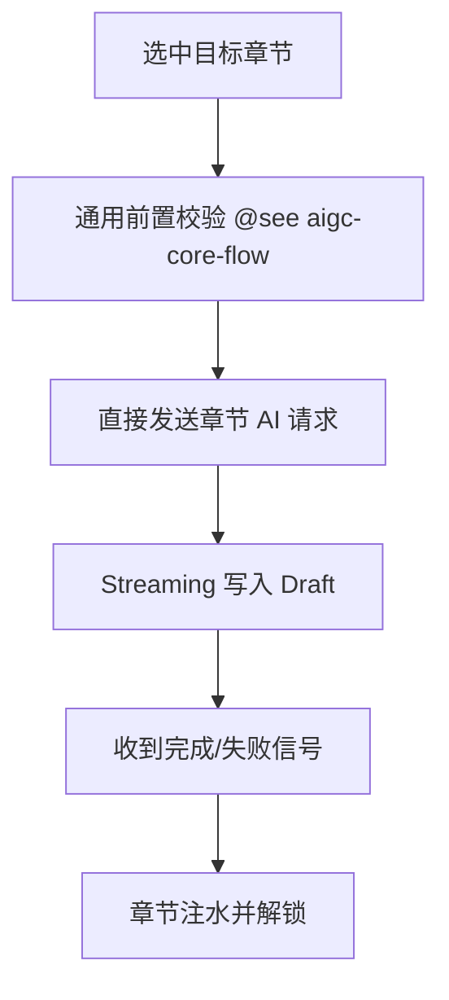

# 单章节 AIGC 场景（纵向手册）

> 聚焦用户在章节列表中触发的“立即重写”场景，基于 [AIGC 核心流程](./aigc-core-flow.md) 的通用校验与流式输出，仅保留单章节所需的最小状态。

## 概览

- **范围**：目标章节锁定、直接 AI 请求、注水收尾
- **目标用户**：前端开发者、内容运营侧的单章节改写需求
- **关键任务**：
  1. 选择章节后秒级触发生成
  2. 流式填充草稿并实时反馈
  3. 成功/失败后原位回收状态

## 信息架构

## 页面蓝图

| 区域         | 显示内容            | 可操作       | 可见条件                                                |
| ------------ | ------------------- | ------------ | ------------------------------------------------------- |
| 章节进度条   | 当前章节进度 0-100% | 取消         | `globalOperation=chapter_generation`                    |
| 锁定章节高亮 | 目标章节状态、标题  | 无           | 生成进行中                                              |
| 快速操作     | 重新生成、查看日志  | 失败或成功后 | `chapterGenerationState.status` 在 `failed`/`succeeded` |

## 任务流程

| 阶段 | 触发条件       | 关键状态                                   | 核心动作               | 反馈                   |
| ---- | -------------- | ------------------------------------------ | ---------------------- | ---------------------- |
| 启动 | 用户点击重写   | `targetChapterId` 赋值                     | 锁定章节并清空草稿     | 展示 Loading 占位      |
| 生成 | 校验通过       | `chapterGenerationState.status=generating` | 直接触发单章节 AI 请求 | 流式预览章节内容       |
| 收尾 | Streaming 结束 | `chapterGenerationState.completed`         | 注水草稿、同步完成状态 | 成功/失败 toast 与解锁 |

## 状态与数据

| 名称                            | 类型    | 说明/限制                                                                            | 来源                        |
| ------------------------------- | ------- | ------------------------------------------------------------------------------------ | --------------------------- | --------- | ------------------------ | -------------------- |
| `targetChapterId`               | string  | 当前生成的章节 ID，空值即未在运行                                                    | 章节树点击事件              |
| `chapterGenerationState.status` | `'idle' | 'generating'                                                                         | 'succeeded'                 | 'failed'` | 控制按钮禁用与进度条展示 | `ReportContentStore` |
| `progress.percent`              | number  | 单章节线性进度，Streaming 条数 → 百分比                                              | `useChapterGeneration` Hook |
| `correlationId`                 | string  | 保证注水与 AI 响应一一对应（详见 [Correlation ID 设计](./correlation-id-design.md)） | `aiRequestHandler`          |

## 与其他流程的关系

| 能力     | 单章节           | 多章节顺序                 | 全文生成           |
| -------- | ---------------- | -------------------------- | ------------------ |
| 章节数量 | 精确 1 个        | 用户自选 N 个              | 自动遍历全部叶子   |
| 调度方式 | 无队列，立即执行 | 复用单章节，顺序遍历队列   | 队列 + 全局进度    |
| 失败处理 | 原位重试         | 支持跳过并回落到单章节重试 | 需整队列重试或回滚 |
| 典型入口 | 章节右键菜单     | 批量选中章节               | 顶部“生成全文”按钮 |

## 复用节点

- `@see ../../../src/store/reportContentStore/hooks/useChapterGeneration.ts` – 状态管理与 Streaming 订阅。
- `@see ../../../src/store/reportContentStore/README.md` – Draft 与 Hydration 复用机制。
- `@see ../RPEditor/rendering-and-presentation-guide.md#6-更新与注水` – 注水执行器。

## 相关文档

- [AIGC 核心流程](./aigc-core-flow.md) – 通用校验、Streaming 与异常处理。
- [Correlation ID 设计文档](./correlation-id-design.md) – 单章节 correlationId 生命周期。
- [多章节顺序 AIGC 场景](./multi-chapter-sequential-aigc-flow.md) – 顺序队列如何复用本流程。
- [全文生成场景](./full-generation-flow.md) – 自动批量生成的差异点。
