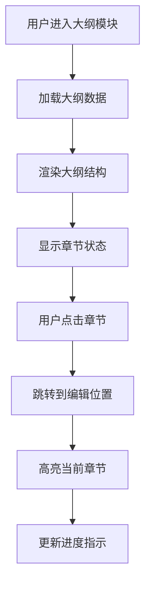
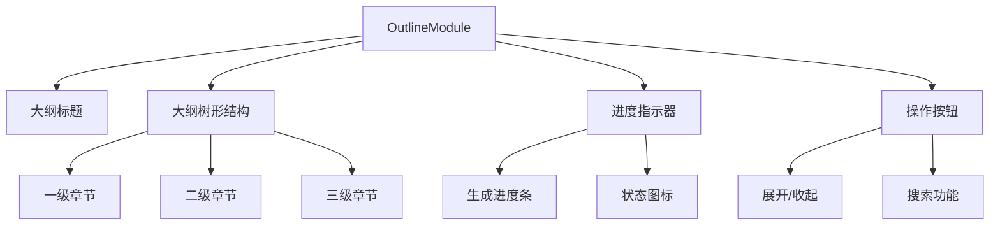

# 报告大纲需求文档

## 功能概述

报告大纲模块是报告详情页面左侧面板的重要组成部分，提供完整的报告大纲结构展示、章节导航和进度指示功能。用户可以通过此模块快速了解报告结构，并跳转到指定章节进行编辑。

## 用户故事

### 主要用户故事

1. **大纲结构展示**

   - 作为用户，我希望能够看到完整的报告大纲结构，以便了解报告的整体框架
   - 作为用户，我希望大纲结构清晰易读，包含章节标题和层级关系

2. **章节导航**

   - 作为用户，我希望能够点击大纲中的章节，快速跳转到对应的编辑位置
   - 作为用户，我希望能够通过大纲了解当前编辑的章节位置

3. **进度指示**
   - 作为用户，我希望能够看到各章节的生成进度，以便了解报告生成的完成情况
   - 作为用户，我希望能够区分已生成、生成中、未生成的不同状态

## 功能流程图

## 界面设计

### 布局结构

### 交互设计

- **树形展示**: 使用树形结构展示章节层级关系
- **展开收起**: 支持章节的展开和收起操作
- **点击跳转**: 点击章节标题跳转到对应编辑位置
- **状态显示**: 通过颜色和图标显示章节状态
- **进度条**: 显示整体生成进度

## 功能特性

### 大纲展示

- **层级结构**: 清晰展示章节的层级关系
- **章节标题**: 显示完整的章节标题
- **缩进显示**: 通过缩进表示层级关系
- **图标指示**: 使用图标区分不同类型的章节

### 章节导航

- **快速跳转**: 点击章节标题快速跳转到编辑位置
- **位置高亮**: 当前编辑的章节在大纲中高亮显示
- **滚动同步**: 大纲滚动与编辑区域同步
- **锚点定位**: 使用锚点实现精确定位

### 进度指示

- **状态区分**: 区分已生成、生成中、未生成状态
- **进度条**: 显示整体生成进度
- **百分比**: 显示具体的完成百分比
- **实时更新**: 生成过程中实时更新进度

## 业务规则

### 大纲结构规则

- **层级限制**: 最多支持4级章节
- **标题长度**: 章节标题最大50字符
- **自动编号**: 章节自动编号，格式为1.1、1.1.1等
- **排序规则**: 按章节顺序排列

### 导航规则

- **跳转精度**: 跳转到章节的精确位置
- **滚动行为**: 跳转后自动滚动到可见区域
- **高亮显示**: 当前章节在大纲中高亮显示
- **状态保持**: 跳转后保持大纲的展开状态

### 进度显示规则

- **状态定义**:
  - 已生成：绿色，100%完成
  - 生成中：蓝色，显示进度百分比
  - 未生成：灰色，0%完成
- **进度计算**: 基于已生成章节数量计算
- **实时更新**: 生成过程中实时更新状态

## 异常处理

### 数据异常

- **大纲加载失败**: 显示"大纲加载失败，请刷新页面"
- **数据格式错误**: 显示"大纲数据格式错误，请联系技术支持"
- **章节缺失**: 显示"部分章节数据缺失，请重新加载"

### 导航异常

- **跳转失败**: 显示"跳转失败，请重试"
- **章节不存在**: 显示"章节不存在，已自动移除"
- **位置错误**: 显示"定位失败，请手动滚动到目标位置"

### 进度异常

- **进度计算错误**: 显示"进度计算异常，请刷新页面"
- **状态不一致**: 显示"状态显示异常，正在同步"
- **更新失败**: 显示"进度更新失败，请重试"

## 性能要求

### 响应时间

- **大纲加载**: < 1秒
- **章节跳转**: < 200ms
- **状态更新**: < 100ms
- **展开收起**: < 100ms

### 数据处理

- **大纲渲染**: 支持1000+章节的流畅渲染
- **状态同步**: 实时同步编辑状态
- **内存管理**: 优化大量章节的内存占用

## 验收标准

### 功能完整性

- [ ] 大纲结构正确显示
- [ ] 章节导航功能正常
- [ ] 进度指示准确
- [ ] 状态同步正确

### 交互体验

- [ ] 大纲操作流畅
- [ ] 跳转响应及时
- [ ] 状态显示清晰
- [ ] 界面友好易用

### 性能指标

- [ ] 大纲加载速度快
- [ ] 跳转响应及时
- [ ] 状态更新实时
- [ ] 内存占用合理

---

_最后更新时间: 2024年12月_
