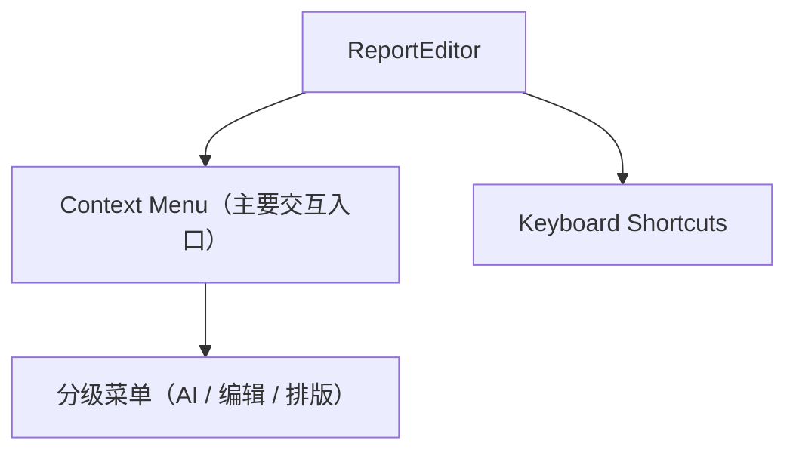
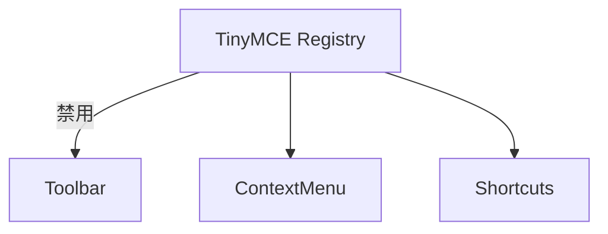

# Toolbar 前端设计文档（停用策略）

## 🧭 设计概览

- 目标：取消顶部工具栏常驻展示，将 TinyMCE 基础编辑能力迁移到上下文菜单与快捷键，降低界面密度。
- 范围：说明 Toolbar 的退场策略、残留配置、与 Context Menu 的职责划分。
- 用例：无直接用户触达；该文档用于验证迁移已覆盖所有历史指令。
- 使用 TinyMCE 默认 context menu 垂直承载指令，`AI 改写` 保留纵向二级菜单，确保视觉层级清晰。

## 🗺 信息架构与导航

- Toolbar 不再渲染，ReportEditor 通过上下文菜单提供全部操作。
- 快捷键保留（Undo/Redo、AI 快捷键等），与菜单并行。

## 🧱 功能迁移映射

| 原 Toolbar 分组       | 迁移后入口                     | 备注                                   |
| ---------------------- | ------------------------------ | -------------------------------------- |
| 撤销/重做              | Context Menu → 编辑分组         | 仍支持快捷键 Ctrl/Cmd + Z / Shift + Z  |
| 文本格式（粗体/斜体等) | Context Menu → 文本样式         | 复用 TinyMCE 内置 `bold/italic/...`    |
| 标题（H1/H2/H3）       | Context Menu → 标题样式         | 提供段落/标题快捷选择                  |
| 列表缩进               | Context Menu → 列表/缩进         | `bullist/numlist/indent/outdent`       |
| 对齐                   | Context Menu → 对齐             | 左/中/右/两端对齐                      |
| 字体 / 字号            | Context Menu → 字体/字号         | 复用 `fontfamily`/`fontsize` 嵌套菜单  |
| 颜色（前景/背景）      | Context Menu → 颜色             | 内置色盘，与主题组件一致               |
| 复制 / 剪切            | Context Menu → 编辑分组         | 浏览器安全限制下触发原生命令           |
| 保存状态指示           | 退场                            | 由主界面顶部 `SaveStatusIndicator` 承载 |

## 🔄 交互说明

- 用户右键或通过快捷键唤起 Context Menu，所有历史 Toolbar 指令均在相应分组出现。
- Toolbar 配置项在 TinyMCE 中设为 `toolbar: false`，无焦点切换、无额外状态管理。
- 迁移后不再存在 Toolbar 特有状态，Undo/Redo/格式指令使用与原 Toolbar 相同的命令栈。

## 🧮 数据与本地状态

- 无持久数据；只需确认 Toolbar 禁用不会影响 TinyMCE Autosave/Undo 栈。
- Context Menu 与快捷键复用相同命令通路，无额外状态。

## 🧩 组件与配置

- Toolbar 组件不再渲染；仅保留配置痕迹，避免第三方插件自动注入。
- 所有编辑能力由 `editorConfig` 的上下文菜单注册和快捷键绑定提供。

## 🚫 非目标

- 不重新实现顶部操作区；如需全局操作（导出/保存），交由页面框架处理。
- 不涵盖 Context Menu 的视觉与定位细节（详见对应文档）。

## ✅ 检查清单

- [ ] `toolbar` 配置已禁用，页面无 Toolbar DOM
- [ ] 原 Toolbar 指令在 Context Menu/快捷键均可访问
- [ ] Toolbar 退场不会影响自动保存、撤销栈与 AI 流程
- [ ] 文档与产品说明同步指出 Toolbar 已停用
