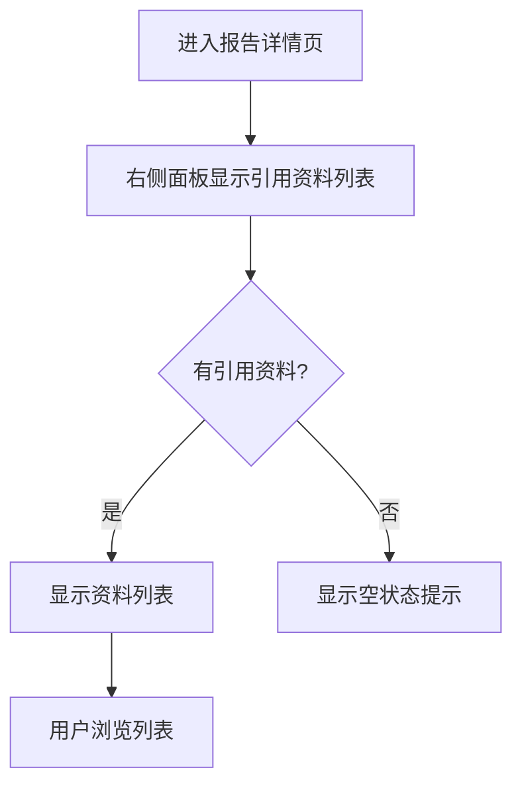

# 引用资料模块 - 需求文档

> 参考规范：`docs/rule/require-doc.md`

> 专注于界面功能和用户交互，描述"要做什么"而不是"怎么实现"

> 文档职责边界：

- 本文覆盖"功能说明、页面布局、操作流程、数据信息、交互反馈、验收标准"。
- 不包含布局蓝图、组件分解、数据派生计算与错误处理边界等设计内容（见 `02-design.md`）。
- 简单实现逻辑（如上传成功显示 Toast）仅在本文作为用户反馈出现，设计文档不再复述。

## 📂 代码关联

本需求对应的主要实现：

- **设计文档**: `02-design.md` - 详细的布局与交互设计
- **实现代码**: `../../src/pages/RPDetail/Reference/` - 引用资料面板实现
- **PDF 查看器**: `../../src/components/File/PDFViewer/` - PDF 预览功能实现

## 功能说明

引用资料模块是报告详情页右侧面板的核心功能，用于展示和管理报告中引用的各类资料。用户可以查看所有引用的表格、文件和建议资料，并进行预览和交互。

### 资料类型

- **数据表格（DPU）**：报告中引用的表格型数据，可预览查看
- **建议资料（RAG）**：AI 推荐的参考资料和外部链接
- **文件（File）**：PDF、Office 文档、图片等文件资源

## 页面布局

### 整体结构

```
┌─────────────────────────────────┐
│  标签页：全部参考资料            │
├─────────────────────────────────┤
│  [参考资料列表]  [上传文件按钮]  │
├─────────────────────────────────┤
│                                 │
│  【1】 表格名称                  │
│       引用次数：3次              │
│                                 │
│  【2】 文件名.pdf                │
│       引用次数：2次              │
│                                 │
│  【3】 建议资料标题              │
│       引用次数：1次              │
│                                 │
└─────────────────────────────────┘
```

### 功能区域

| 区域           | 内容                  | 说明                                   |
| -------------- | --------------------- | -------------------------------------- |
| **顶部标题栏** | 标签页标题 + 上传按钮 | 固定显示，提供文件上传入口             |
| **资料列表**   | 所有引用资料          | 按全局序号排序，显示资料名称和引用次数 |

## 操作流程

### 查看引用资料



> 预览资料流程与详细交互请参考设计文档（02-design.md）。

> 上传文件流程与状态反馈请参考设计文档（02-design.md）。

## 数据信息

### 资料列表项

| 字段         | 说明                 | 格式                   |
| ------------ | -------------------- | ---------------------- |
| **序号**     | 全局引用序号         | 【1】【2】【3】...     |
| **名称**     | 资料名称/标题        | 文本，最多显示 2 行    |
| **类型图标** | 资料类型标识         | 表格/文件/建议资料图标 |
| **引用次数** | 在报告中被引用的次数 | "引用次数：N次"        |

### 文件信息

| 字段         | 说明             | 格式                    |
| ------------ | ---------------- | ----------------------- |
| **文件名**   | 完整文件名       | 包含扩展名              |
| **文件类型** | 文件格式         | PDF/Word/Excel/PPT/图片 |
| **文件大小** | 文件大小（可选） | KB/MB                   |

## 置顶文件（Top Files）

### 功能说明

- 定义：置顶文件为报告级文件列表中未被任何章节引用的文件。
- 目标：帮助编辑者快速发现"尚未引用"的文件，便于后续引用或清理。
- 展示：在引用资料列表中以"置顶文件"区块展示，样式与文件资料项一致。

### 用户故事

- 作为报告编辑者，我希望看到哪些上传的文件尚未被章节使用，以便决定是否引用或删除它们。

### 交互规则

- 点击置顶文件项：进入文件预览视图（同普通文件项）。
- 删除置顶文件：与文件删除流程一致，需确认后执行删除。
- 状态显示：对可变状态（`UPLOADED`、`OUTLINE_PARSED`）显示加载反馈，与引用列表一致。

### 状态与轮询

- 报告级文件写入 Redux 后，由选择器 `selectTopReportFiles` 计算置顶文件。
- 轮询选择器 `selectPendingFileIds` 包含报告级文件的可变状态；置顶文件的展示实时叠加最新状态。

### 验收标准

- 未被章节引用的报告级文件在"置顶文件"区块中显示且仅显示一次。
- 置顶文件的上传/解析状态在轮询后实时更新，显示与引用列表一致的状态反馈。
- 置顶文件的预览与删除交互与普通文件项保持一致。

## 交互反馈

### 加载状态

| 状态         | 显示内容                | 位置         |
| ------------ | ----------------------- | ------------ |
| **加载中**   | 加载动画 + "加载中..."  | 列表区域中央 |
| **加载失败** | 错误图标 + 错误提示     | 列表区域中央 |
| **空状态**   | 空图标 + "暂无参考资料" | 列表区域中央 |

### 操作反馈

| 操作         | 反馈                      | 说明                     |
| ------------ | ------------------------- | ------------------------ |
| **点击资料** | 高亮选中 + 展开预览       | 当前项高亮，右侧显示预览 |
| **上传文件** | 进度提示 + 成功/失败消息  | Toast 提示上传结果       |
| **删除文件** | 确认对话框 + 删除成功提示 | 需要用户确认             |

### 预览交互

| 资料类型   | 交互方式    | 说明                |
| ---------- | ----------- | ------------------- |
| **表格**   | 滚动查看    | 支持横向和纵向滚动  |
| **PDF**    | 翻页 + 缩放 | 页码控制 + 缩放按钮 |
| **图片**   | 缩放 + 旋转 | 支持放大缩小和旋转  |
| **Office** | 翻页查看    | 转换为 PDF 后预览   |

## 交互规则

### 显示规则

- 资料按章节顺序排序，第一个章节的所有引用在最前面
- 章节内按类型排序：表格（DPU）> 建议资料（RAG）> 文件（File）
- 同类型内保持默认顺序（文件按上传时间，表格和建议资料保持原有顺序）
- 全局序号从 1 开始连续编号
- 同一资料在报告中多次引用，只显示一次
- 引用次数实时统计，显示在资料名称下方
- 空状态时显示"暂无参考资料"提示

### 操作限制

- 只能上传支持的文件格式（PDF、Word、Excel、PPT、图片）
- 文件大小限制（具体限制由后端定义）
- 删除文件需要确认操作
- 预览时不能编辑资料内容

### 状态切换

- 点击资料项时，列表视图切换为预览视图
- 预览视图可返回列表视图
- 上传文件时显示上传进度
- 加载失败时提供重试选项

## 检查清单

- [x] 功能说明清楚
- [x] 界面布局明确
- [x] 操作流程完整
- [x] 数据要求具体
- [x] 交互反馈明确
- [x] 状态切换清晰
