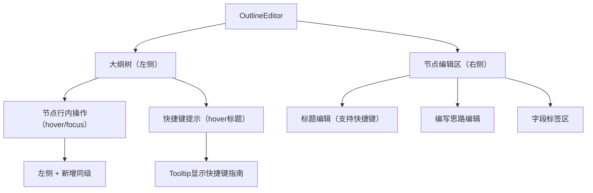
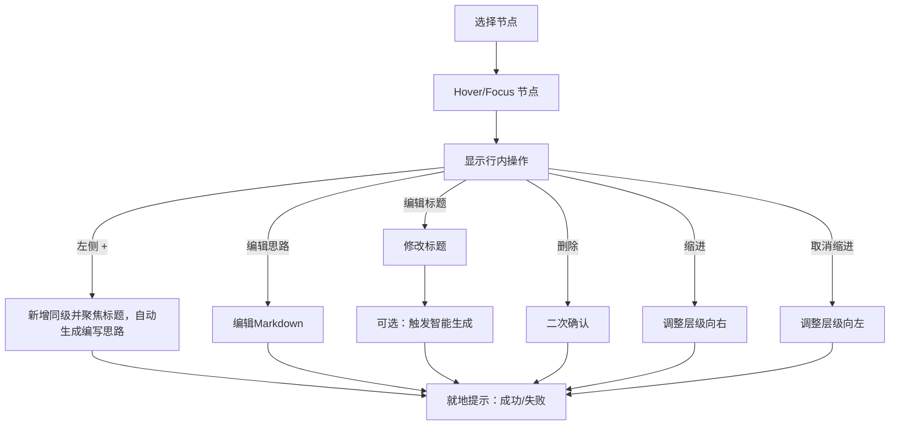

# OutlineEditor 组件前端需求文档

## 功能说明

为报告大纲提供所见即得的结构化编辑体验：用户在左侧浏览大纲，右侧编辑当前节点的标题与"编写思路"，支持同级/子级新增、删除与字段标签管理，并在需要时触发智能生成以辅助撰写。

### 快捷键操作功能

- **智能提示**：hover标题时显示快捷键操作指南，帮助用户快速了解可用操作
- **快速新增**：Enter键快速新增同级标题，提高编辑效率
- **层级调整**：Tab/Shift+Tab进行节点层级的缩进调整
- **快速导航**：方向键在节点间快速移动并进入编辑状态
- **多语言支持**：快捷键提示支持国际化，适应不同语言环境

## 页面布局

| 区域         | 展示内容                                     | 默认状态         | 可执行操作                                 |
| ------------ | -------------------------------------------- | ---------------- | ------------------------------------------ |
| 大纲树       | 层级结构、各节点标题、编写思路摘要           | 展开当前节点     | 选择节点、展开/折叠、定位当前编辑          |
| 节点行内操作 | 悬浮/聚焦时出现的编辑、删除、同级“+”入口     | 默认隐藏         | 悬浮标题左侧“+”新增同级；编辑/删除当前节点 |
| 节点编辑区   | 标题输入、编写思路编辑（Markdown）、字段标签 | 根据选中节点展示 | 编辑标题/思路、添加/删除字段               |

## 操作流程

| 步骤             | 用户操作                | 页面反馈                                               |
| ---------------- | ----------------------- | ------------------------------------------------------ |
| 选择节点         | 点击大纲树节点          | 编辑区载入该节点内容                                   |
| 显示操作         | 悬浮或聚焦节点标题/思路 | 行内出现“编辑/删除/左侧+（同级）”                      |
| 新增同级         | 点击标题左侧"+"         | 自动插入同级节点并聚焦标题输入，保存后自动生成编写思路 |
| 编辑标题         | 行内修改标题            | 显示未保存标记或就地提示                               |
| 智能生成（可选） | 编辑后触发生成          | 就地显示生成中/完成/失败并可采纳                       |
| 编辑编写思路     | Markdown编辑            | 显示未保存标记或就地提示                               |
| 删除节点         | 点击"删除"并确认        | 删除节点；就地提示结果                                 |
| 缩进节点         | 点击"缩进"按钮          | 节点向右移动一级；就地提示结果                         |
| 取消缩进节点     | 点击"取消缩进"按钮      | 节点向左移动一级；就地提示结果                         |

## 数据信息

### 展示类数据

| 数据项       | 显示位置      | 刷新规则              | 备注                |
| ------------ | ------------- | --------------------- | ------------------- |
| 节点标题     | 大纲树/编辑区 | 选择/编辑后刷新       | 支持行内编辑        |
| 编写思路摘要 | 大纲树节点行  | 展开节点或悬停显示    | 查看全文在编辑区    |
| 字段标签     | 编辑区字段区  | 编辑变更后刷新        | 标签可删除/新增     |
| 变更提示     | 节点行/编辑区 | 变更时出现/保存后消失 | 未保存标记/就地提示 |
| 生成状态     | 编辑区        | 生成进行/完成/失败    | 可取消（如提供）    |

### 用户输入数据

| 输入区域 | 字段           | 约束/校验                                 |
| -------- | -------------- | ----------------------------------------- |
| 标题编辑 | 标题文本       | 必填；建议≤200字符；空值禁用保存          |
| 思路编辑 | Markdown 内容  | 建议≤5000字符；支持清空并保存为空         |
| 字段标签 | 标签列表       | 输入空格添加；标签名称建议≤50字符；可删除 |
| 操作选择 | 新增/删除/保存 | 删除需二次确认；无变更时保存禁用          |

## 交互反馈

### 状态与提示

| 场景       | 反馈类型      | 展示位置      | 描述                       |
| ---------- | ------------- | ------------- | -------------------------- |
| 未保存变更 | 徽标/就地提示 | 节点行/编辑区 | 显示未保存标记或提示       |
| 保存进行中 | 进度提示      | 编辑区        | 展示“保存中”，避免重复保存 |
| 保存成功   | 成功提示      | 编辑区        | 显示“已保存”及时间点       |
| 保存失败   | 错误提示+重试 | 编辑区        | 展示失败原因与重试入口     |
| 智能生成中 | 加载提示      | 编辑区        | 显示生成进度与“暂停生成”入口 |
| 生成暂停   | 状态恢复提示  | 编辑区        | 取消“生成中”状态，不记错误 |
| 生成失败   | 错误卡片      | 编辑区        | 提供重试与保留原内容       |
| 删除节点   | 确认弹窗      | 中心/节点层   | 二次确认后执行删除         |

### 交互规则

| 条件               | 页面表现             | 目的             |
| ------------------ | -------------------- | ---------------- |
| 标题为空           | 保存按钮置灰         | 避免提交空标题   |
| 无改动             | 保存按钮置灰         | 避免无效保存     |
| 删除操作           | 弹窗确认             | 防止误删         |
| 同级新增           | 自动带入序号         | 降低手动录入成本 |
| 切换节点且有未保存 | 提示保存或保留编辑态 | 避免内容丢失     |
| 智能生成结果       | 允许采纳或保持原样   | 保持用户可控     |

## 快捷键操作需求

### 快捷键提示功能

| 触发条件     | 展示内容                          | 显示时机            | 隐藏条件            |
| ------------ | --------------------------------- | ------------------- | ------------------- |
| 鼠标悬浮标题 | 完整快捷键操作指南                | 悬浮0.5秒后显示     | 鼠标离开0.1秒后隐藏 |
| 提示内容     | Enter/Tab/Shift+Tab/↑/↓键功能说明 | 使用kbd标签清晰展示 | 支持多语言切换      |

### 快捷键操作功能

#### 标题编辑快捷键

| 快捷键      | 使用场景       | 功能描述       | 用户反馈                           |
| ----------- | -------------- | -------------- | ---------------------------------- |
| Enter       | 标题编辑模式下 | 保存编辑       | 保存当前标题，退出编辑模式         |
| Shift+Enter | 标题编辑模式下 | 保存并新增同级 | 保存当前编辑，创建新节点并进入编辑 |
| Tab         | 标题编辑模式下 | 当前标题降一级 | 节点向右缩进，层级数字更新         |
| Shift+Tab   | 标题编辑模式下 | 当前标题升一级 | 节点向左缩进，层级数字更新         |
| ↓           | 标题编辑模式下 | 修改下一标题   | 保存当前编辑，焦点移至下一节点     |
| ↑           | 标题编辑模式下 | 修改上一标题   | 保存当前编辑，焦点移至上一节点     |
| Esc         | 标题编辑模式下 | 取消编辑       | 恢复原内容，返回查看模式           |

#### 编写思路编辑快捷键

| 快捷键 | 使用场景       | 功能描述     | 用户反馈                 |
| ------ | -------------- | ------------ | ------------------------ |
| Enter  | 编写思路编辑时 | 保存编写思路 | 立即保存当前内容到服务器 |
| Esc    | 编写思路编辑时 | 取消编辑     | 恢复原内容，编辑器失焦   |

### 快捷键约束条件

| 约束类型 | 具体限制                | 处理方式                               |
| -------- | ----------------------- | -------------------------------------- |
| 层级限制 | Tab受最大层级限制       | 达到最大层级时Tab键无效果              |
| 层级限制 | Shift+Tab受最小层级限制 | 达到最小层级时Shift+Tab键无效果        |
| 导航边界 | 方向键受节点范围限制    | 到达首/末节点时方向键无效果            |
| 编辑状态 | 快捷键仅在编辑模式生效  | 非编辑模式下无焦点状态，不触发键盘事件 |

## 检查要点

- [ ] 功能说明清楚
- [ ] 界面布局明确
- [ ] 操作流程完整
- [ ] 数据要求具体
- [ ] 快捷键功能完整
- [ ] 提示交互清晰
- [ ] 可暂停智能生成的入口与反馈

## 相关文档

- 上层模块：../requirement.md
- AI 对话核心流程：../../../../packages/gel-ui/docs/biz/ai-chat/chat-flow-core-design.md
- AI 对话技术设计：../../../../packages/gel-ui/docs/biz/ai-chat/chat-flow-technical-design.md
