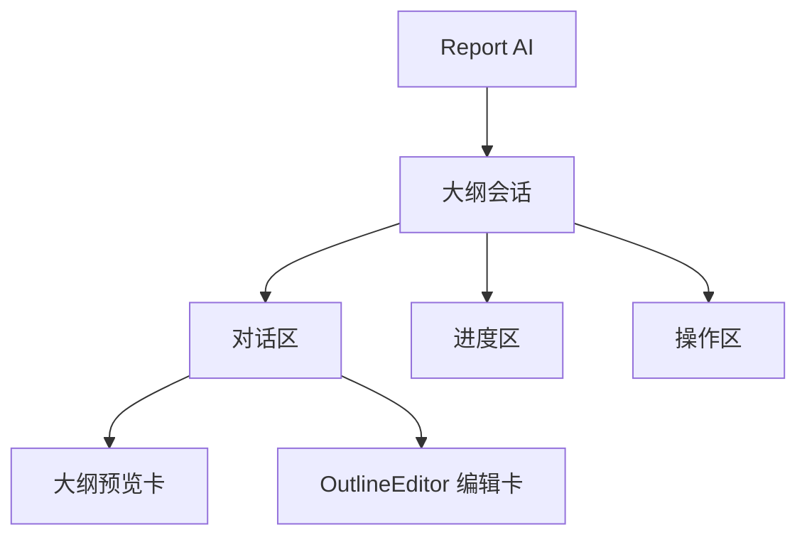
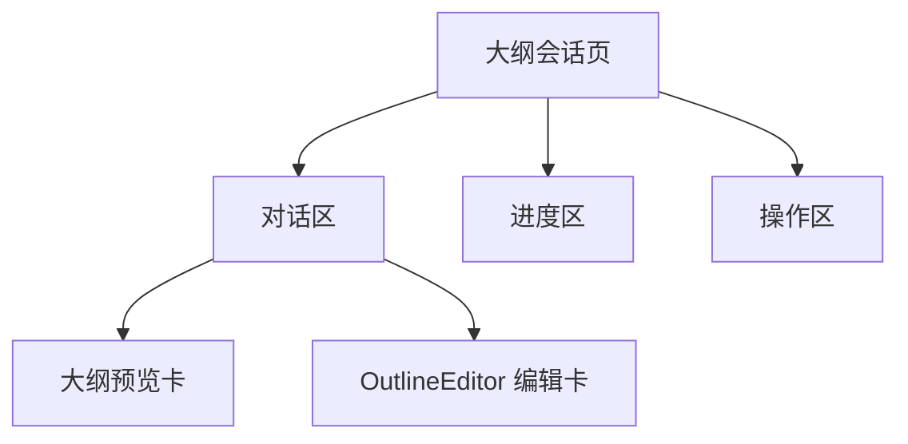
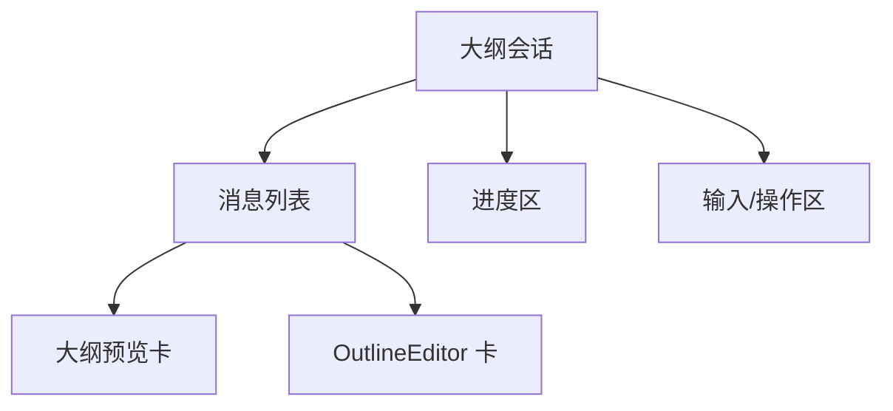
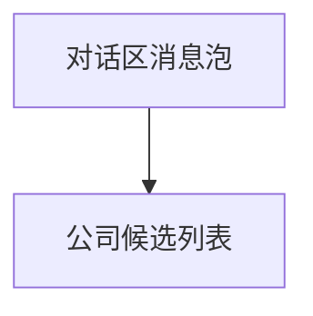
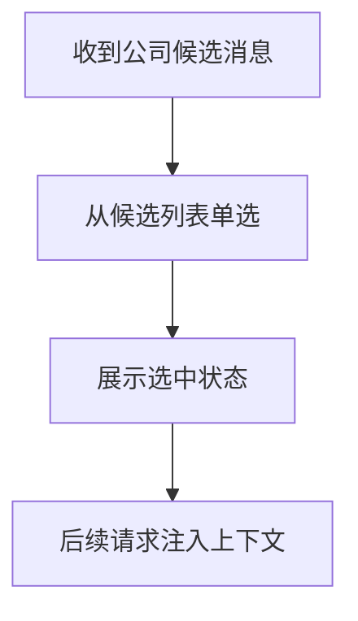

# 大纲会话模块前端设计文档（布局与功能）

## 🧭 设计概览

- 功能范围：与 AI 协作完成大纲的生成、预览、编辑与确认；展示任务进度、文件解析状态，并在确认后进入全文生成。
- 边界：不含样式与技术细节；聚焦布局、功能与交互流程。
- 目标用户/场景：报告创作者、分析师、研究人员在报告开篇阶段快速搭建与修订大纲结构。
- 关键用例：生成并预览大纲；进入编辑修改标题与“编写思路”；查看进度与解析状态；确认后开始“生成全文”。

## 🗺 信息架构与导航



- 入口：从报告创建或对话页进入“大纲会话”；生成成功的消息卡内可切换“编辑”。
- 返回：回到对话主视图，保留当前大纲与文件上下文。
- 导航规则：在对话区的卡片内切换“预览/编辑”；进度区与对话区状态联动；“生成全文”仅在确认后于操作区启用。
- 输入来源：用户在入口页完成需求输入与文件上传，本页面读取传入的上下文。

## 🧱 页面蓝图（大纲会话页）

- 目标与完成标准：完成大纲生成→预览→编辑→确认，并保证状态可见、路径可达、返回可预期。



| 区域   | 职责                 | 显示数据                            | 允许操作            | 条件/可见性                                             |
| ------ | -------------------- | ----------------------------------- | ------------------- | ------------------------------------------------------- |
| 对话区 | 展示历史消息与大纲卡 | 结构化大纲、思路摘要、文件解析状态  | 展开/折叠、进入编辑 | 常显；最后一条 agent 消息显示编辑模式，其余显示预览模式 |
| 进度区 | 展示四步进度         | 分析问题/文件解析/深度思考/生成大纲 | 查看提示与当前步骤  | 常显                                                    |
| 操作区 | 关键动作             | 返回/重新生成/生成全文              | 点击触发            | "生成全文"确认后启用                                    |

- 状态与反馈：
  - 加载：卡片与进度区骨架/进行中提示
  - 空：无大纲展示引导；当入口上下文缺失时提示返回入口页
  - 错误：解析/生成失败原位提示并可重试，不阻断主流程
  - 提交：生成/确认/导出原位显示进行中与结果反馈，避免重复触发

## 🔄 交互流程与状态

```mermaid
flowchart TD
  A[入口页输入需求/上传文件] --> B[跳转至大纲会话]
  B --> C[展示文件解析状态]
  C --> D[AI 生成结构化大纲]
  D --> E[预览大纲卡]
  E -->|需要修改| F[进入编辑卡 OutlineEditor]
  E -->|无需修改| H[确认大纲]
  F --> G[保存并返回预览]
  G --> H[确认大纲]
  H --> I[操作区显示"生成全文"]
  Note1[注：只有最后一条 agent 消息显示编辑模式]
  Note2[其余历史消息显示预览模式]
  E -.-> Note1
  E -.-> Note2
```

| 触发条件       | 系统行为                                      | 用户反馈               | 可撤销     | 备注                        |
| -------------- | --------------------------------------------- | ---------------------- | ---------- | --------------------------- |
| 文件解析失败   | 保持失败状态，不中断生成                      | 对话区错误提示，可重试 | 否         | 降级为无文件生成            |
| 预览→编辑      | 切换为编辑卡                                  | 编辑区载入节点内容     | 是（取消） | 维持消息顺序                |
| 编辑未保存离开 | 提示保存或保留                                | 原位提示               | 是         | 避免内容丢失                |
| 编辑器保存     | 调用 reportChapter/batchUpdateChapterTree API | 显示保存状态           | 否         | 全量保存，支持自动/手动保存 |
| 确认大纲       | 设置确认标记                                  | 操作区启用"生成全文"   | 否         | 依据需求文档                |

## 大纲消息显示模式

### 编辑模式 vs 预览模式

为了优化用户体验，大纲消息根据其在对话中的位置采用不同的显示模式：

- **编辑模式（OutlineEditor）**：只有最后一条包含 outline 数据的 agent 消息显示编辑模式，允许用户修改大纲内容
- **预览模式（OutlinePreview）**：历史消息中的 outline 数据以只读预览模式显示，用户可查看但不可编辑

### 实现逻辑

消息解析器 `createRPOutlineMessageParser` 通过 `getIsLastMessage` 函数判断当前消息是否为最后一条：

- 如果是最后一条且包含 outline 数据：使用 `createOutlineEditorMessage` 创建编辑模式消息
- 如果不是最后一条但包含 outline 数据：使用 `createOutlinePreviewMessage` 创建预览模式消息

这样确保用户始终在最新的大纲上进行编辑，避免误操作历史版本。

## 数据与本地状态（技术无关）

- 显示字段：大纲树（层级/标题/思路摘要）、进度（四步状态）、文件解析（名称/类型/状态/进度）、动作（返回/重生/生成全文）
- 数据来源：大纲与思路来自 AI 生成与用户编辑；文件状态随上传与解析进度变化
- 刷新与缓存：进入编辑卡刷新节点；保存后同步回预览卡；进度与解析变化即时联动
- 并发与重复提交：生成/确认禁重复提交，失败可重试；解析失败不阻断主流程

## 🧩 组件分解与复用



- 边界：
  - 预览卡：结构展示与只读交互
  - 编辑卡（引用组件）：参见 ./OutlineEditor/design.md
  - 进度区：步骤状态展示
  - 操作区：承载关键动作按钮

## 公司选择（布局与功能）

- 位置与目标：通过对话区消息泡呈现公司候选，便于在生成/编辑前就近绑定企业上下文；仅支持从候选中单选。
- 布局结构



| 区域         | 职责           | 显示数据     | 允许操作       | 条件/可见性              |
| ------------ | -------------- | ------------ | -------------- | ------------------------ |
| 公司选择入口 | 绑定企业上下文 | 当前公司名称 | 从候选列表单选 | 常显；选中后显示已选状态 |

- 交互流程



- 交互规则表

| 触发条件     | 系统行为       | 用户反馈                 | 可撤销         | 备注                 |
| ------------ | -------------- | ------------------------ | -------------- | -------------------- |
| 收到候选消息 | 渲染单选列表   | 消息泡展示候选项         | 否             | 根据后端返回顺序显示 |
| 选择公司     | 设为当前上下文 | 显示选中状态并禁用其他项 | 是（重新选择） | 与后续生成联动       |

- 数据字段（功能性）
  - corpId（必填，唯一）
  - corpName（必填，显示用）
  - industry/location（可选）

## 🚫 非目标与不包含

- 不含样式规范（配色、字体、间距等）
- 不定义 API 契约（另见 API 文档）

## ✅ 检查清单（布局与功能）

- [ ] 页面蓝图与区域职责明确
- [ ] 端到端流程可追踪
- [ ] 加载/空/错误/提交状态可见
- [ ] 入口/返回路径清晰
- [ ] 禁用/确认/撤销策略已定义
- [ ] 组件边界清晰并可复用

## 相关文档

- 需求文档：./requirement.md
- 编辑器设计：./OutlineEditor/design.md
- AI 对话核心：../../../../packages/gel-ui/docs/biz/ai-chat/chat-flow-core-design.md
- AI 技术设计：../../../../packages/gel-ui/docs/biz/ai-chat/chat-flow-technical-design.md
