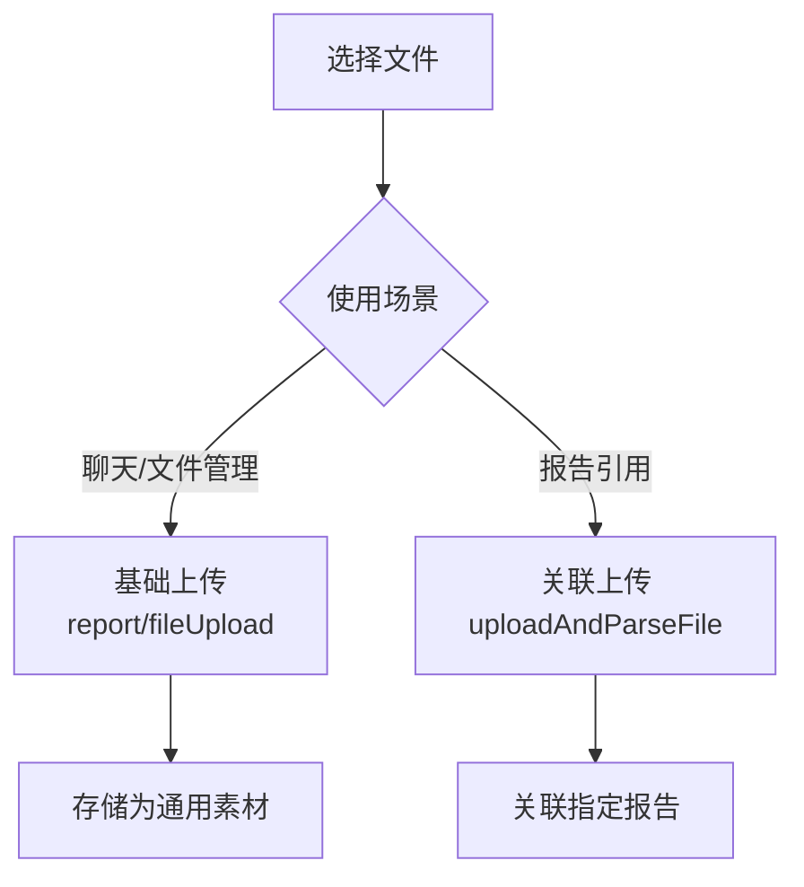
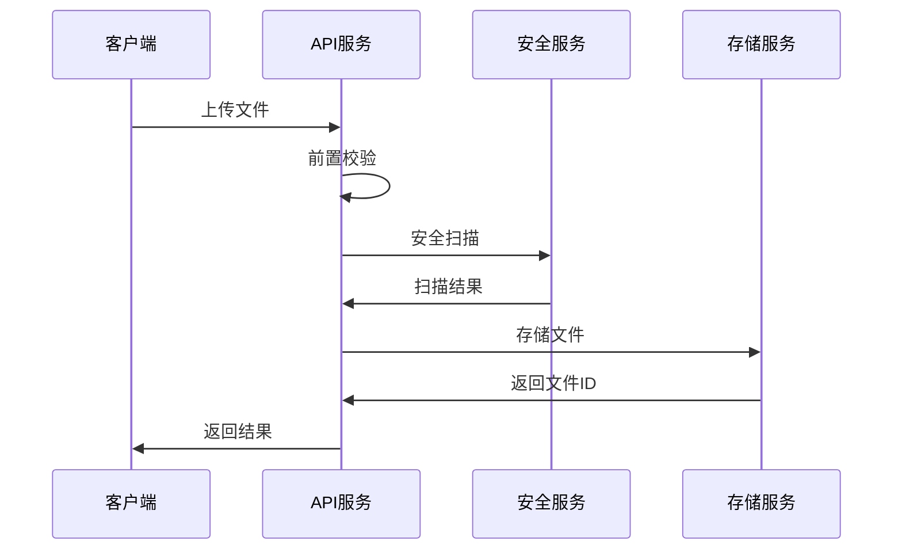
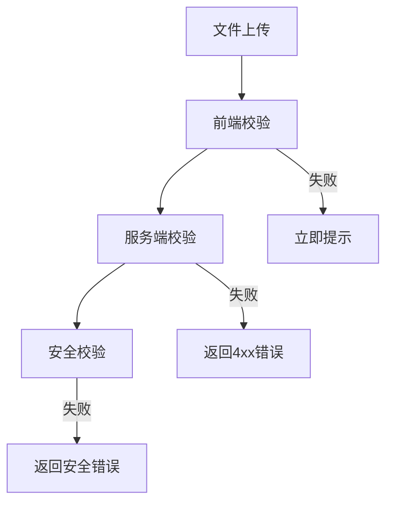

# 文件上传 API 文档

## 概述

报告 AI 系统的文件上传 API 接口，提供素材文件的上传、查询和删除功能，支持基础上传和报告关联上传两种模式。

## 核心接口

| 接口名 | 方法 | 路径 | 用途 |
| ------ | ---- | ---- | ---- |
| 基础上传 | POST | /api/report/fileUpload | 聊天发送器、文件管理场景 |
| 关联上传 | POST | /api/report/uploadAndParseFile | 报告引用资料、需关联报告场景 |
| 批量上传 | POST | /api/report/fileUpload/batch | 多文件批量处理 |
| 文件查询 | GET | /api/report/file/{fileId} | 获取文件信息 |
| 文件删除 | DELETE | /api/report/file/{fileId} | 删除指定文件 |

## 接口规范

### 基础上传 vs 关联上传

### 请求参数

| 场景 | 参数 | 类型 | 必填 | 说明 |
| ---- | ---- | ---- | ---- | ---- |
| 通用 | file | File | ✅ | 上传的文件对象 |
| 关联上传 | groupId | string | ✅ | 报告ID，用于文件关联 |

## 上传流程

## 响应规范

### 成功响应

| 字段 | 类型 | 说明 |
| ---- | ---- | ---- |
| Code | number | 状态码，200表示成功 |
| Message | string | 响应消息 |
| Data.fileId | string | 文件唯一标识 |
| Data.fileName | string | 文件名称 |

### 查询参数

| 参数 | 类型 | 必填 | 说明 |
| ---- | ---- | ---- | ---- |
| page | number | 否 | 页码，默认1 |
| limit | number | 否 | 每页数量，默认20 |
| type | string | 否 | 文件类型过滤 |

## 校验机制

### 三层校验体系

| 校验层级 | 校验内容 | 校验位置 | 处理方式 |
| ---- | ---- | ---- | ---- |
| 前端校验 | 大小、格式 | 客户端 | 立即阻止上传 |
| 服务端校验 | MIME类型、完整性 | API服务 | 返回4xx错误 |
| 安全校验 | 病毒扫描、恶意代码 | 安全服务 | 返回安全错误码 |

## 错误处理

### 通用错误码

| 错误码 | 类型 | 用户提示 |
| ---- | ---- | ---- |
| 200 | 成功 | "文件上传成功" |
| 400 | 请求错误 | "请求格式错误，请重试" |
| 413 | 文件过大 | "文件大小超过50MB限制" |
| 415 | 格式不支持 | "请上传PDF、Word、Excel等格式文件" |
| 500 | 服务器错误 | "服务器异常，请稍后重试" |

### 安全校验错误码

| 错误码 | 安全问题 | 用户提示 |
| ---- | ---- | ---- |
| 4001 | 病毒感染 | "文件存在安全风险，请检查后重新上传" |
| 4002 | 恶意脚本 | "文件包含不安全内容，禁止上传" |
| 4003 | 文件损坏 | "文件已损坏或格式异常，请重新选择" |
| 4004 | 类型伪装 | "文件类型验证失败，请确认文件格式" |

## 文件约束

| 约束项 | 限制 | 校验方式 |
| ---- | ---- | ---- |
| 文件大小 | ≤50MB | 前端+服务端双重校验 |
| 支持格式 | PDF/DOC/DOCX/TXT/JPG/PNG/XLS/XLSX | MIME类型+文件头校验 |
| 并发上传 | ≤5个文件 | 前端队列控制 |
| 超时时间 | 30秒 | 网络超时配置 |
| 安全扫描 | 必须通过 | 第三方安全服务 |

## 关联引用

- @see ../design.md - 交互设计和开发规范
