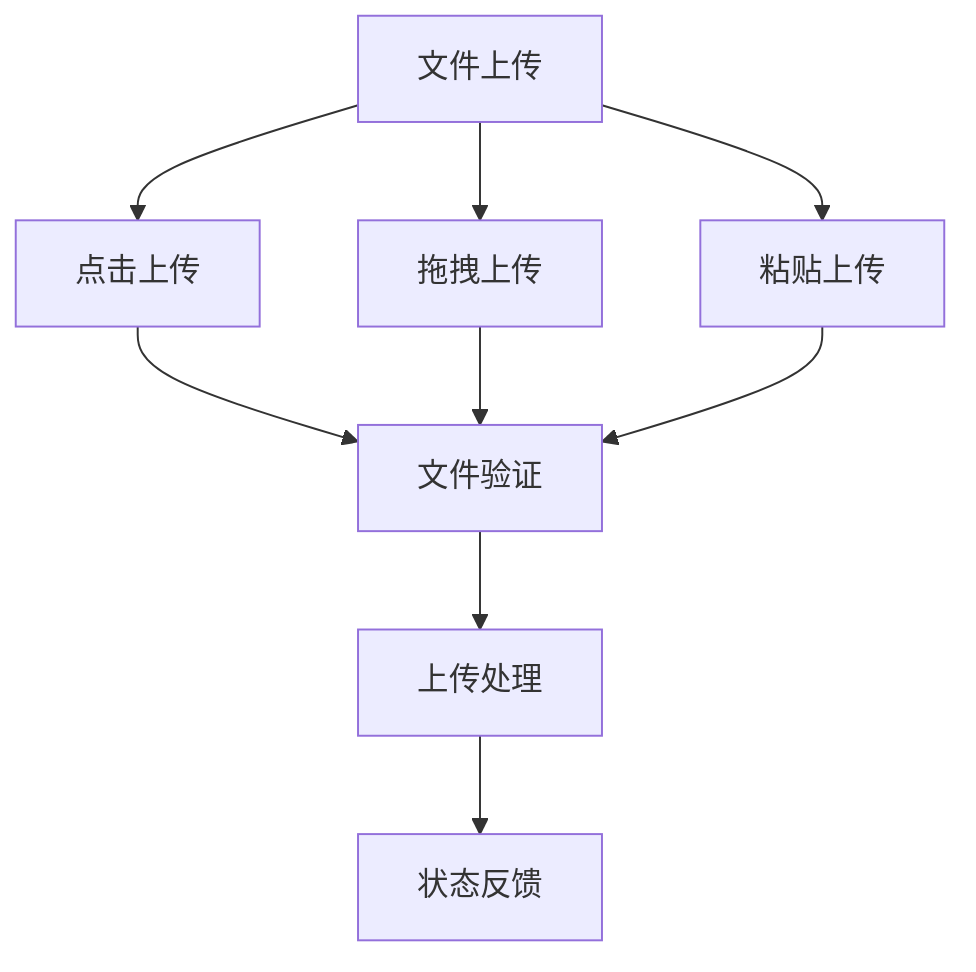
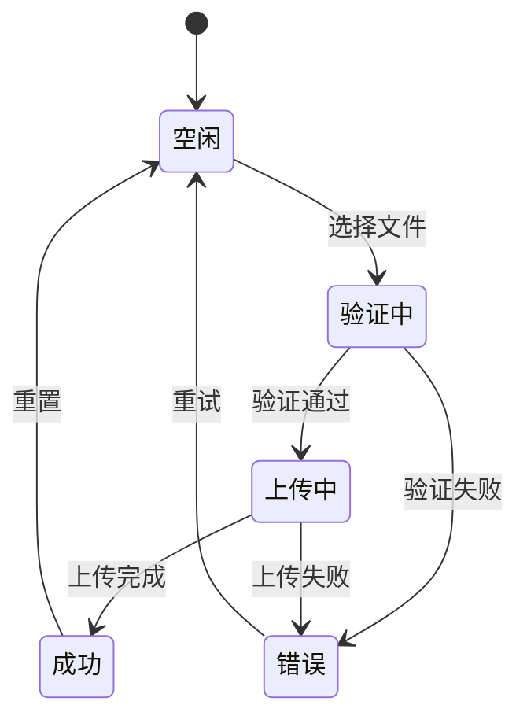
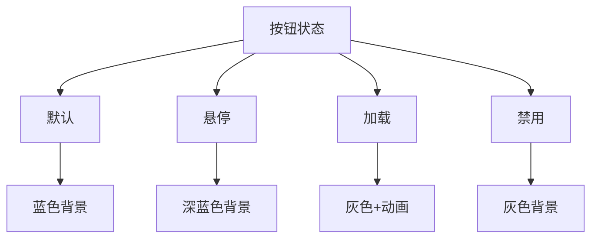
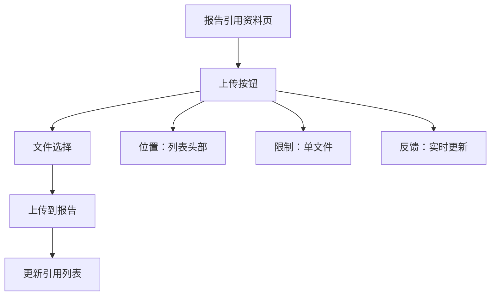
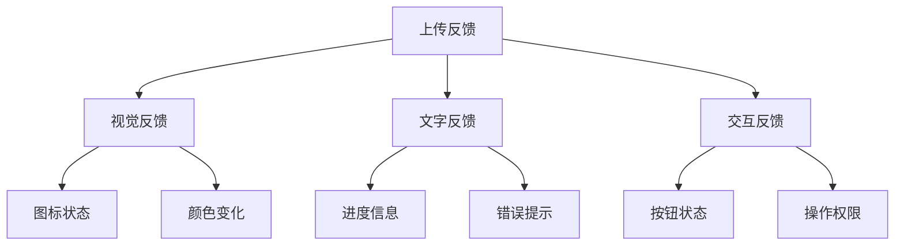

# 文件上传交互设计

## 概述

定义文件上传功能的交互规范，包括上传方式、状态流转、视觉反馈和无障碍设计，确保用户体验的一致性和可用性。

## 交互方式

### 三种上传方式



| 方式 | 适用场景 | 交互特点 |
| ---- | ---- | ---- |
| 点击上传 | 所有设备 | 传统方式，易于理解 |
| 拖拽上传 | 桌面端 | 高效，符合用户习惯 |
| 粘贴上传 | 内容编辑 | 快捷，提升效率 |

## 状态流转

### 上传状态机



### 状态说明

| 状态 | 触发条件 | 用户操作 |
| ---- | ---- | ---- |
| 空闲 | 初始状态、操作完成 | 选择文件 |
| 验证中 | 文件选中 | 等待验证结果 |
| 上传中 | 验证通过 | 可取消上传 |
| 成功 | 上传完成 | 可继续上传 |
| 错误 | 验证失败或上传失败 | 可重试上传 |

## 视觉设计规范

### 按钮视觉状态



| 状态 | 颜色 | 交互 | 说明 |
| ---- | ---- | ---- | ---- |
| 默认 | 蓝色主色 | 可点击 | 正常可用状态 |
| 悬停 | 深蓝色 | 鼠标悬停 | 提示可交互 |
| 加载 | 灰色+动画 | 不可点击 | 上传进行中 |
| 禁用 | 灰色 | 不可操作 | 不可用状态 |

### 拖拽区域视觉

| 状态 | 视觉效果 | 说明 |
| ---- | ---- | ---- |
| 默认 | 虚线边框 | 等待文件拖入 |
| 悬停 | 蓝色边框 | 文件悬停提示 |
| 激活 | 绿色边框 | 准备接收文件 |
| 错误 | 红色边框 | 验证失败反馈 |

## 组件接口设计

### UploadFileBtn 核心属性

| 属性 | 类型 | 必填 | 说明 |
| ---- | ---- | ---- | ---- |
| label | string | ✅ | 按钮显示文字 |
| onUploadSuccess | function | ✅ | 上传成功回调 |
| disabled | boolean | 否 | 禁用状态 |
| showTooltip | boolean | 否 | 是否显示提示 |
| apiEndpoint | string | 否 | 自定义API端点 |
| extraFormData | object | 否 | 额外表单数据 |

### 事件回调

| 回调函数 | 触发时机 | 参数 |
| ---- | ---- | ---- |
| onUploadStart | 开始上传 | fileName, fileType |
| onUploadProgress | 上传进度更新 | fileId, progress |
| onUploadSuccess | 上传成功 | fileInfo |
| onUploadError | 上传失败 | error |
| onValidationError | 前端校验失败 | validation |

## 开发最佳实践

### useFileUploadService 配置

```typescript
const { uploadFile, isUploading } = useFileUploadService({
  onUploadSuccess: (fileInfo) => console.log('上传成功', fileInfo),
  onUploadError: (error) => console.error('上传失败', error),
  apiEndpoint: 'report/fileUpload', // 或 'report/uploadAndParseFile'
  extraFormData: { groupId: reportId } // 报告关联时使用
});
```

### ✅ 推荐做法

- 配置必要的回调函数：`onUploadSuccess`、`onUploadError`
- 使用 `isUploading` 控制UI交互状态
- 基于错误码提供精准用户提示
- 复用 `useFileUploadService` 统一逻辑

### ❌ 避免做法

- 缺少前端预校验直接上传
- 使用通用错误提示代替具体信息
- 重复实现上传逻辑而不复用服务

## 场景化设计

### ReferenceView 场景



### 响应式适配

| 设备类型 | 断点 | 布局特点 | 交互优化 |
| ---- | ---- | ---- | ---- |
| 移动端 | <768px | 按钮全宽 | 触摸友好 |
| 平板端 | 768-1024px | 自适应布局 | 支持拖拽 |
| 桌面端 | >1024px | 标准布局 | 键盘支持 |

## 反馈机制设计

### 多维度反馈



| 状态 | 视觉反馈 | 文字提示 | 交互状态 |
| ---- | ---- | ---- | ---- |
| 成功 | 绿色✓ | "上传成功" | 可继续上传 |
| 失败 | 红色✗ | 具体错误信息 | 可重试 |
| 上传中 | 蓝色进度条 | "上传中 X%" | 可取消 |

## 无障碍设计

| 功能 | 实现方式 | 用户价值 |
| ---- | ---- | ---- |
| 键盘导航 | Tab/Enter/Space | 支持键盘操作 |
| 屏幕阅读器 | aria-label/role | 视障用户可理解 |
| 状态通知 | aria-live | 实时状态播报 |

## 关联引用

- @see ../api.md - API接口规范
- @see ../requirements.md - 功能需求
