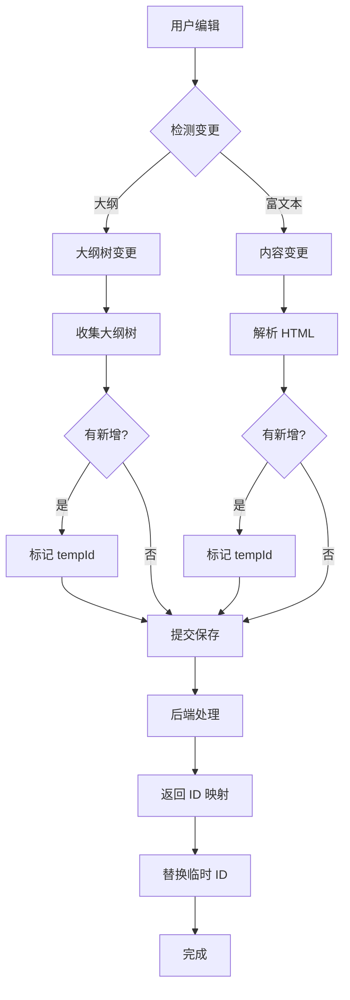
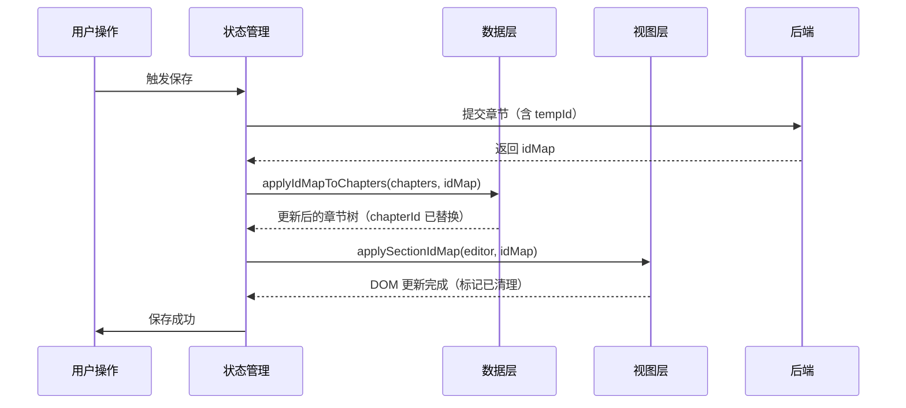
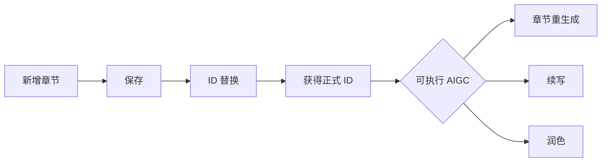

# 章节保存流程设计

## 概览

报告系统支持两种章节编辑方式，共享同一套保存机制。

## 编辑方式对比

| 维度     | 大纲编辑器           | 富文本编辑器         |
| -------- | -------------------- | -------------------- |
| 编辑方式 | 手动点击、输入、拖拽 | 富文本内容编辑       |
| 数据来源 | 大纲树状态           | HTML 解析            |
| 触发方式 | 自动保存（去抖）     | 自动保存（哈希判定） |
| 保存范围 | 完整大纲树           | 完整文档             |
| 新增章节 | 手动创建             | 自动检测             |

## 保存流程



## 新增章节处理

### 临时标识

**数据结构（章节树）：**

| 字段          | 类型      | 说明                                     |
| ------------- | --------- | ---------------------------------------- |
| `tempId`      | `string`  | 格式：`new-chapter-{timestamp}-{serial}` |
| `isTemporary` | `boolean` | 标记为临时章节                           |

**DOM 标记（编辑器）：**

| 章节类型 | 属性                   | 值          | 说明          |
| -------- | ---------------------- | ----------- | ------------- |
| 临时章节 | `data-temp-chapter-id` | `tempId`    | 临时章节 ID   |
|          | `data-temp-chapter`    | `"true"`    | 临时章节标记  |
| 持久章节 | `data-chapter-id`      | `chapterId` | 持久化章节 ID |

**一致性保证：**

- DOM 属性与数据结构字段一一对应
- 临时章节使用 `data-temp-chapter-id`，持久化章节使用 `data-chapter-id`
- 两个字段互斥，不混用
- `ensureSectionIds` 生成临时 ID 时写入 `data-temp-chapter-id`
- `applySectionIdMap` 替换 ID 时从临时字段移动到持久化字段
- `parseDocumentChapterTree` 通过检查 `data-temp-chapter-id` 识别临时章节

### 创建方式

**大纲编辑器：**

- 点击"+"按钮或快捷键
- 调用 `createChapter()` 生成带 tempId 的章节

**富文本编辑器：**

- 插入新标题（h1-h6）
- 系统自动检测未绑定 `data-chapter-id` 的标题

## 保存 API

### 请求

```typescript
interface SaveRequest {
  reportId: string;
  chapters: RPChapterSavePayload[];
}

interface RPChapterSavePayload {
  chapterId?: string; // 现有章节 ID
  tempId?: string; // 临时 ID（新增章节）
  isTemporary?: boolean; // 是否临时
  title: string;
  content?: string; // 富文本提供
  writingThought?: string; // 大纲提供
  keywords?: string[];
  children?: RPChapterSavePayload[];
}
```

### 响应

```typescript
interface SaveResponse {
  success: boolean;
  idMap: Record<string, string>; // tempId → chapterId
}
```

**说明：**

- `idMap` 的键是 `tempId`（如 `"new-chapter-123"`）
- `idMap` 的值是后端生成的真实 `chapterId`（如 `"789"`）
- 前端使用 `applyIdMapToChapters()` 函数处理映射

## ID 替换与后续操作

保存成功后，将所有临时 ID 替换为正式 ID，这是后续章节级 AIGC 操作的前提。

### 替换实现

**大纲编辑器：**

```typescript
// 参考实现：src/components/outline/OutlineTreeEditor/hooks/useOutlinePersistence.ts
const updatedTree = applyIdMapToChapters(outlineTree, response.idMapping);
setOutlineTree(updatedTree);
```

**富文本编辑器（数据层 + 视图层）：**

```typescript
// 参考实现：src/store/reportContentStore/hooks/useReportContentPersistence.ts

// 1. 更新数据层（章节树）
const updatedChapters = applyIdMapToChapters(chapters, response.idMapping);
updateCanonical(updatedChapters);

// 2. 更新视图层（编辑器 DOM）
editorRef.current?.applyIdMap(response.idMapping);

// 3. 同步到编辑器（可选，如果需要重新渲染）
triggerHydration(updatedChapters);
```

**核心工具函数：**

| 函数                     | 位置                                       | 职责                                                                  |
| ------------------------ | ------------------------------------------ | --------------------------------------------------------------------- |
| `applyIdMapToChapters()` | `src/domain/chapter/idMapping.ts`          | 数据层 ID 映射，递归处理章节树，清理 tempId 和 isTemporary            |
| `applySectionIdMap()`    | `src/domain/reportEditor/chapterId/ops.ts` | 视图层 ID 映射，更新 DOM 中的 data-chapter-id，移除 data-temp-chapter |

**替换流程：**



### 为什么必须替换 ID

| 原因          | 说明                                                        |
| ------------- | ----------------------------------------------------------- |
| AIGC 操作依赖 | 章节重生成、续写等操作需要正式 `chapterId` 才能调用 AI 服务 |
| 数据一致性    | 后端数据库使用正式 ID，前端必须同步                         |
| 关联查询      | 章节引用、跳转、统计等功能依赖正式 ID                       |
| 避免冲突      | 临时 ID 仅在本地有效，不能用于跨会话操作                    |

### AIGC 操作前置条件



**操作限制：**

- 带 `tempId` 的章节**不能**触发章节级 AIGC 操作
- 必须等待保存成功并完成 ID 替换
- UI 应禁用或隐藏相关操作按钮

## 错误处理

| 错误类型 | 处理方式              |
| -------- | --------------------- |
| 网络错误 | 显示重试，保留临时 ID |
| 验证错误 | 显示错误信息          |
| ID 冲突  | 提示刷新页面          |

## 相关模块

| 模块                                                                      | 职责                                                  |
| ------------------------------------------------------------------------- | ----------------------------------------------------- |
| `src/domain/chapter/factory.ts`                                           | 章节创建与 tempId 生成                                |
| `src/domain/chapter/idMapping.ts`                                         | 数据层 ID 映射（applyIdMapToChapters）                |
| `src/domain/reportEditor/chapterId/ops.ts`                                | 视图层 ID 同步（ensureSectionIds, applySectionIdMap） |
| `src/domain/reportEditor/document/parse.ts`                               | HTML 解析（parseDocumentChapterTree）                 |
| `src/components/outline/OutlineTreeEditor/hooks/useOutlinePersistence.ts` | 大纲编辑器保存与 ID 替换                              |
| `src/store/reportContentStore/hooks/useReportContentPersistence.ts`       | 富文本编辑器保存与 ID 替换                            |
| `packages/gel-api/src/chat/report/`                                       | 保存 API                                              |
| `packages/gel-api/src/chat/types/report/detail.ts`                        | 类型定义（RPChapterSavePayload）                      |

## 相关文档

- [大纲编辑器](../RPOutline/OutlineEditor/README.md)
- [内容管理](../RPDetail/ContentManagement/README.md)
- [数据与状态](../RPDetail/ContentManagement/data-layer-guide.md)
