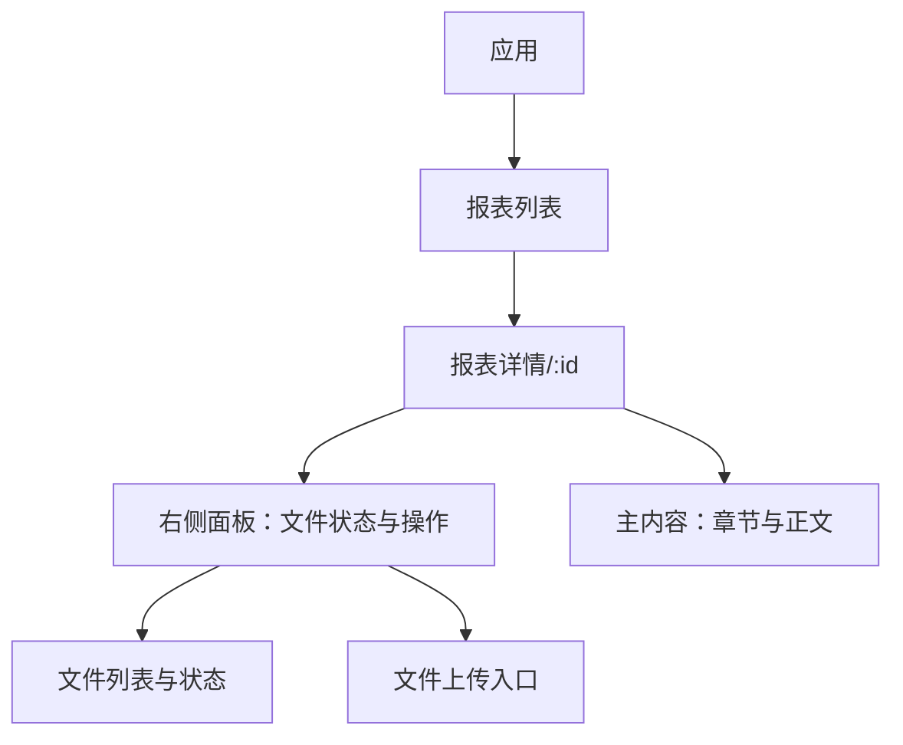
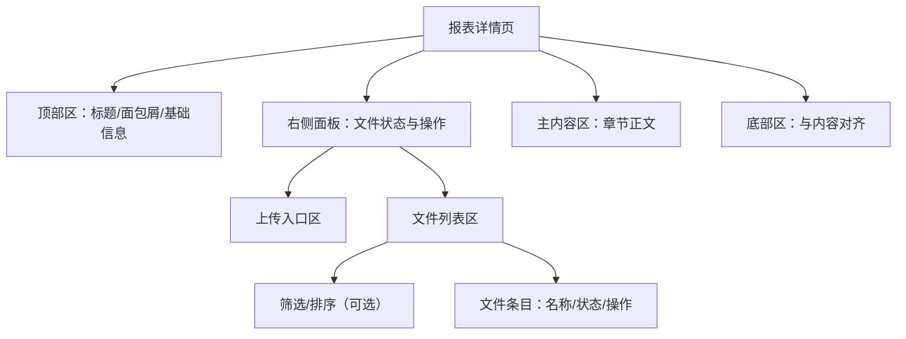
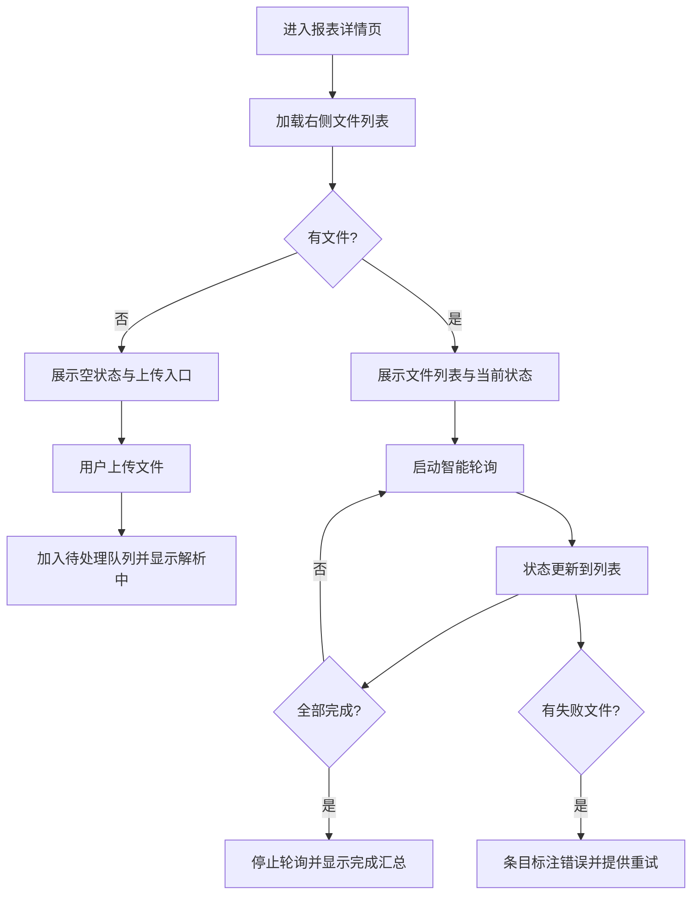
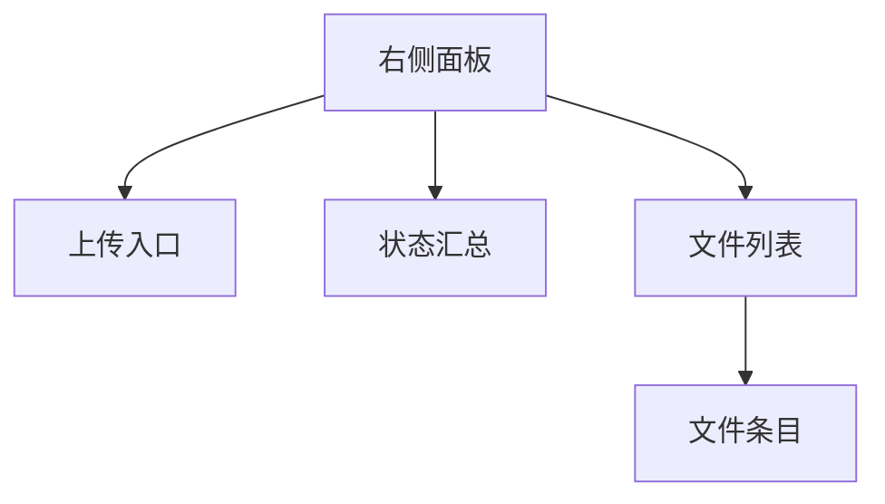

# 文件状态轮询与展示前端设计文档（布局与功能）

## 🧭 设计概览
- 功能范围与边界：在报表详情页的右侧面板中，跟踪并展示文件解析状态，支持上传、状态查看、错误提示与轮询控制。该模块仅描述前端布局与交互，不涉及后端协议与代码实现。
- 目标用户与场景：报表编辑与查看人员，需要了解财报文件的解析进度，在解析中避免误操作，在失败时获得可重试的引导。
- 关键用例：
  - 用户上传财报文件后，立即在列表中看到“解析中”状态。
  - 用户在右侧面板中查看所有文件的当前状态与进度。
  - 所有文件解析完成后，自动停止轮询并展示完成状态。
  - 解析失败的文件在列表中清晰标注，并提供可重试的入口。

## 🗺 信息架构与导航
- 信息架构（模块与页面关系）

- 路由与入口映射
  - 路由：`/report/:id` 展示报表详情页
  - 入口来源：报表列表项点击进入详情页；详情页右侧面板进入文件状态模块
  - 返回路径：从详情页通过面包屑返回列表；右侧面板内操作均在当前页完成，无独立路由

- 导航规则
  - 右侧面板在报表详情页固定可见；当无文件时展示“空状态”与上传入口
  - 面包屑：`首页 / 报表列表 / 报表详情`
  - 后退操作不打断当前轮询；离开详情页即终止轮询（由页面级逻辑处理）

## 🧱 页面蓝图（逐页）

### 报表详情页（聚焦右侧面板）
- 页面目标与完成标准：帮助用户管理并查看当前报表的文件解析状态；当全部解析完成，右侧面板状态整体切为“全部完成”。

- 布局结构图

- 区域职责表

| 区域 | 职责 | 显示数据 | 允许操作 | 条件/可见性 |
| ---- | ---- | -------- | -------- | ----------- |
| 顶部区 | 展示报表基本信息与导航 | 标题、面包屑 | 返回列表 | 始终可见 |
| 右侧面板 | 管理与展示文件状态 | 文件列表、状态汇总 | 上传、刷新、重试 | 始终可见 |
| 上传入口区 | 触发文件上传流程 | 上传按钮、说明文案 | 选择文件并上传 | 列表为空或用户需要新增文件时 |
| 文件列表区 | 展示每个文件的解析状态与可用操作 | 文件名、状态标签、错误提示 | 删除（解析中禁用）、重试（失败时） | 有文件时可见 |
| 主内容区 | 展示报表章节正文 | 章节标题与内容 | 章节内的编辑/浏览 | 始终可见 |
| 底部区 | 辅助信息或版权声明 | 文案 | 无 | 内容较长时随内容 |

- 状态与反馈
  - 加载：首次进入详情页/切换报表时，右侧面板整体显示加载占位
  - 空：无文件时，展示空状态与上传入口
  - 错误：列表或状态获取失败时，在右侧面板顶部统一提示；文件级错误在条目内展示
  - 提交中：上传/重试过程中，按钮进入“处理中”状态并禁用重复操作
  - 成功：解析完成的文件显示“已完成”状态；全部完成时面板汇总显示完成标识
  - 失败：失败的文件条目显示错误状态与重试入口
  - 禁用：解析中的文件禁用删除、编辑等破坏性操作

## 🔄 交互流程与状态

- 主要用户任务流程

- 关键对象状态机（文件条目）
  - 状态集合：未上传/已上传待解析/解析中/已完成/失败
  - 进入条件：上传完成→待解析；轮询反馈→解析中/已完成/失败
  - 退出条件：完成或失败后，条目保持最终状态且不再参与轮询
  - 可触发操作：删除（解析中禁用）、重试（失败时）、刷新（面板级）

- 交互规则表

| 触发条件 | 系统行为 | 用户反馈 | 可撤销 | 备注 |
| -------- | -------- | -------- | ------ | ---- |
| 进入详情页 | 拉取文件列表与状态 | 面板加载占位 | 否 | 页面级加载 |
| 上传文件 | 新增条目并标记待解析 | 条目显示解析中 | 否 | 支持批量上传 |
| 轮询更新 | 刷新条目状态 | 状态标签变化 | 否 | 智能轮询仅针对未完成 |
| 全部完成 | 停止轮询 | 面板显示完成汇总 | 否 | 自动停止 |
| 失败条目重试 | 重新加入待处理 | 条目回到解析中 | 否 | 重试失败时提示错误 |
| 删除文件 | 移除条目 | 列表更新 | 是 | 解析中禁用删除 |

## 🧮 数据与本地状态（技术无关）
- 显示字段清单
  - 列表：文件名、状态标签（解析中/已完成/失败）、可用操作（删除/重试）
  - 汇总：进行中数量、已完成数量、失败数量（可选）
- 数据来源与依赖
  - 远端：当前报表的文件与其解析状态（通过页面加载与周期性查询）
  - 本地缓存：待处理文件的最新状态、轮询开关与计数器
- 查询规则（筛选与排序，视需求）
  - 默认按上传时间或文件名排序；支持按状态筛选（全部/进行中/失败/完成）
- 刷新与缓存策略
  - 自动：进入详情页时加载；待处理文件存在时周期性刷新
  - 手动：用户触发刷新按钮可立即获取最新状态
  - 失效：离开详情页或全部完成时停止刷新
- 并发与重复提交处理
  - 上传与重试操作互斥处理，避免重复提交
  - 解析中条目禁用破坏性操作，避免并发引发不一致

## 🧩 组件分解与复用

- 职责边界
  - 右侧面板：协调上传、列表展示与刷新/轮询控制，仅暴露语义化回调与数据
  - 上传入口：触发上传流程与成功/失败回调
  - 状态汇总：展示聚合状态（进行中/完成/失败）
  - 文件列表：渲染条目、派发条目级事件（删除/重试）
  - 文件条目：展示单条文件的名称与状态，处理禁用与反馈

- 输入/输出（以功能语义描述）
  - 输入数据：文件集合、各文件当前状态、汇总统计
  - 输出事件：上传完成、重试请求、删除请求、手动刷新
  - 面板级：开始/停止轮询的语义化控制，不暴露实现细节

## 🌍 可访问性与国际化（可选）
- 键盘路径：上传按钮、刷新按钮、列表条目的重试/删除可通过键盘操作
- 文案长度：状态标签与错误提示需支持多语言与可变长度，避免布局破碎

## 🚫 非目标与不包含
- 不涉及视觉样式（配色、字体、间距等）
- 不定义后端接口细节与契约（另见 API 文档）

## 🔗 相关实现

### Hook实现
- [useFileStatusPolling Hook](../../../../src/hooks/useFileStatusPolling.ts) - 智能状态轮询实现
- [文件状态判断](../../../src/domain/file/fileStatus.ts) - 可变状态和完成状态判断

### 使用场景
- [文件管理页面](../specs/fileManagement/spec-design-v1.md) - 文件管理中的状态轮询
- [报表详情页](../../RPDetail/) - 右侧面板文件状态展示

## ✅ 检查清单（布局与功能）
- [ ] 所有页面均有蓝图与区域职责表
- [ ] 所有主要任务均有端到端流程
- [ ] 列表/上传的加载、空、错误状态明确
- [ ] 路由、入口与返回路径可追踪
- [ ] 筛选/排序/分页（如有）规则明确
- [ ] 禁用条件、确认/撤销策略已定义
- [ ] 组件拆分与复用边界清晰