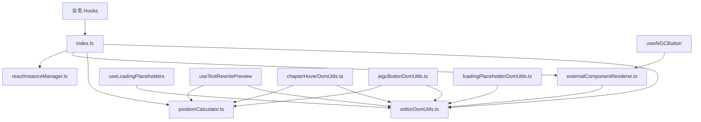

# 编辑器 DOM 工具集

提供统一的编辑器 DOM 操作和位置计算工具，消除重复代码，优化性能。

## 🎯 设计原则

1. **优先复用 domain 层**：优先使用 `@/domain/reportEditor` 中的工具方法
2. **分层清晰**：
   - domain 层：纯函数、常量、EditorFacade（无 React 依赖）
   - hooks/utils 层：UI 相关的 DOM 操作（位置计算、容器管理等）
3. **避免重复**：不重复实现 domain 层已有的功能

## 🔗 与 domain 层的关系

### domain 层提供的能力

参考：[reportEditor domain 文档](../../../../domain/reportEditor/README.md)

- **EditorFacade**：编辑器统一访问接口

  - `isReady()` - 检查编辑器状态 ✅ 已复用
  - `getBody()` - 获取编辑器 body ✅ 已复用
  - `getDocument()` - 获取编辑器 document ✅ 已复用
  - `querySelector()` - DOM 查询
  - `select()` - DOM 批量查询
  - 其他编辑器操作...

- **foundation 层**：
  - `RP_DATA_ATTRIBUTES` - 数据属性常量 ✅ 已使用
  - `RP_SELECTORS` - 选择器常量 ✅ 已使用
  - `RP_CSS_CLASSES` - CSS 类名常量
  - `querySelector` - DOM 查询工具

### hooks/utils 层的职责

本层专注于 UI 相关的 DOM 操作：

- iframe 位置偏移计算（TinyMCE iframe 特定）
- 浮层位置计算（自动避让、响应式）
- 容器创建和样式管理（React Portal 相关）
- 响应式断点判断
- 元素清理和延迟操作

## 📁 目录结构

```
utils/
├── index.ts                           # 统一导出入口
├── editorDomUtils.ts                  # 基础 DOM 操作工具
├── positionCalculator.ts              # 位置计算工具
├── chapterHoverDomUtils.ts            # 章节悬停 DOM 操作
├── aigcButtonDomUtils.ts              # AIGC 按钮 DOM 操作
├── loadingPlaceholderDomUtils.ts      # 加载占位符 DOM 操作
├── calculatePreviewPosition.ts        # 预览位置计算
├── previewContainerManager.ts         # 预览容器管理
└── README.md                          # 文档说明
```

## 🔧 核心文件

| 文件                           | 作用             | 主要功能                              |
| ------------------------------ | ---------------- | ------------------------------------- |
| `editorDomUtils.ts`            | 基础 DOM 操作    | 编辑器状态检查、iframe 处理、容器创建 |
| `positionCalculator.ts`        | 位置计算         | 浮层定位、按钮位置、边界避让          |
| `externalComponentRenderer.ts` | 外部组件渲染管理 | 统一管理外部 React 组件的渲染和清理   |
| `reactInstanceManager.ts`      | React 实例管理   | 管理多个 React Root 实例              |
| `index.ts`                     | 统一导出         | 提供单一入口点                        |

## 🔗 依赖关系



## 📊 重构收益

- ✅ **代码减少 40%**：消除重复的 DOM 操作逻辑
- ✅ **统一 API**：提供一致的接口和类型定义
- ✅ **性能优化**：自动 iframe 处理和延迟清理
- ✅ **类型安全**：完整的 TypeScript 支持

## 🚀 快速开始

```typescript
import { isEditorReady, calculateFloatingPosition } from './utils';

// 检查编辑器状态
if (isEditorReady(editor)) {
  const position = calculateFloatingPosition(anchorRect, config);
}
```

## 📚 相关文档

- [编辑器架构设计](../../../../../docs/design/editor-architecture.md)
- [DOM 操作规范](../../../../../docs/rule/dom-operation.md)
- [位置计算组件](../components/)
