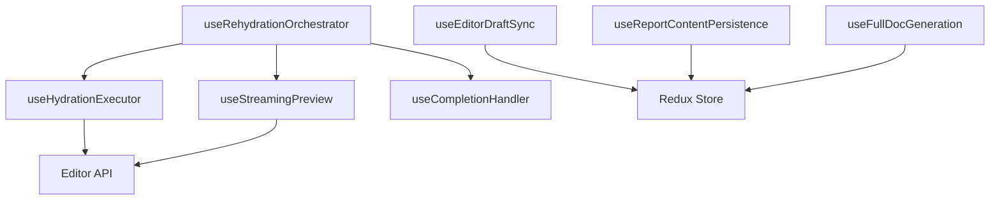

# Hooks 架构说明

## 目录职责

业务逻辑层的 Hook 封装，负责状态管理、编辑器交互、数据同步等核心业务逻辑

## 相关设计文档

- [内容管理模块总览](../../../docs/RPDetail/ContentManagement/README.md) - 整体架构与流程蓝图
- [数据与状态管理](../../../docs/RPDetail/ContentManagement/data-layer-guide.md) - Canonical/Draft 分层、哈希判定、保存流程
- [生命周期与交互控制](../../../docs/RPDetail/ContentManagement/lifecycle-flow.md) - AIGC 生成与用户编辑的互斥编排
- [Hydration 运行手册](./rehydration/HYDRATION.md) - 注水机制、Correlation ID 闭环、状态管理

## 目录结构

```
hooks/
├── index.ts                          # 统一导出
├── useLifecycleManager.ts            # 生命周期管理（无状态，Redux 驱动）
├── useEditorDraftSync.ts             # 编辑器草稿同步（Draft Tree 架构）
├── useReportContentPersistence.ts    # 文档保存（单飞保存流程）
├── useFullDocGeneration.ts           # 全文生成 Redux 版本
├── useRehydrationOrchestrator.ts     # 统一注水编排（核心）
└── rehydration/                      # 重注水拆分模块（内部使用）
    ├── HYDRATION.md                  # 注水机制运行手册
    ├── useHydrationExecutor.ts       # 纯执行层：读取 Redux 任务，执行编辑器操作
    ├── useStreamingPreview.ts        # 流式预览：全文生成期间增量更新
    └── useCompletionHandler.ts       # 完成检测：章节完成识别与收尾
```

## 核心文件职责

### useLifecycleManager

无状态生命周期管理，提供阶段查询和转换方法，所有状态从 Redux 获取

### useEditorDraftSync

监听编辑器内容变更（防抖 100ms），解析 HTML 并更新 Draft Tree，计算文档级 hash 用于脏判定

### useReportContentPersistence

实现单飞保存流程：同一时间只有一个保存请求在途，保存成功后更新 Canonical，失败保留 Draft 支持重试

### useFullDocGeneration

全文生成控制：为每个章节创建 `correlationId`，逐个发送消息，章节完成后触发注水，生成完成后合入 Canonical

### useRehydrationOrchestrator

统一注水编排，委托三个子 Hook 处理不同场景：执行层（useHydrationExecutor）、流式预览（useStreamingPreview）、完成检测（useCompletionHandler）

### Rehydration 子模块

- **useHydrationExecutor**: 读取 `currentTask` 并执行对应的注水操作（全量/章节级）
- **useStreamingPreview**: 全文生成期间的流式预览，仅更新视图不写入 Canonical
- **useCompletionHandler**: 监听消息流检测章节完成，触发合并并设置注水任务

## 模块依赖



- 本模块 → Redux selectors（读取状态）
- 本模块 → Redux dispatch（触发 actions）
- 本模块 → 编辑器 API（编辑器交互）
