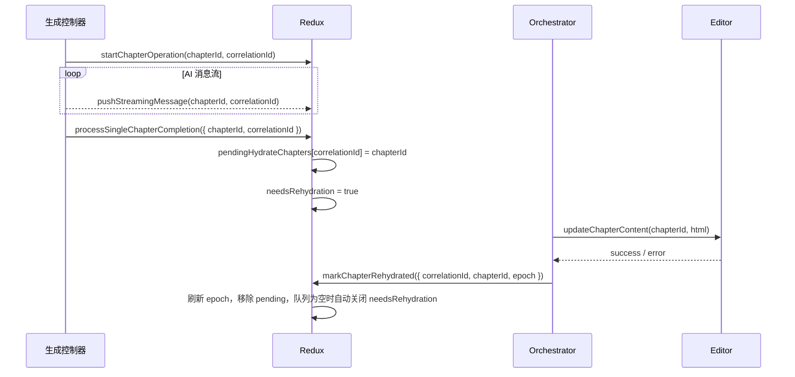

# Hydration（重注水）运行手册

> 目标：阐明“谁决定需要注水、谁执行注水、如何保证多次生成仍能写回编辑器”。本文整合原 Hydration 说明与 Correlation ID 机制，供开发者调试与扩展参考。

## 1. 为什么需要这套机制？

- 报告正文在 **初始化、AI 生成、章节重生成、还原** 等场景都会被外部数据覆盖，必须与 TinyMCE 实际视图保持一致。
- 早期实现仅按章节 ID 记录“已处理”，导致同一章节重生成时无法再次注水。为此，我们引入 **Correlation ID 闭环** 来追踪每一次操作。
- Redux 负责决策（哪些章节需要写入、是否打开注水闸门），`useRehydrationOrchestrator` 负责执行（何时把内容写进编辑器），两者解耦后流程可控、可调试。

## 2. HydrationState 数据结构

位置：`apps/report-ai/src/store/reportContentStore/types.ts`

| 字段                                | 类型                               | 作用                                                                                         | 设置者                                              | 使用者                         |
| ----------------------------------- | ---------------------------------- | -------------------------------------------------------------------------------------------- | --------------------------------------------------- | ------------------------------ |
| `lastHydratedEpochByChapter`        | `Record<string, number>`           | 记录章节最后一次真正写入 TinyMCE 的时间戳，用于避免重复覆盖                                  | `markChapterRehydrated`、`updateHydratedEpoch`      | `RehydrationGate`、调试工具    |
| `pendingHydrateChapters`            | `Record<string, string>`           | 待注水清单（`correlationId → chapterId`），说明哪些章节需要写入                              | `processSingleChapterCompletion`                    | `usePendingChapterRehydration` |
| `activeOperations`                  | `Record<string, ChapterOperation>` | 跟踪进行中的章节操作（生成/重生成/人工），便于在完成回调中找回关联 ID                        | `startChapterOperation`、`completeChapterOperation` | 生成控制器、fallback 匹配      |
| `needsRehydration` _(位于根 state)_ | `boolean`                          | 是否打开注水闸门；为 true 时 Orchestrator 会尝试消费 `pendingHydrateChapters` 或执行全量注水 | reducers（合并阶段）、Orchestrator（特殊情况）      | `useRehydrationOrchestrator`   |

## 3. Correlation ID 闭环

### 3.1 设计动机

- 支持同一章节多次生成 / 重生成，每次都能写回最新内容。
- 处理并发或跨页面请求，依旧能追踪“是谁触发的操作”。
- 出问题时，日志中的 `correlationId` 可串联起整个链路。

### 3.2 三层分工

| 层         | 责任                                                         | 关键动作                                                                                                     | 主要文件                                                                               |
| ---------- | ------------------------------------------------------------ | ------------------------------------------------------------------------------------------------------------ | -------------------------------------------------------------------------------------- |
| **操作层** | 发起章节请求时生成 `correlationId` 并记录 `activeOperations` | `startChapterOperation`（单章：mode=`single` / 全文：mode=`batch`）                                          | `reducers/chapterOperationReducers.ts`                                                |
| **合并层** | 收到完成信号后合并消息，设置章节级注水任务                   | `processSingleChapterCompletion`                                                    | `utils/chapterProcessing.ts`                                         |
| **执行层** | Orchestrator 消费注水任务，写入 TinyMCE，成功后完成任务      | `useHydrationExecutor`                                                              | `hooks/rehydration/useHydrationExecutor.ts`                          |

### 3.3 生命周期

### 3.4 兜底策略

1. **强约束（默认）**：请求与完成均携带同一 `correlationId`。
2. **弱约束**：缺失 ID 时，可在 `activeOperations` 中查找同章节最新的 pending 操作。
3. **最差兜底**：如仍无法匹配，会创建临时 ID 保证流程继续，同时记录警告日志。

### 3.5 开发者备忘

**章节重生成场景：**

- 发起章节请求务必调用 `startChapterOperation` 并保留返回的 `correlationId`
- 完成回调需要把它传给 `processSingleChapterCompletion`

**全文生成场景：**

- `startChapterOperation (mode='batch')` 为叶子章节创建 `correlationId`，锁定章节并登记 `latestRequestedOperations`
- `startFullDocumentGeneration` 初始化队列与进度信息
- `useFullDocumentGeneration` 读取 `latestRequestedOperations` 逐章发送消息，并在发送后标记 `requested=true`
- 章节完成时由 `useFullDocumentGeneration` 调用 `processSingleChapterCompletion`，随后 dispatch `progressToNextChapter`

**通用规则：**

- 一切"需要注水"决策都放在 `processSingleChapterCompletion` 内，避免多个 reducer 竞争
- Executor 不直接操作状态，而是通过 `completeHydrationTask` 把成功事实回写 store
- 遇到注水未执行时，排查链路：请求是否生成 ID → 发送消息是否携带 → 完成时是否传回 → 注水任务是否设置

## 4. 关键时序与互锁

1. **初始化 / 还原**

   - `chapterLoadingSuccess` 设置 `currentTask = { type: 'full-init', reason: 'page-load' }`
   - `useHydrationExecutor` 执行全量注水 `setFullContent`，完成后调用 `completeHydrationTask`

2. **全文生成**（逐章节注水）

   - `startChapterOperation(mode='batch')`：批量创建 `correlationId`，锁定章节并登记 `activeOperations`
    和 `latestRequestedOperations`
   - `startFullDocumentGeneration`：写入生成队列和进度基线
   - `useFullDocumentGeneration`：读取 `latestRequestedOperations` 逐章发送消息（发送后标记 `requested=true`）
   - 同一 Hook 监听完成消息 → 调用 `processSingleChapterCompletion` → dispatch `progressToNextChapter`
   - `processSingleChapterCompletion`：设置 `currentTask = { type: 'chapter-rehydrate', ... }`
   - `useHydrationExecutor`：执行章节级注水
   - 重复直到所有章节完成

3. **章节重生成**（单章节注水）

   - `startChapterOperation`：生成 `correlationId`，记录到 `activeOperations`
   - 发送消息（带 `correlationId`）
   - 完成时调用 `processSingleChapterCompletion`（传递 `correlationId`）
   - `processSingleChapterCompletion`：设置章节级注水任务
   - `useHydrationExecutor`：执行章节级注水

4. **生成期流式预览**
   - 当 `globalOperation.kind === 'full_generation'` 时，`useStreamingPreview` 仅做视觉预览
   - 不写入 Canonical，也不触发注水任务

> **重要**：全文生成和章节重生成都是 **逐章节注水**，不是等全部完成后才全量注水。这确保了用户能实时看到生成结果。

## 5. reducers / hooks 职责速览

| 模块                                                     | 作用                                                                                           |
| -------------------------------------------------------- | ---------------------------------------------------------------------------------------------- |
| `hydrationReducers.setHydrationTask`                     | 设置当前注水任务（`full-init`、`full-rehydrate`、`chapter-rehydrate`、`idle`）。               |
| `hydrationReducers.completeHydrationTask`                | 完成注水任务：重置为 `idle`，清理 Draft 状态。                                                 |
| `generationReducers.startFullDocumentGeneration`         | 初始化全文生成：为每个章节创建 `correlationId`，记录到 `activeOperations` 和 `chapterStates`。 |
| `generationReducers.progressToNextChapter`               | 推进全文生成索引、更新当前章节指针，保持进度一致。                                            |
| `utils/chapterProcessing.processSingleChapterCompletion` | 合并消息、更新章节状态、设置 `currentTask = chapter-rehydrate`。                               |
| `hooks/useRehydrationOrchestrator`                       | 统一调度各个注水 Hook：`useHydrationExecutor`、`useStreamingPreview`、`useCompletionHandler`。 |
| `hooks/rehydration/useHydrationExecutor`                 | **核心执行层**：读取 `currentTask`，执行对应的注水操作（全量/章节级）。                        |
| `hooks/rehydration/useStreamingPreview`                  | 流式生成期间的增量更新与视觉预览。                                                             |
| `hooks/rehydration/useCompletionHandler`                 | 跟踪消息流，判断生成完成并自动调用 `finishGlobalOperation` 收尾。                              |

## 6. 常见问题解答

- **全文生成和章节重生成有什么区别？**

  - 本质上都是 **逐章节生成 + 逐章节注水**
  - 全文生成：在 `startFullDocumentGeneration` 时为所有章节批量创建 `correlationId`
  - 章节重生成：在 `startChapterOperation` 时为单个章节创建 `correlationId`
  - 完成处理和注水逻辑完全相同，都通过 `processSingleChapterCompletion` → `useHydrationExecutor`

- **为什么全文生成不是生成完所有章节后再一次性注水？**

  - 逐章节注水能让用户实时看到生成进度，提升体验
  - 避免长时间等待后一次性加载大量内容导致的性能问题
  - 统一的注水机制降低了复杂度和出错可能

- **`correlationId` 的生命周期是什么？**

  - **创建**：`startChapterOperation`（single/batch）
  - **使用**：序列化在 `activeOperations`、`latestRequestedOperations`，并随消息流传递
  - **完成**：`processSingleChapterCompletion` 将操作状态置为 `completed` 并发出注水任务

- **如何调试注水问题？**
  - 启用 `debug: true` 查看详细日志
  - 检查 `hydration.latestRequestedOperations[chapterId]` 是否更新、`requested` 是否为 `true`
  - 检查发送消息时 `agentParam.correlationId` 是否正确
  - 检查 `currentTask` 是否正确设置为 `chapter-rehydrate`
  - 检查 `useHydrationExecutor` 是否被触发执行

## 7. 参考资料

### 设计文档

- [内容管理模块总览](../../../../docs/RPDetail/ContentManagement/README.md) - 整体架构与流程蓝图
- [数据与状态管理](../../../../docs/RPDetail/ContentManagement/data-layer-guide.md) - Canonical/Draft 分层、哈希判定、保存流程
- [生命周期与交互控制](../../../../docs/RPDetail/ContentManagement/lifecycle-flow.md) - AIGC 生成与用户编辑的互斥编排
- [全文生成流程详解](../../../../docs/RPDetail/ContentManagement/full-generation-flow.md) - 全文生成的完整流程、涉及模块、关键逻辑
- [未来扩展方向](../../../../docs/RPDetail/ContentManagement/future-expansion.md) - 带宽优化、章级提示、协同等增强方案

### 代码实现

- [Hooks 架构说明](../README.md) - 业务逻辑层 Hook 封装
- [useRehydrationOrchestrator](../useRehydrationOrchestrator.ts) - 统一注水编排
- [useHydrationExecutor](./useHydrationExecutor.ts) - 纯执行层：读取 Redux 任务，执行编辑器操作
- [useStreamingPreview](./useStreamingPreview.ts) - 流式预览：全文生成期间增量更新
- [useCompletionHandler](./useCompletionHandler.ts) - 完成检测：章节完成识别与收尾

### Redux 状态管理

- `../../reducers/hydrationReducers.ts` - 注水状态管理
- `../../reducers/generationReducers.ts` - 全文生成状态管理
- `../../utils/chapterProcessing.ts` - 章节完成处理逻辑
- `../../../types/report/generation.ts` - 注水相关类型定义
