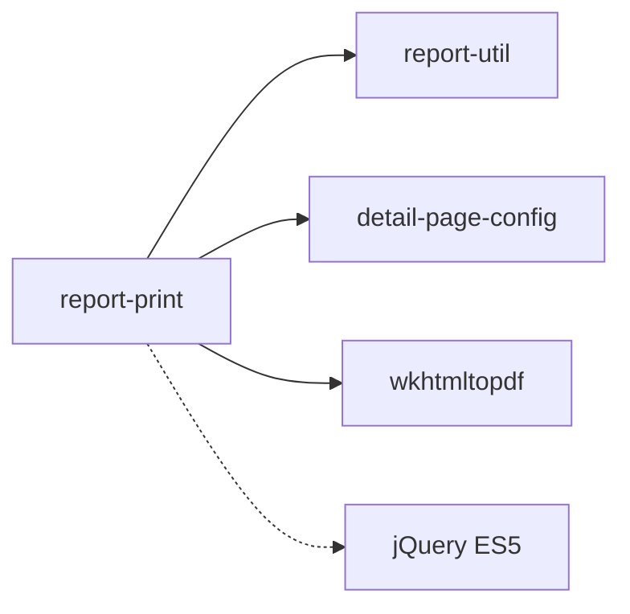

# `report-print` - PDF 报告生成引擎

PDF 报告生成生态系统的最终执行引擎，通过 wkhtmltopdf 将动态数据转换为可打印的静态 HTML 页面。

## 目录结构

```
apps/report-print/
├── public/                     # 静态资源 (模板、图片、多语言)
├── scripts/
│   └── export.cjs             # PDF 导出脚本 (wkhtmltopdf 封装)
├── src/
│   ├── api/                   # API 服务层 (数据获取)
│   ├── comp/                  # 核心渲染组件
│   │   ├── PDFPage/          # 页面管理器 (物理分页)
│   │   ├── TableHandler/     # 表格处理器 (跨页逻辑)
│   │   └── CellSplitter/     # 单元格分割器 (微观处理)
│   ├── handle/               # 业务逻辑处理 (表格解析、单元格渲染)
│   ├── pages/                # 应用入口 (creditEntry.ts)
│   └── store/                # 状态管理与事件总线
└── docs/                     # 设计文档
```

## 关键文件

| 文件 | 作用 |
|------|------|
| `src/pages/creditEntry.ts` | 应用入口，初始化渲染流程 |
| `src/comp/PDFPage/index.ts` | 页面管理，控制物理分页 |
| `src/comp/TableHandler.ts` | 表格逐行渲染与跨页处理 |
| `scripts/export.cjs` | 开发测试脚本，封装 wkhtmltopdf 调用 |
| `src/comp/RPPrintRenderer/index.ts` | 总渲染器，协调整个报告构建 |

## 核心依赖



**依赖说明**：
- `report-util` → 提供兼容性工具函数
- `detail-page-config` → 表格配置与业务规则
- `wkhtmltopdf` → PDF 生成目标环境

## 相关文档

### 架构与设计
- [架构设计](./architecture.md)
- [Core Architecture](./docs/core-architecture.md) - 完整的组件职责和兼容性要求
- [Core Rendering Flow](./docs/core-rendering-flow.md) - 详细的四阶段渲染流程

### 技术方案
- [PDF Pagination Design](./docs/pdf-pagination-design.md)
- [DOM-based Row Splitting](./docs/dom-based-row-splitting.md)

### 开发指南
- [Development Guide](./docs/development.md) - 开发验证流程、构建和测试方法

## 兼容性要求

所有运行时代码必须在 wkhtmltopdf 的 ES5 引擎中执行，严禁使用现代 JS 语法。详见[Core Architecture](./docs/core-architecture.md#核心原则为-wkhtmltopdf-而生)。
