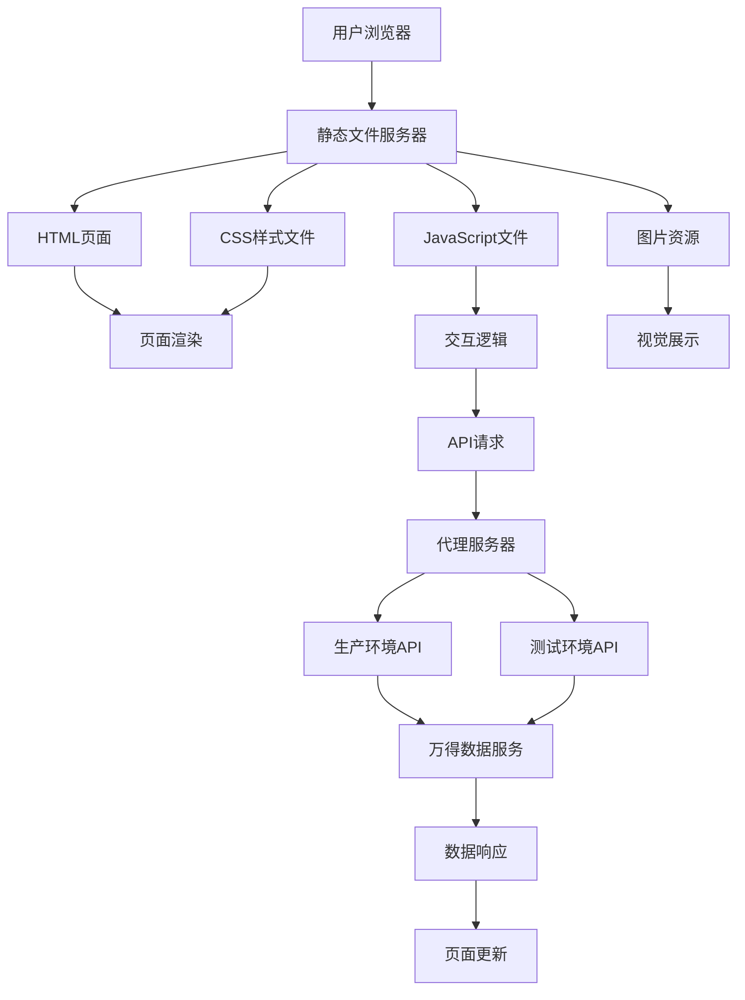
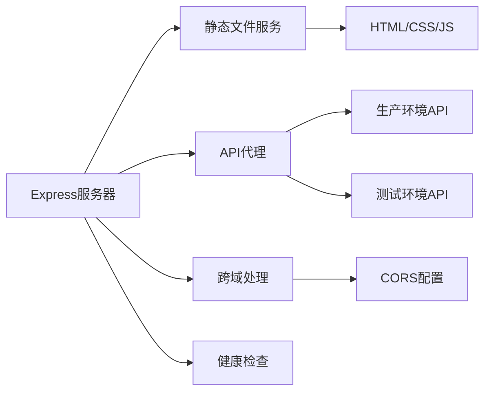
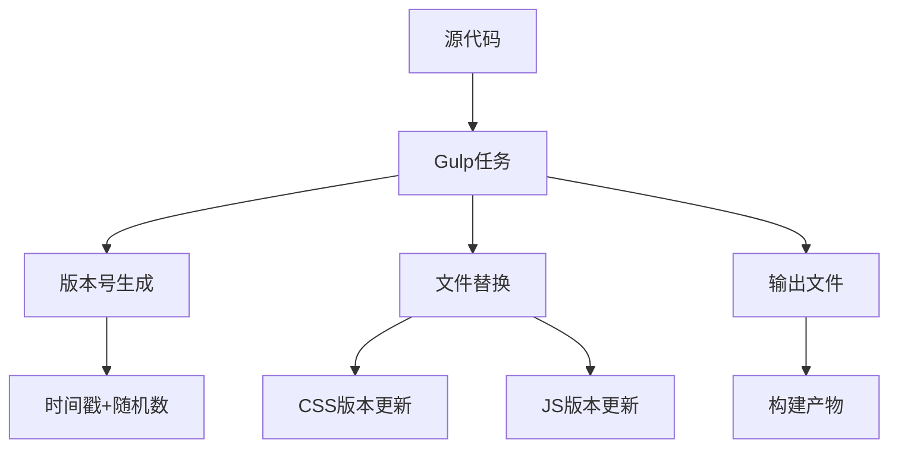
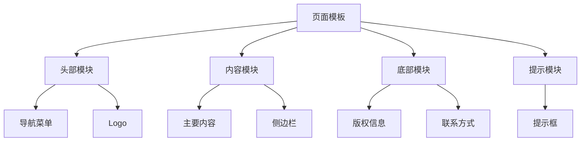
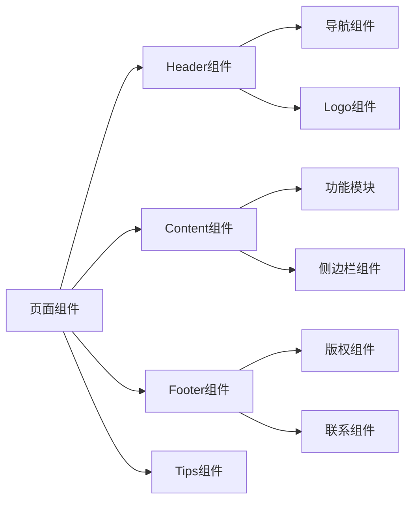
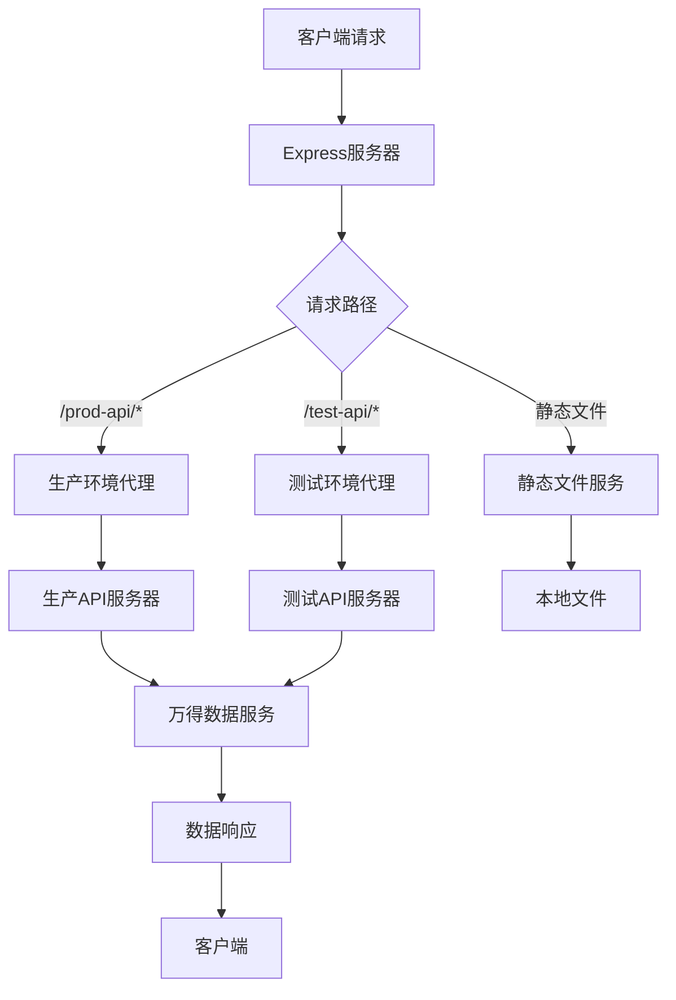
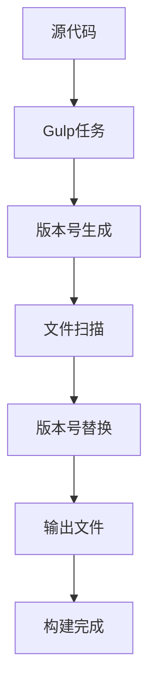
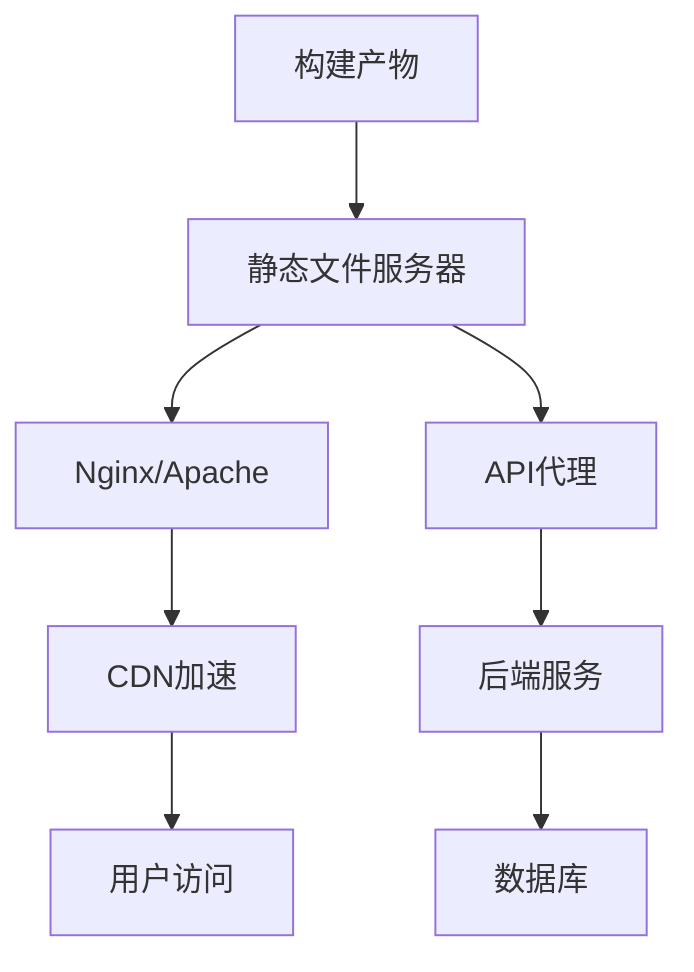

# 技术架构设计

## 架构概述

万得征信项目采用静态网站架构，通过HTML5、CSS3、JavaScript构建前端界面，使用Express.js提供开发服务器和API代理功能。项目专注于展示企业征信数据服务，采用模块化的前端架构设计。

## 系统架构图



## 技术栈详解

### 前端技术栈

#### HTML5
- **语义化标签**：使用header、nav、main、section、footer等语义化标签
- **响应式设计**：支持移动端和桌面端适配
- **SEO优化**：合理的页面结构和meta标签

#### CSS3
- **模块化样式**：按功能模块组织CSS文件
- **响应式布局**：使用媒体查询适配不同屏幕
- **动画效果**：CSS3动画和过渡效果
- **版本管理**：通过Gulp自动更新版本号

#### JavaScript
- **ES6+语法**：使用现代JavaScript特性
- **模块化开发**：按功能模块组织JS文件
- **jQuery库**：DOM操作和AJAX请求
- **组件化**：可复用的前端组件

### 开发工具链

#### Express.js 开发服务器


#### Gulp 构建工具


## 项目结构设计

### 目录结构
```
wind-zx/
├── docs/                    # 项目文档
├── resource/               # 静态资源
│   ├── css/               # 样式文件
│   │   ├── homepage.css   # 首页样式
│   │   ├── contact.css    # 联系页面样式
│   │   ├── util.css       # 工具样式
│   │   ├── header.css     # 头部样式
│   │   ├── foot.css       # 底部样式
│   │   └── general.css    # 通用样式
│   ├── js/                # JavaScript文件
│   │   ├── homepage.js    # 首页逻辑
│   │   ├── contactMenu.js # 联系菜单
│   │   ├── loadHeaderFooter.js # 头部底部加载
│   │   ├── misc.js        # 工具函数
│   │   ├── jquery.js      # jQuery库
│   │   └── config/        # 配置文件
│   ├── images/            # 图片资源
│   └── static/            # 其他静态资源
├── about/                  # 关于页面
│   ├── contact.html       # 联系我们
│   ├── disclaimer.html    # 免责声明
│   ├── agreement.html     # 用户协议
│   └── apply.html         # 异议申请
├── index.html             # 首页
├── contact.html           # 联系页面
├── other.html             # 其他页面
├── risk.html              # 风险页面
├── proxy.js               # 开发代理服务器
├── gulpfile.js            # 构建配置
└── package.json           # 项目配置
```

### 模块化设计

#### 页面模块


#### 组件架构


## API代理架构

### 代理配置


### 跨域处理
- **CORS配置**：自动添加跨域响应头
- **请求头处理**：支持自定义请求头
- **Cookie处理**：支持跨域Cookie传递
- **安全配置**：HTTPS支持和证书验证

## 构建和部署

### 构建流程


### 版本管理策略
- **时间戳版本**：基于当前时间生成版本号
- **随机数后缀**：添加随机数避免缓存冲突
- **自动更新**：构建时自动更新所有资源版本号
- **缓存控制**：通过版本号控制浏览器缓存

### 部署架构


## 性能优化

### 前端优化
- **资源压缩**：CSS和JS文件压缩
- **图片优化**：图片格式选择和压缩
- **缓存策略**：合理的缓存控制
- **懒加载**：按需加载资源

### 网络优化
- **CDN加速**：静态资源CDN分发
- **Gzip压缩**：响应内容压缩
- **HTTP/2**：支持HTTP/2协议
- **预加载**：关键资源预加载

## 安全考虑

### 前端安全
- **XSS防护**：输入内容过滤和转义
- **CSRF防护**：请求头验证
- **内容安全策略**：CSP配置
- **HTTPS强制**：强制使用HTTPS

### API安全
- **代理验证**：API请求验证
- **跨域控制**：严格的CORS配置
- **请求限流**：防止恶意请求
- **日志记录**：请求日志记录

## 监控和日志

### 性能监控
- **页面加载时间**：监控页面加载性能
- **API响应时间**：监控API调用性能
- **错误率统计**：监控错误发生情况
- **用户行为分析**：用户访问行为统计

### 日志管理
- **访问日志**：记录用户访问信息
- **错误日志**：记录系统错误信息
- **API日志**：记录API调用信息
- **安全日志**：记录安全相关事件

## 扩展性设计

### 模块化扩展
- **组件化设计**：可复用的前端组件
- **插件机制**：支持功能插件扩展
- **主题系统**：支持多主题切换
- **国际化**：支持多语言扩展

### 技术栈升级
- **渐进式升级**：支持技术栈渐进式升级
- **兼容性保证**：保证向后兼容
- **性能优化**：持续的性能优化
- **安全更新**：及时的安全补丁

## 开发规范

### 代码规范
- **HTML规范**：语义化标签和结构
- **CSS规范**：模块化样式和命名
- **JavaScript规范**：ES6+语法和模块化
- **文件组织**：清晰的文件组织结构

### 版本控制
- **Git工作流**：规范的分支管理
- **提交规范**：统一的提交信息格式
- **代码审查**：严格的代码审查流程
- **自动化测试**：持续集成和测试 