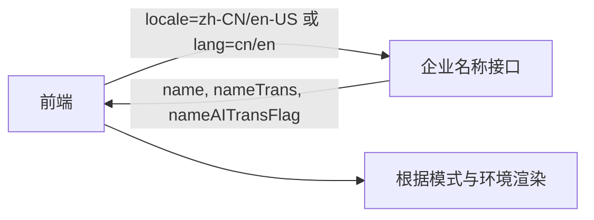

# 国际化 API 文档（intl）

## API 概述
提供语言检测、切换、类型与翻译调用等前端 API，面向组件开发与业务场景统一接入。

## 调用流程
```mermaid
graph LR
  C[组件] --> T[t(key, default?, options?)]
  T --> I[i18n]
  I --> R[Resources]
  C --> H[getLocale / getLang / isEn]
  C --> S[switchLocaleInWeb]
```

## 函数列表
| 名称 | 说明 | 参数 | 返回值 |
|---|---|---|---|
| getLocale | 获取当前区域语言（含区域） | - | `SupportedLocale`（`zh-CN`/`en-US`） |
| getLang | 获取 URL 友好的语言简写 | - | `'cn' | 'en'` |
| isEn | 是否为英文环境 | - | `boolean` |
| switchLocaleInWeb | Web 端切换语言（写入/删除 `lan` 后刷新） | - | `void` |
| t | 翻译查询，支持字符串与 React 节点插值 | `key`, `default?`, `options?` | `string` 或包含 React 节点的混合数组 |
| i18n | i18n 实例（只读） | - | i18n 实例对象 |

## 类型
| 类型名 | 用途 | 取值 |
|---|---|---|
| SupportedLocale | 受支持的区域语言 | `zh-CN`、`en-US` |
| SupportedLang | URL 简写 | `cn`、`en` |

## 配置与约定
| 项 | 值 |
|---|---|
| 命名空间 | `common` |
| 存储键 | `lan`（localStorage） |
| 默认语言 | `zh-CN` |
| 资源 | `zh-CN`/`en-US` 两套内置文案 |

## 请求参数（语言环境传递）
- 推荐参数：`locale` ∈ {`zh-CN`, `en-US`}
- 兼容参数：`lang` ∈ {`cn`, `en`}
- 规范要求：
  - 至少提供其一；若两者同时提供，以 `locale` 为准
  - 后端需对 `lang` 做标准化以得到 `locale`
  - 响应中的翻译字段（如 `nameTrans`）必须与请求语言一致
  - 无法产出目标语言翻译时，返回空/缺省值，由前端按显示模式与优先级降级渲染

## 企业名称字段契约（与后端协作）

### 采用的三字段设计（结论）
- 主要位置仍采用 3 字段：
  - 原始字段：`name`（示例，实际以“原始字段”替换）
  - 翻译字段：`nameTrans`
  - AI 标识：`nameAITransFlag`
- 其余位置不新增字段，仅提供 `name` 即可（前端直接显示公司名称，不依赖 `nameTrans`/`nameAITransFlag`）。

### 字段语义与约束
| 字段 | 类型 | 语义与约束 |
|---|---|---|
| name | string | 原始名称（不做任何翻译处理） |
| nameTrans | string 可选 | 翻译后的名称，语种必须与请求 `locale/lang` 对齐；其来源按优先级产生：官方/6254 → TRANS（机翻表） → AI（在线翻译）；若无可用翻译则为空/缺省 |
| nameAITransFlag | boolean 可选 | 是否展示“Provided by AI”标识：当且仅当 `nameTrans` 来源为 TRANS 或 AI 时为 true；来源为官方/6254 时为 false；无翻译时为空/缺省 |

说明：
- 后端无法可靠判断 `name` 的原始语种时，无需提供 `nameOriginalLang`，前端将按字符规则判断（参考公司名称规则文档）。
- 若当前仅支持“中→英”的 TRANS，中文环境下需要“英→中”时，后端可不返回 `nameTrans`，由前端按模式规则降级到 AI 或原始。

### 请求-响应流程


### 模式与字段使用对照（精简为两种模式）
| 模式 | 主要位置使用 | 其余位置使用 | “Provided by AI” |
|---|---|---|---|
| 模式一 | 仅 `name`（单行） | 仅 `name`（单行） | 不展示 |
| 模式二 | 上：`name`；下：`nameTrans`（若有） | 仅 `name`（单行） | 主要位置：`nameAITransFlag` 为 true 时展示；其余位置：不展示 |

> 前端展示逻辑：
> - 主要位置：当 `name` 已是目标语时，仅展示 `name` 单行；否则上下两行。
> - 其余位置：不使用翻译字段，始终展示 `name`。

更多业务规则与展示细则见：`./company-name.md`

## 相关
- 复杂数据结构批量翻译工具：`./translate.md`
- 设计说明：`./design.md`
- 需求说明：`./requirements.md`
