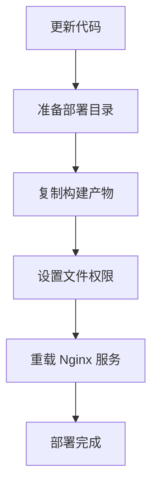

# 预发布部署指南

预发布环境的自动化部署和配置管理。

## 🚀 快速部署

### 应用部署

```bash
# 构建并部署到预发布
pnpm app deploy-staging company

# 部署所有应用
pnpm app deploy-staging --all

# 详细输出
pnpm app deploy-staging company --verbose
```

### Nginx 配置部署

```bash
# 部署 Nginx 配置
node scripts/staging/deployNginxConfig.js

# 测试配置（不实际部署）
node scripts/staging/deployNginxConfig.js --dry-run

# 详细输出模式
node scripts/staging/deployNginxConfig.js --verbose
```

## 📋 部署流程



## 🗂️ 部署环境

### 服务器目录结构

```
预发布服务器:
├── /home/deploy/source/frontend/Company          # 源码目录
└── /var/www/Wind.WFC.Enterprise.Web/PC.Front     # 部署目录
    ├── Company                                    # 企业应用
    ├── ai                                         # AI聊天应用
    └── reportai                                   # 报告AI应用
```

### 关键配置

| 配置项 | 值 | 说明 |
|--------|----|-----|
| 源码目录 | `/home/deploy/source/frontend/Company` | Git 仓库克隆目录 |
| 部署目录 | `/var/www/Wind.WFC.Enterprise.Web/PC.Front` | Web 根目录 |
| Git 分支 | `staging` | 预发布分支 |
| 文件权限 | `deploy:deploy` | 部署用户权限 |

## 🌐 访问地址

预发布环境应用访问路径：
```
http://your-domain.com/Wind.WFC.Enterprise.Web/PC.Front/{app-name}
```

具体应用路径：
- Company: `http://your-domain.com/Wind.WFC.Enterprise.Web/PC.Front/Company`
- AI Chat: `http://your-domain.com/Wind.WFC.Enterprise.Web/PC.Front/ai`
- Report AI: `http://your-domain.com/Wind.WFC.Enterprise.Web/PC.Front/reportai`

## 🔧 部署器核心功能

### StagingDeployer 类

预发布环境部署器提供以下核心功能：

```javascript
class StagingDeployer {
  // 基础配置
  sourcePath = '/home/deploy/source/frontend/Company'  // 源码目录
  deployPath = '/var/www/Wind.WFC.Enterprise.Web/PC.Front'  // 部署目录
  gitBranch = 'staging'  // Git分支

  // 主要方法
  async updateCode()        // 更新代码到staging分支
  async prepareDirectories() // 准备部署目录和权限
  async deployApp(app)      // 部署单个应用
  async restartServices()   // 重启Nginx服务
}
```

### 部署步骤

1. **准备目录** - 创建并设置部署目录权限
2. **更新代码** - 从Git仓库拉取staging分支代码
3. **部署应用** - 复制构建产物到目标目录
4. **重启服务** - 测试并重载Nginx配置

## ❓ 故障排查

### 常见问题

| 问题 | 原因 | 解决方案 |
|------|------|---------|
| 构建产物不存在 | 构建失败或路径错误 | 检查构建流程，确认 `buildDir` 配置 |
| 目录权限被拒绝 | sudo 权限不足 | 确认部署用户有sudo权限 |
| Nginx 配置错误 | 语法错误或路径问题 | `sudo nginx -t` 检查配置 |
| Git 更新失败 | 网络或权限问题 | 检查Git仓库访问权限 |

### 关键检查点

```bash
# 检查源码目录
ls -la /home/deploy/source/frontend/Company

# 检查部署目录权限
ls -la /var/www/Wind.WFC.Enterprise.Web/PC.Front

# 测试Nginx配置
sudo nginx -t

# 检查Git状态
cd /home/deploy/source/frontend/Company && git status
```

## 🔄 紧急回滚

### 应用回滚

```bash
# 切换到上一个稳定版本
git checkout <previous_commit>
pnpm app deploy-staging company --verbose
```

### 手动回滚

```bash
# 恢复备份文件
sudo cp /path/to/backup/* /var/www/Wind.WFC.Enterprise.Web/PC.Front/Company/
sudo chown -R deploy:deploy /var/www/Wind.WFC.Enterprise.Web/PC.Front/
sudo nginx -t && sudo systemctl reload nginx
```

## 🔧 环境要求

- **服务器权限**: deploy用户 sudo权限
- **Git访问**: staging分支读取权限
- **目录权限**: `/var/www/Wind.WFC.Enterprise.Web/PC.Front` 写入权限
- **Nginx**: 配置重载权限

## 📞 技术支持

如遇问题请联系：
- 技术支持：your-email@example.com
- 运维团队：ops@example.com

## 相关文档

- [开发指南](./development.md) - 开发流程和工具
- [本地部署](./deployment.md) - 本地部署流程
- [脚本工具集](../scripts/README.md) - 脚本整体架构

## 相关脚本

- [预发布部署器](../scripts/deployers/StagingDeployer.js) - 预发布环境部署实现
- [Nginx 配置部署](../scripts/staging/deployNginxConfig.js) - Nginx 配置管理
- [应用管理工具](../scripts/run-app.js) - 统一应用管理入口