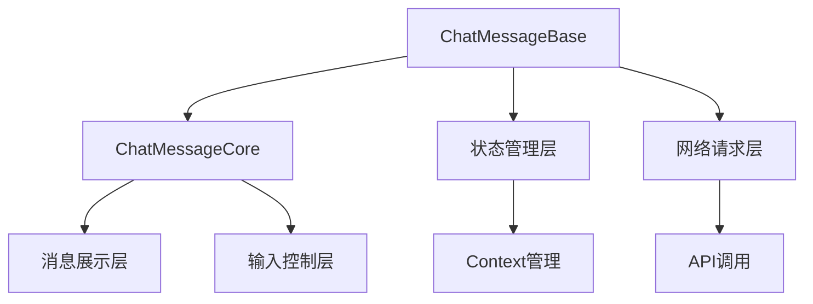
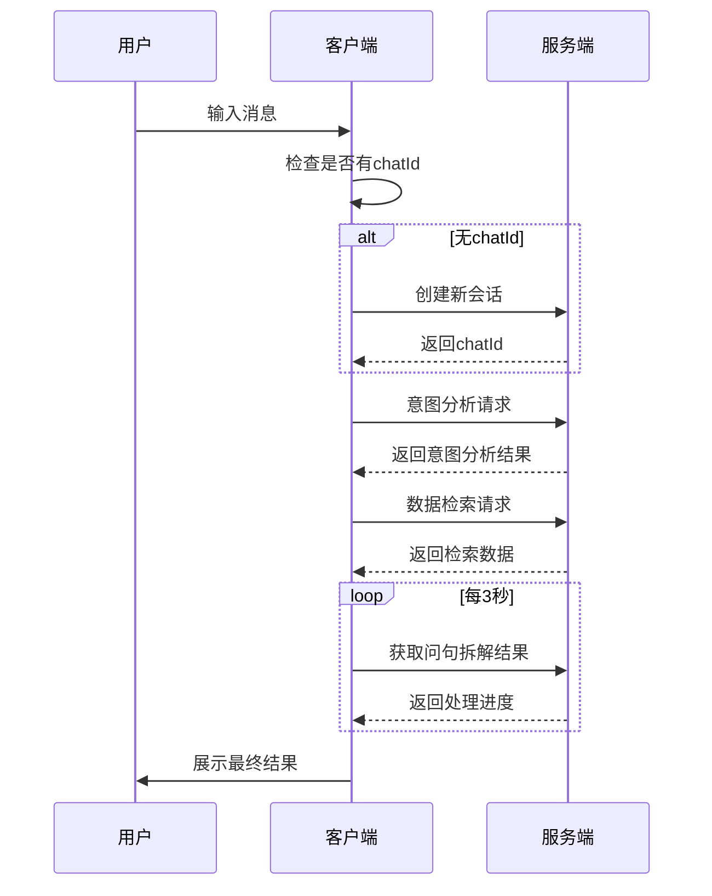

# AI 对话组件设计文档

## 一、组件概述

### 1.1 功能简介

该组件是一个完整的 AI 对话系统，支持：

- 创建新会话
- 发送消息和接收回复
- 历史消息管理
- 流式响应处理
- 消息解析与展示
- 错误处理与状态恢复

### 1.2 技术栈

- 前端框架：React + TypeScript
- UI 组件库：Ant Design 5 + Ant Design X
- 状态管理：React Hooks + Context
- 网络请求：Axios
- 样式处理：Less Modules

## 二、架构设计

### 2.1 整体架构



### 2.2 核心模块

#### 2.2.1 ChatMessageBase 组件

基础组件 - 负责业务逻辑处理和状态管理

- 该组件主要完成三项核心功能：
  1. 维护会话状态和消息列表
  2. 处理消息的发送和接收
  3. 管理历史消息的加载和恢复

内部集成了多个核心 Hook：

- useChatBase: 处理核心聊天功能
- useChatRestore: 处理历史消息恢复
- useChatRoomContext: 管理会话上下文

- @param initialMessage - 初始消息，通常用于从其他页面跳转时带入的消息
- @param initialDeepthink - 初始深度思考模式
- @param entityType - 实体类型，用于特定场景的消息处理
- @param entityName - 实体名称，配合实体类型使用

#### 2.2.2 ChatMessageCore 组件

UI组件 - 负责渲染和用户交互处理

- 该组件主要完成三项核心功能：
  1. 渲染消息列表和处理消息展示
  2. 管理滚动位置和加载更多
  3. 处理用户输入和交互

内部维护了多个关键状态：

- scrollPosition: 滚动位置信息
- bubbleLoading: 消息加载状态
- showScrollBottom: 是否显示滚动到底部按钮

- @param roles - 角色配置，用于不同角色的消息展示
- @param chatId - 会话ID
- @param content - 当前输入内容
- @param parsedMessages - 解析后的消息列表
- @param isChating - 是否正在聊天

#### 2.2.3 useChatBase Hook

核心Hook - 负责处理聊天的核心逻辑和状态管理

- 该Hook主要完成三项核心功能：
  1. 管理聊天相关的所有状态
  2. 处理消息的发送和接收
  3. 管理API请求和错误处理

内部维护了多个重要引用：

- abortControllerRef: 用于取消请求
- latestResultRef: 保存最近的结果
- parserRef: 消息解析器引用

- @param axiosChat - 聊天API实例
- @param isDev - 开发环境标志
- @param wsid - WebSocket ID
- @param baseUrl - API基础路径

#### 2.2.4 useConversationSetup Hook

会话设置钩子 - 负责初始化聊天会话和处理非流式消息

- 该钩子主要完成两项核心功能：
  1. 如果没有聊天ID，负责创建新的聊天会话
  2. 发送并处理非流式消息（不包含流式输出处理）

内部维护了三个状态：

- content: 输入框内容
- loadingText: 加载状态文本
- isLoading: 是否处于加载状态

- @param chatCreator - 创建新聊天会话的函数，当没有chatId时会调用此函数
- @param onAddConversation - 添加会话到列表的回调函数，创建新会话时会调用
- @returns {ConversationSetupHookResult} 包含内容管理和消息发送的接口

#### 2.2.5 useXChatParser Hook

消息解析钩子 - 负责消息的解析和转换

- 该钩子主要完成三项核心功能：
  1. 解析不同类型的消息（用户消息、AI响应等）
  2. 创建对应的消息组件
  3. 处理特殊消息类型（图表、参考资料 等）

内部维护了多个消息创建器：

- createUserMessage: 创建用户消息
- createAIHeaderMessage: 创建AI消息头部
- createAIContentMessage: 创建AI消息内容
- createChartMessage: 创建图表消息

- @param axiosChat - 聊天API实例
- @param axiosEntWeb - 企业Web API实例
- @param sendMessage - 发送消息的回调函数
- @param roleName - 角色名称
- @returns 消息解析函数

## 三、数据流设计

### 3.1 数据结构

```typescript
// 消息原始数据结构
interface AgentMsgDepre {
  role: string // 角色（user/assistant）
  content: string // 消息内容
  agentId?: string // 代理ID
  chatId?: string // 会话ID
  think?: number // 思考模式
  status: string // 消息状态
  entityType?: string // 实体类型
  entityName?: string // 实体名称
}

// 会话数据结构
interface Conversation {
  id: string // 会话ID
  title: string // 会话标题
  updateTime: string // 更新时间
  questionsNum: number // 问题数量
  questions: string // 问题内容
}
```

### 3.2 状态管理

```typescript
// 聊天状态
const { chatId, setChatId, setIsChating } = useChatRoomContext()

// 会话列表状态
const { addConversationItem, updateConversationsItems } = useConversationsBase()

// 消息状态
const { content, parsedMessages, handleContentChange, sendMessage } = useChatBase()
```

## 四、接口调用流程

### 4.1 创建新会话

```typescript
POST /chat/addChatGroup
Request:
{
  rawSentence: string,   // 用户输入的消息
  entityCode?: string    // 可选的实体代码
}
Response:
{
  chatId: string,        // 新创建的会话ID
  status: number         // 状态码
}
```

### 4.2 消息处理流程



### 4.3 错误处理机制

#### 4.3.1 网络错误处理

```typescript
try {
  const result = await sendRequest()
} catch (error) {
  if (error.isAxiosError) {
    // 网络错误处理
    handleNetworkError(error)
  } else {
    // 业务错误处理
    handleBusinessError(error)
  }
}
```

#### 4.3.2 状态恢复

```typescript
// 请求取消处理
const cancelRequest = useCancelChatRequest(
  axiosChat,
  setIsChating,
  latestResultRef,
  abortStreamControllerRef,
  abortControllerRef,
  isFirstQuestionRef,
  onRefresh
)
```

## 五、UI 设计

### 5.1 组件层级

```
ChatMessageBase
└── ChatMessageCore
    ├── 消息列表区域
    │   └── Bubble.List
    ├── 滚动控制按钮
    │   └── ScrollToBottomButton
    └── 输入控制区域
        └── ChatActions
```

### 5.2 关键交互设计

#### 5.2.1 消息加载

- 使用 Spin 组件显示加载状态
- 支持消息分页加载
- 滚动到顶部自动加载更多历史消息

```typescript
<Spin spinning={bubbleLoading}>
  <div className={styles.chat}>
    <div ref={chatContainerRef} onScroll={handleScroll}>
      <Bubble.List items={bubbleItems} />
    </div>
  </div>
</Spin>
```

#### 5.2.2 滚动控制

- 新消息自动滚动到底部
- 提供手动滚动到底部按钮
- 保持滚动位置不变当加载历史消息时

#### 5.2.3 输入控制

- 支持文本输入
- 支持快捷操作
- 支持发送状态反馈

## 六、性能优化

### 6.1 渲染优化

```typescript
// 使用 memo 优化组件重渲染
export const ChatMessageCore = memo((props) => {
  // 组件实现
})

// 使用 useCallback 缓存回调函数
const handleContentChange = useCallback((content) => {
  setContent(content)
}, [])
```

### 6.2 数据加载优化

- 分页加载历史消息
- 使用虚拟滚动处理大量消息
- 缓存已加载的消息

## 七、注意事项

### 7.1 开发注意事项

1. **初始化顺序**

   - 确保 Context Provider 正确配置
   - 检查必要的环境变量和配置

2. **错误处理**

   - 网络错误需要友好提示
   - 业务错误需要合适的降级处理
   - 状态恢复机制要可靠

3. **性能考虑**
   - 大量消息时注意内存占用
   - 注意防抖和节流处理
   - 避免不必要的重渲染

### 7.2 使用注意事项

1. **配置要求**

   - 需要正确配置 API 地址
   - 需要配置正确的认证信息
   - 需要提供必要的环境变量

2. **性能建议**
   - 合理设置分页大小
   - 及时清理不需要的消息
   - 使用正确的缓存策略

## 八、调试信息

### 8.1 开发环境配置

```typescript
const isDev = process.env.NODE_ENV === 'development'
const wsid = getWsidDevProd()
const baseUrl = getApiPrefix()
```

### 8.2 日志记录

```typescript
console.error('创建对话失败:', error)
console.error('sendAndInitializeConversation 异步错误:', error)
```

### 8.3 常见问题排查

1. 网络请求失败

   - 检查网络连接
   - 检查 API 配置
   - 检查认证信息

2. 消息发送失败

   - 检查会话状态
   - 检查请求参数
   - 检查错误处理

3. UI 展示问题
   - 检查数据格式
   - 检查样式配置
   - 检查浏览器兼容性
