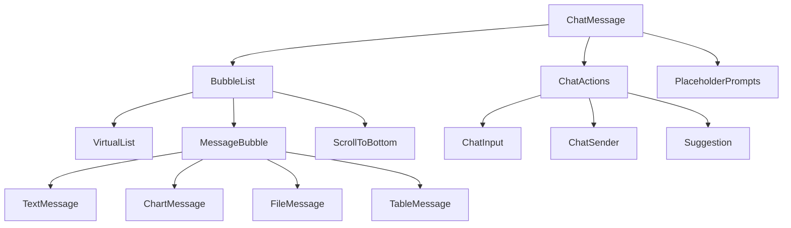
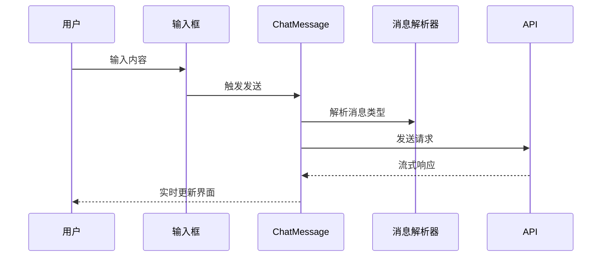
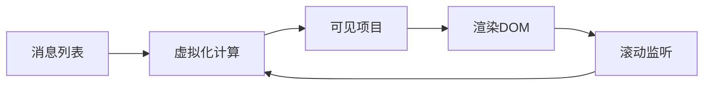

# Chat Messages 设计文档

## 一句话定位
提供完整的聊天消息渲染、交互和管理功能，支持多种消息类型、流式更新和高性能渲染。

## 概览
- **功能范围**：消息渲染、用户交互、虚拟化列表、流式更新
- **目标用户**：需要聊天界面的开发者
- **关键用例**：
  1. 显示多类型消息（文本、图表、文件等）
  2. 处理用户交互（复制、重试、下载等）
  3. 支持大量消息的高效渲染

## 信息架构



## 组件职责

| 组件 | 主要职责 | 状态 | 交互 |
|------|----------|------|------|
| `ChatMessage` | 聊天界面容器 | 消息列表、加载状态 | 发送消息、滚动控制 |
| `BubbleList` | 消息列表渲染 | 虚拟化配置 | 滚动、加载更多 |
| `MessageBubble` | 单条消息渲染 | 消息类型、角色 | 复制、重试、操作 |
| `ChatActions` | 输入操作区域 | 输入内容、建议 | 发送、粘贴、文件上传 |

## 页面蓝图

### 主要区域职责
| 区域 | 显示内容 | 可操作 | 可见条件 |
|------|----------|--------|----------|
| 消息列表区 | 历史消息、流式消息 | 滚动、点击操作 | 始终可见 |
| 输入区域 | 输入框、发送按钮、建议 | 输入、发送、选择建议 | 始终可见 |
| 占位提示区 | 欢迎信息、快捷建议 | 点击建议 | 无消息时显示 |
| 滚动按钮 | "回到底部"提示 | 点击滚动 | 不在底部时显示 |

## 消息类型支持

| 消息类型 | 渲染组件 | 特殊交互 | 数据来源 |
|----------|----------|----------|----------|
| `text` | TextMessage | 复制、编辑 | 用户输入、AI响应 |
| `chart` | ChartMessage | 切换图表类型、下载 | API返回数据 |
| `file` | FileMessage | 预览、下载 | 用户上传、AI生成 |
| `table` | TableMessage | 排序、导出 | API结构化数据 |
| `suggestion` | SuggestionMessage | 点击采纳 | AI推荐内容 |

## 流程图

### 消息发送流程


### 虚拟化渲染流程


## 关键特性

### 1. 性能优化
- [x] **虚拟化列表**：只渲染可见区域消息
- [x] **消息缓存**：避免重复解析相同内容
- [x] **批量更新**：合并多个状态更新

### 2. 流式支持
- [x] **实时渲染**：流式消息逐字符显示
- [x] **打字动画**：模拟AI思考过程
- [x] **中断处理**：支持停止生成

### 3. 交互体验
- [x] **自动滚动**：新消息自动滚动到底部
- [x] **智能回滚**：用户查看历史时停止自动滚动
- [x] **快捷操作**：复制、重试、点赞等

## 使用示例

```typescript
<ChatMessage
  messages={messages}
  onMessageSend={handleSend}
  enableVirtual={messages.length > 50}
  enableAutoScroll={true}
  suggestions={quickReplies}
  placeholder="请输入您的问题..."
/>
```

## 扩展点

1. **自定义消息类型**：扩展消息渲染器
2. **交互行为**：自定义操作按钮和处理逻辑
3. **样式主题**：支持自定义样式和主题

## 相关文档
- [Chat Hooks 设计文档](./chat-hooks.md)
- [Chat Roles 设计文档](./chat-roles.md)
- @see packages/ai-ui/src/ChatMessage/index.ts