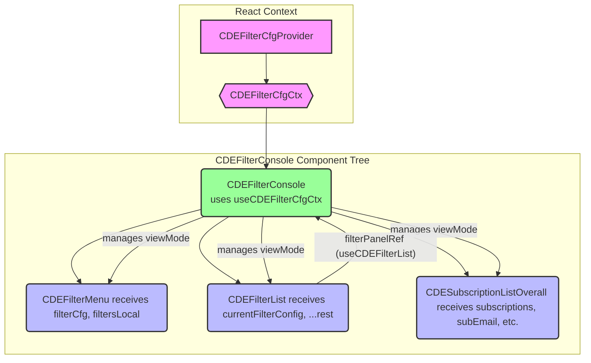

```mermaid
graph TD
    subgraph "React Context"
        Provider[CDEFilterCfgProvider] --> Ctx{{CDEFilterCfgCtx}};
    end

    subgraph "CDEFilterConsole Component Tree"
        Ctx --> FC(CDEFilterConsole
 uses useCDEFilterCfgCtx);

        FC --> FM(CDEFilterMenu receives filterCfg, filtersLocal);
        FC --> FL(CDEFilterList receives currentFilterConfig, ...rest);
        FC --> CS(CDESubscriptionListOverall receives subscriptions, subEmail, etc.);

        FC -- "manages viewMode" --> FL;
        FC -- "manages viewMode" --> CS;
        FC -- "manages viewMode" --> FM;

        FL -- "filterPanelRef (useCDEFilterList)" --> FC;
    end

    %% Styling (optional, for clarity)
    classDef context fill:#f9f,stroke:#333,stroke-width:2px;
    classDef component fill:#bbf,stroke:#333,stroke-width:2px;
    classDef main_component fill:#9f9,stroke:#333,stroke-width:2px;

    class Provider,Ctx context;
    class FC main_component;
    class FM,FL,CS component;

    %% Annotations
    %% note right of FC
    %%     Manages viewMode (main/subscribe)
    %%     Manages filtersLocal (users current filter state)
    %%     Manages currentFilterIndex (selected config)
    %%     Exposes resetFilters via ref
    %% end

    %% note right of Ctx
    %%     Provides:
    %%     filterCfg (base filter configurations)
    %%     codeMap (derived from filterCfg)
    %%     getFilterItemById (utility from filterCfg)
    %% end

    %% note right of FL
    %%     Renders filter items based on currentFilterConfig
    %%     Calls onFilterChange with local filter state
    %% end

    %% note right of FM
    %%     Displays filter categories from filterCfg
    %%     Highlights active category based on filtersLocal
    %% end

```
