## FilterForm 组件

**作者:** [Calvin](xyi.calvin@gmail.com)

**创建日期:** 2025年06月01日

**更新日期:** 2025年07月16日

`FilterForm` 是一个高度可配置的动态表单组件，旨在通过一份 JSON 配置 (`FilterConfigItem[]`) 动态渲染出包含各种标准和自定义筛选条件的表单。它支持简单输入控件、下拉选择、以及由多个控件组合而成的"组合筛选器"。该组件的核心思想是"配置驱动 UI"，并提供统一的数据提交和回显格式。

### 核心设计

1.  **配置驱动 (Configuration-Driven)**: 通过一份数据 (`config`) 动态渲染 UI，极大提高了灵活性和可复用性。
2.  **声明式组件注册 (Declarative Registration)**: 在 `registry.ts` 中维护一个声明式的 `componentMap` 对象作为**单一数据源**。`FilterForm` 根据 `itemType` 字符串查找并渲染对应组件，并利用 TypeScript 的 `keyof typeof` 实现了**组件类型的自动推断**，杜绝了注册类型与使用类型不一致的问题。
3.  **配置预处理 (Configuration Pre-processing)**: 在 `utils/preprocess.ts` 中，通过**策略模式**将不同 `itemType` 的复杂处理逻辑解耦。主函数根据 `itemType` 在"策略地图"中查找并执行相应处理函数，使得逻辑清晰、易于扩展。
4.  **组合模式 (Composition Pattern)**: 在配置预处理步骤中 (`preprocessFilterItem`)，可以动态生成组合配置 (`item.composition`)，允许将多个基础组件灵活地拼接为一个复杂的筛选单元。
5.  **智能包装 (Smart Wrapper)**: 通过 `hasOwnFormItem` 静态标记，实现对表单项 (`Form.Item`) 的智能包装与渲染放权。这部分逻辑被封装在 `hooks/useFilterItemRenderer.tsx` 中。
6.  **开发/生产环境分离**: 通过 `React.lazy` 按需加载开发环境下的调试组件，确保了生产环境包体积的纯净。
7.  **逻辑与视图分离**: 核心的渲染逻辑、表单状态管理逻辑被分别抽取到了自定义 Hooks `useFilterItemRenderer` 和 `useFilterForm` 中，使得主组件 `CDEForm.tsx` 的代码更加简洁清晰。

### 关键特性详解

#### 智能 `Form.Item` 包装与 `hasOwnFormItem`

为了兼顾便利性与灵活性，`FilterForm` 实现了一套智能的 `Form.Item` 包装机制，该逻辑主要由 `hooks/useFilterItemRenderer.tsx` Hook 提供。

- **默认行为**: 默认情况下，`FilterForm` 会自动为每个**基础组件**包裹一个表单项 (`<Form.Item>`)，处理 `label`、`name` 等通用属性。
- **定制化**: 当一个基础组件需要深度定制其 `Form.Item` 时，可以在其组件内部自行包裹 `<Form.Item>`，并为该组件添加一个静态标记：
  ```tsx
  MyCustomComponent.hasOwnFormItem = true
  ```
  当渲染器检测到这个标记时，它会"放权"，不再为该组件提供外层的 `Form.Item` 包装，从而将布局控制权完全交给子组件。

#### 统一的配置预处理: `preprocessFilterItem`

为了支持根据传入数据动态改变组件类型和布局（例如，有的产业筛选带"置信度"而有的不带，或根据选项决定渲染为普通多选还是树形多选），我们使用一个统一的配置预处理函数 `preprocessFilterItem`。该函数在渲染胡克 `useFilterItemRenderer` 中被调用。

- **职责**: 该函数使用策略模式，接收一个原始的 `FilterConfigItem`，并根据其 `itemType` 和其他属性，动态地转换 `itemType` 或构建一个 `composition` 数组来返回一个最终给渲染层使用的组件配置。
- **优势**: 将所有配置转换逻辑集中于一处，实现了组件布局与输入数据的解耦，让组件配置真正地"活"了起来，并且使得逻辑清晰、易于扩展。

#### 关键的默认值处理

这是一个非常重要且容易被忽略的点：**在许多表单库的实现中，仅在组件上设置 `defaultValue` 属性只会影响 UI 显示，并不会将该值注册到表单的状态中，导致提交时数据丢失！**

为了解决这个"致命 Bug"，我们通过自定义 Hook `hooks/useNormalizedValues.ts` 来处理传入的 `initialValues`。它会遍历配置，智能地抽取出所有 `initialValue` 和 `defaultValue`，并将其转换为 Ant Design Form 所要求的格式。最终，在 `CDEForm.tsx` 中，这些值被作为 `initialValues` 属性传递给 `<Form>` 组件，确保它们能被正确地初始化并提交。

#### 友好的开发者体验

`FilterForm` 在开发模式下 (`process.env.NODE_ENV !== 'production'`) 通过懒加载 `dev/DevErrorDisplay.tsx` 组件，提供了丰富的运行时错误提示，同时保证了生产环境的包体积不受影响：

- **组件未注册**: 当 `itemType` 对应的组件在 `registry.ts` 的 `componentMap` 中找不到时。
- **缺少数据源**: 当级联选择器等需要树形数据的组件没有获得有效的 `options` 时。

这些错误会直接以醒目的红色提示框渲染在页面上，极大地提升了开发和调试效率。

### 目录结构与功能说明

```
FilterForm/
├── README.md                           # 组件说明文档
├── CDEForm.tsx                         # 核心入口：定义 FilterForm，负责组装和渲染表单
├── index.tsx                           # 组件出口文件，负责导出 CDEForm 及相关类型
├── index.module.less                   # FilterForm 自身的样式文件
├── registry.ts                         # 组件注册中心：声明式地映射所有可用的筛选器组件 (componentMap)
├── components/                         # 结构性/组合性子组件目录
│   ├── CompositeFilter.tsx             # 组合筛选器：用于渲染由多个子组件构成的复杂筛选条件
│   ├── FilterFormItem.tsx              # 筛选器渲染单元：循环配置并调用 Hook 进行渲染
│   └── ExtraItems.tsx                  # 额外的筛选器容器，用于响应式地显示/隐藏
├── config/                             # 配置文件目录
│   ├── mock.ts                         # 模拟数据：用于 Storybook 或开发调试
│   └── comprehensiveMock.ts            # 另一个更复杂的模拟数据
├── dev/                                # 开发环境下专用代码目录
│   └── DevErrorDisplay.tsx             # 开发模式下的错误提示组件
├── FilterItem/                         # 原子筛选组件目录
│   ├── basic/                          # 基础筛选器目录
│   └── custom/                         # 自定义(业务)筛选器目录
├── hooks/                              # 自定义 Hooks 目录
│   ├── useFilterForm.ts                # 封装了表单核心逻辑的 Hook (状态管理、事件处理)
│   ├── useFilterItemRenderer.tsx       # 封装了筛选器渲染逻辑的 Hook
│   ├── useNormalizedValues.ts          # 用于格式化表单初始值的 Hook
│   └── ...                             # 其他辅助性 Hooks
├── types/                              # TypeScript 类型定义目录
│   └── index.ts                        # 核心类型定义文件 (自动从 registry.ts 推断类型)
└── utils/                              # 工具函数目录
    ├── preprocess.ts                   # 配置预处理工具：使用策略模式转换后端配置
    ├── formUtils.ts                    # 表单相关的纯工具函数
    ├── transform.ts                    # 用于在提交时转换表单数据的工具函数
    └── date.ts                         # 共享的日期处理工具函数
```

### `FilterForm` 工作流程图

```mermaid
graph TD
    A[开始: 接收 config 和 initialValues] --> B[CDEForm 组件];
    B --> C[调用 useFilterForm Hook];
    C --> D[1. 调用 useNormalizedValues 计算初始值];
    D --> E[2. 设置 Form 初始值];
    E --> F[3. 返回表单状态和事件处理器];
    B -- 获取 --> F;
    B --> G[渲染 <Form> 容器];
    G --> H[渲染 FilterFormItem 组件];
    H -- 循环渲染 config --> I[调用 useFilterItemRenderer Hook];
    I -- 对每个 item --> J[调用 renderFilterItemWithExtra];
    J --> K{预处理配置};
    K --> L{渲染主筛选器};
    L --> M{有 Extra?};
    M -- 是 --> N[渲染 ExtraItems 组件];
    N -- useWatch 监听值变化 --> O{是否显示?};
    O -- 是 --> P[渲染额外筛选器];
    L --> Q[UI 呈现];
    P --> Q;
    M -- 否 --> Q;
    Q -- 用户交互 --> R[触发 onValuesChange];
    R -- useFilterForm 中的 handleValuesChange --> S[更新表单状态];
    Q -- 提交 --> T[触发 onFinish];
    T -- useFilterForm 中的 handleFinish --> U[调用 transformFormValues];
    U --> V[结束: 返回格式化数据];
```



---

此次重构后，`FilterForm` 组件的内部逻辑更清晰，职责划分更合理，为未来的功能扩展打下了坚实的基础。
