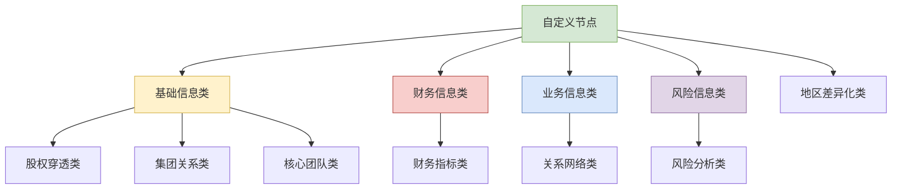

# 自定义节点完整列表

## 概览

**功能范围**：企业详情页面配置系统中所有自定义节点类型的完整列表。

**目标用户**：
- 前端开发人员：了解自定义节点的实现方式
- 产品经理：掌握自定义节点的业务功能

**关键用例**：
1. 查找特定业务场景的自定义节点
2. 了解自定义节点的配置要求
3. 参考自定义节点的最佳实践

## 自定义节点分类体系



## 基础信息模块自定义节点

### 核心自定义节点列表

| 节点名称 | 业务功能 | 数据复杂度 | 组件类型 |
|----------|----------|------------|----------|
| **ActualController** | 实际控制人分析 | 中等 | 控制链可视化 |
| **ShareholderPenetrationGraph** | 股权穿透图谱 | 高 | 图谱可视化 |
| **GroupSystem** | 集团体系展示 | 高 | 网络关系图 |
| **Competitor** | 竞争对手分析 | 中等 | 竞争分析图表 |
| **CoreTeam** | 核心团队展示 | 中等 | 团队关系网络 |
| **HeaderQuarter** | 总部信息展示 | 中等 | 地图可视化 |

### 核心配置特点

**股权穿透图谱** (`ShareholderPenetrationGraph`)
- 支持多层股权关系展示
- 最小持股比例阈值控制
- 交互式图谱操作（缩放、拖拽）

**集团体系** (`GroupSystem`)
- 多种布局类型支持
- 关系类型过滤
- 资本规模和地区筛选

**实际控制人** (`ActualController`)
- 控制链条追溯
- 控制权比例计算
- 导出功能支持

## 财务信息模块自定义节点

### 财务分析节点

| 节点名称 | 业务功能 | 分析维度 | 数据来源 |
|----------|----------|----------|----------|
| **corpFinancialIndicator** | 财务指标综合分析 | 多维度财务指标 | 财务报表API |

**财务指标配置特点**：
- 时间范围对比分析
- 行业平均基准对比
- 趋势预测和可视化

## 业务信息模块自定义节点

### 关系网络节点

| 节点名称 | 业务功能 | 网络类型 | 风险评估 |
|----------|----------|----------|----------|
| **corpCustomersAndSuppliers** | 客户供应商关系 | 供应链网络 | 依赖度分析 |
| **corpBusinessAssociates** | 商业伙伴网络 | 合作关系 | 风险传导 |

**关系网络配置特点**：
- 地理分布分析
- 行业集中度评估
- 风险传导路径识别

## 风险信息模块自定义节点

### 风险分析节点

| 节点名称 | 业务功能 | 风险类型 | 可视化方式 |
|----------|----------|----------|------------|
| **RiskHeatmap** | 风险热力图 | 综合风险 | 热力图展示 |

**风险分析配置特点**：
- 多维度风险聚合
- 时间序列分析
- 预警阈值设置

## 地区差异化自定义节点

### 特殊地区配置节点

| 节点名称 | 适用地区 | 特殊处理 | 合规要求 |
|----------|----------|----------|----------|
| **HKCorpInfo** | 香港企业 | 公司注册处查询 | 香港法规 |
| **英国股东信息** | 英国企业 | Companies House查询 | 英国法规 |
| **印度股东信息** | 印度企业 | MCA Portal查询 | 印度法规 |
| **泰国股东信息** | 泰国企业 | DBD注册查询 | 泰国法规 |

### 地区差异化配置特点

**香港企业** (`HKCorpInfo`)
- 公司注册处数据集成
- 商业登记信息查询
- 年报披露要求

**英国企业** (`英国股东信息`)
- Companies House数据对接
- 实控人信息披露
- 股东名册查询

**印度企业** (`印度股东信息`)
- MCA Portal数据集成
- 外资持股限制检查
- 披露阈值控制

## 自定义节点开发规范

### 组件开发要求

```typescript
interface CustomNodeComponent<T = any> {
  value: T // 节点数据
  config: CustomNodeConfig // 节点配置
  nodeId: string // 节点ID
  onDataUpdate?: (data: T) => void // 数据更新回调
  onError?: (error: Error) => void // 错误处理回调
}
```

### 核心开发原则

1. **数据驱动**：配置驱动渲染逻辑
2. **性能优先**：大数据量的虚拟化处理
3. **错误恢复**：完善的错误处理和降级机制
4. **可测试性**：组件逻辑与展示分离

### 性能优化要点

| 优化维度 | 实现方式 | 适用场景 |
|----------|----------|----------|
| **数据懒加载** | 可见时加载 | 大型网络图 |
| **虚拟化渲染** | 按需渲染节点 | 复杂图谱 |
| **数据缓存** | 智能缓存策略 | 重复访问数据 |
| **防抖处理** | 交互事件优化 | 用户频繁操作 |

## 使用指南

### 快速查找节点

1. **按业务模块**：参考模块分类表
2. **按功能类型**：查看分类体系图
3. **按地区特殊需求**：查看地区差异化节点

### 配置参考

- 基础配置：参考节点配置设计文档
- 实现示例：查看具体模块的README
- 最佳实践：参考现有节点配置

### 常见使用场景

| 使用场景 | 推荐节点 | 配置要点 |
|----------|----------|----------|
| **投资尽调** | 股权穿透、实际控制人 | 控制链深度、持股比例 |
| **风险分析** | 风险热力图、关系网络 | 风险阈值、关联度分析 |
| **跨境业务** | 地区差异化节点 | 合规要求、数据源配置 |

## 相关文档

- @see ./node-configuration-design.md - 节点配置设计详解
- @see ./data-structures.md - 核心数据结构说明
- @see ../README.md - 包概述和快速开始
- @see ../../types/src/ConfigDetail/report/index.ts - 类型定义文件
- @see ./documentation-index.md - 完整文档索引