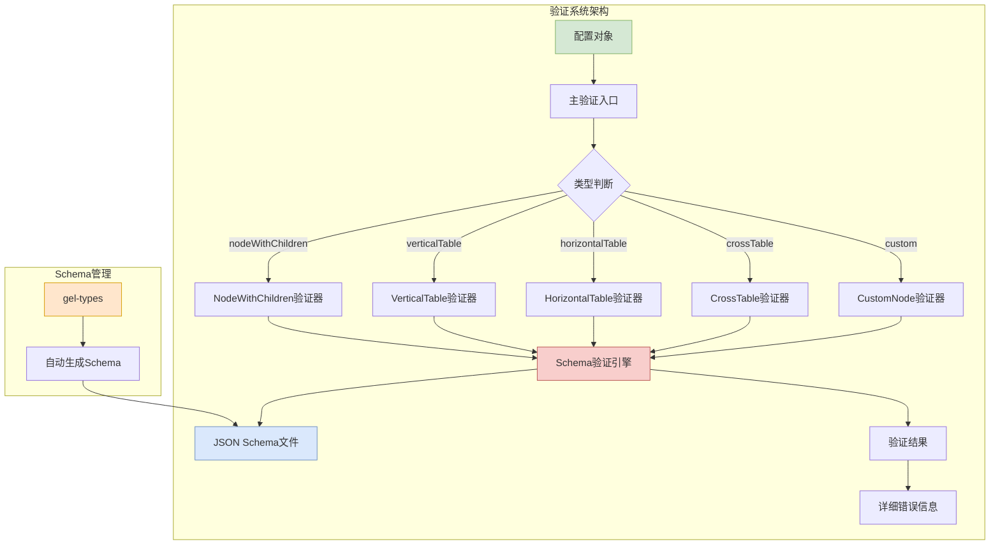
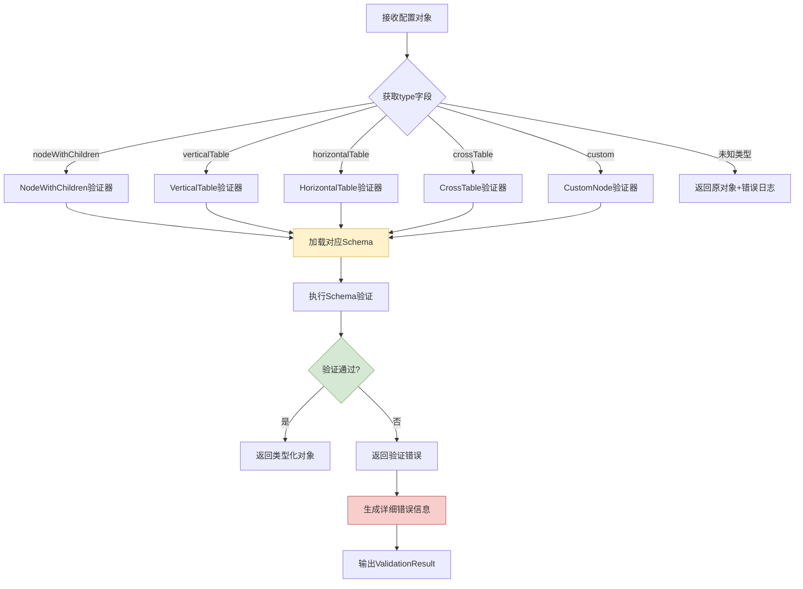

# 类型校验系统设计

## 概览

**功能范围**：提供轻量级、无第三方依赖的配置验证系统，确保配置对象结构正确。

**目标用户**：
- 开发人员：验证配置结构正确性
- 构建系统：CI/CD流程中的自动验证
- 维护人员：调试配置问题和类型错误

**关键用例**：
1. 开发阶段验证配置对象结构
2. 构建时自动检查配置完整性
3. 运行时提供详细错误信息辅助调试

## 信息架构



**模块说明**：
- `validator/index.ts` - 主验证入口，根据类型分发到对应验证器
- `validator/validator.ts` - 核心验证引擎，实现JSON Schema验证逻辑
- `validator/[Type].ts` - 类型特定验证器，处理各表格类型的特殊逻辑
- `schema/` - 从gel-types自动生成的JSON Schema文件

## 任务流程

### 配置验证流程



## 组件复用

### 验证器层级结构

```
ValidationSystem (根系统)
├── validateReportDetailNodeOrNodesJson (主入口)
├── validateReportDetailTableJson (表格验证入口)
├── CoreValidator (核心验证引擎)
│   ├── validateSchema (Schema验证)
│   ├── validateWithDefinitions (含定义的验证)
│   └── getJsonType (类型获取工具)
└── TypeSpecificValidators (类型特定验证器)
    ├── VerticalTableValidator
    ├── HorizontalTableValidator
    ├── CrossTableValidator
    ├── CustomNodeValidator
    └── NodeWithChildrenValidator
```

### 输入输出规范

| 组件 | 输入类型 | 输出类型 | 错误处理 |
|------|----------|----------|----------|
| **主验证入口** | `any` (配置对象) | `ReportDetailNodeOrNodesJson` | 未知类型时返回原对象+错误日志 |
| **核心验证引擎** | `instance`, `schema`, `path` | `ValidationResult` | 结构化错误信息 |
| **类型验证器** | 类型化配置对象 | 类型化对象 + 验证结果 | 类型转换错误 |

## 技术约束

### ES5兼容性要求

验证器代码需要兼容wkhtmltopdf的ES5环境：

**兼容性实现**：
- 使用`for...in`循环替代`Object.entries`/`Object.keys`
- 使用`Array.prototype.indexOf`替代`Array.prototype.includes`
- 避免使用箭头函数和解构赋值
- 使用`var`声明变量

### 无依赖设计

- **验证引擎**：完全自实现，不依赖任何第三方验证库
- **Schema处理**：内置$ref解析，无需外部库
- **错误处理**：原生JavaScript错误处理机制

## 设计优势

### 轻量级
- 运行时零第三方依赖
- 核心验证逻辑仅300余行代码
- 自动Tree-shaking优化

### 可靠性
- 从TypeScript类型自动生成Schema，保证同步
- 详细的错误信息，便于调试
- 完整的类型安全保证

### 兼容性
- ES5兼容代码，支持wkhtmltopdf环境
- 纯JavaScript实现，无环境依赖
- 支持完整的JSON Schema规范

## 相关文档

- @see ../README.md - 包概述
- @see ./design.md - 整体设计文档
- @see ./examples.md - 代码示例和使用方法
- @see ./data-structures.md - 数据结构说明
- @see ./node-configuration-design.md - 节点配置设计详解
- @see ./custom-nodes-complete-list.md - 自定义节点完整列表