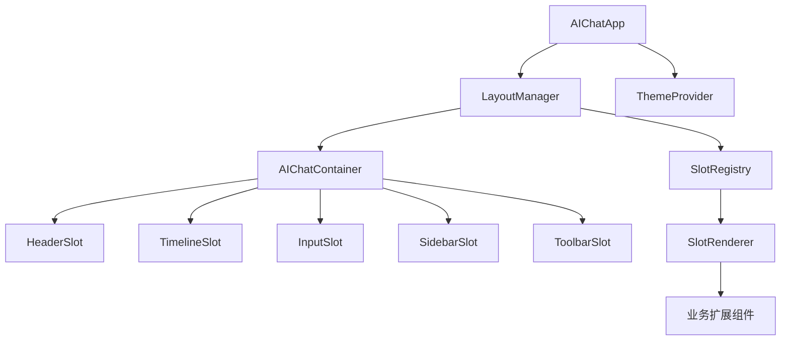
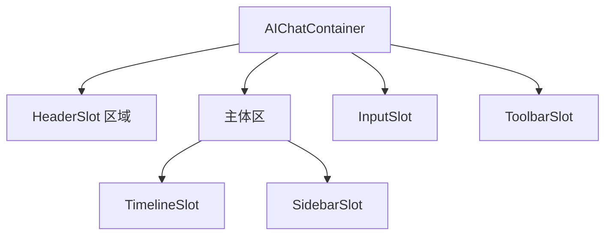
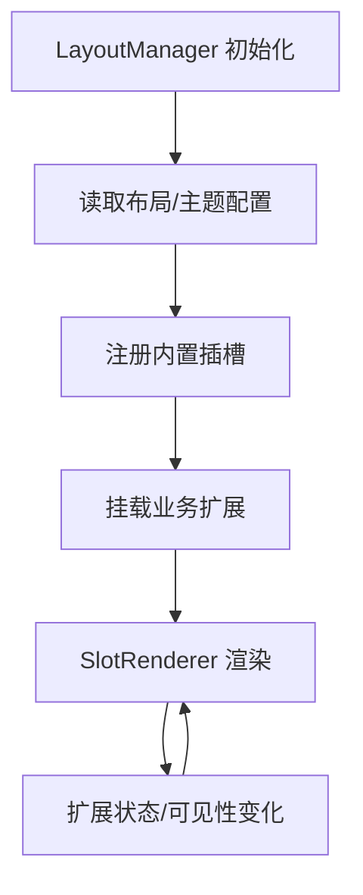
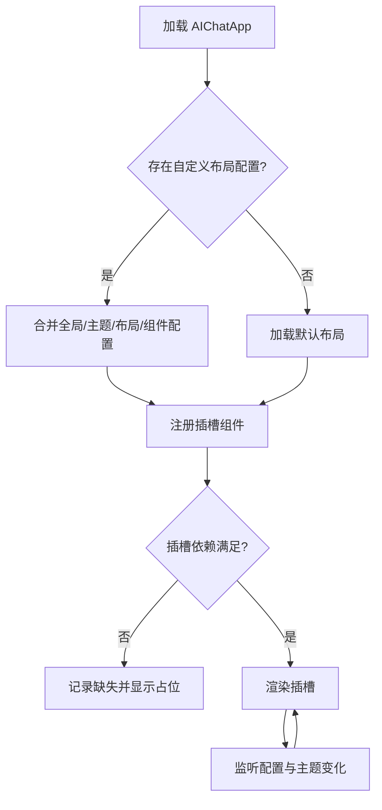
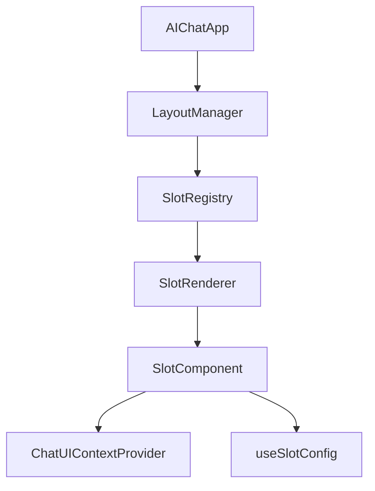

# AI 对话组件架构设计文档（布局与功能）

## 🧭 设计概览
- 功能范围与边界：聚焦 AI 对话 UI 组件层，说明容器布局、插槽系统、配置驱动能力与扩展规则；不涉及消息流程编排与网络请求。
- 目标：降低组件耦合度，提高扩展效率，支持不同业务在不改动底层逻辑的情况下灵活组合头部、时间线、侧栏及操作区。
- 目标用户：前端工程师、设计工程师、需要在现有聊天框架上做业务定制的团队。
- 关键用例：
  1. 为特定行业接入自定义的侧栏指标卡片而无需修改核心容器。
  2. 向 AI 消息页脚注入“转工单”“知识库反馈”等业务按钮。
  3. 按项目需求切换“并排布局”和“头部压缩布局”。
  4. 动态调整主题与品牌色并覆盖局部组件样式。

## 🗺 信息架构与导航

- **入口映射**：`AIChatApp` 通过 `LayoutManager` 读取配置并注入对应插槽；`SlotRegistry` 维护 `slotId → component` 的映射，业务可通过注册 API 动态挂载。
- **导航规则**：插槽渲染顺序遵循 `priority` 排序；不可见插槽按配置隐藏但仍保留状态；Toolbar/Sidebar 可按布局模式（横向/纵向）切换摆放位置。
- **返回策略**：布局切换或主题更新会触发容器重渲染但保持消息时间线滚动位置；业务扩展卸载时需归还插槽释放资源。

## 🧱 页面蓝图（核心区域）

### 顶层容器布局

| 区域 | 职责 | 默认内容 | 可替换/扩展 | 可见性规则 |
| ---- | ---- | -------- | ----------- | ----------- |
| HeaderSlot | 展示会话标题、实体信息、全局操作 | 默认头部组件 | 可注入自定义按钮、指标 | 始终显示，可压缩布局 |
| TimelineSlot | 显示消息时间线 | XChat 消息面板 | 支持自定义消息 renderer | 始终显示 |
| SidebarSlot | 展示溯源、实体、报表等结构数据 | 默认参考面板 | 可插入多 Tab 自定义内容 | 可配置初始隐藏 |
| InputSlot | 输入框与快捷操作 | 基础输入组件 | 支持替换输入法、附件等 | 始终显示 |
| ToolbarSlot | 工具栏与全局动作 | 空（按需） | 可注册导出、收藏、深度检索 | 仅当有注册按钮时显示 |

### 插槽生命周期

- 插槽在挂载时接收 `context`（当前会话、路由、主题）与 `config`（优先级、可见性、权限）。
- 卸载扩展时触发 `onDispose` 回调，用于清理订阅与计时器。

## 🔄 交互流程与状态

- **状态管理**：
  - `LayoutMode`：`split`（并排）、`focus`（单列）、`compact`（窄屏）。
  - `ThemeState`：`light` / `dark` / `brand`，影响 CSS 变量。
  - `SlotVisibility`：`visible`、`hidden`、`collapsed`。
- **交互规则**：

| 触发条件 | 系统行为 | 用户反馈 | 可撤销 | 备注 |
| -------- | -------- | -------- | ------ | ---- |
| 修改布局配置 | 重新计算区域栅格并触发重渲染 | 容器过渡动画，保持滚动位置 | 是（恢复默认） | 通过配置中心或 URL 参数 |
| 注册新插槽 | 更新 SlotRegistry 并立即渲染 | 新区域渐显 | 是（注销） | 需声明优先级避免冲突 |
| Sidebar 收起 | 将 `SlotVisibility` 设为 `collapsed` | 侧栏折叠动画，按钮高亮 | 是 | 保持在窄屏默认收起 |
| 切换主题 | 更新 CSS 变量与暗色标志 | 平滑过渡，无闪烁 | 是 | 主题配置合并顺序：组件 > 布局 > 主题 > 全局 |
| 插槽报错 | 捕获异常并渲染错误占位 | 提示“组件不可用” + 重试按钮 | 是 | 错误不会影响其他插槽 |

## 🧮 数据与本地状态
- **配置层级**：

| 层级 | 内容 | 合并优先级 | 示例 |
| ---- | ---- | ---------- | ---- |
| GlobalConfig | API 域、默认主题、全局操作集 | 低 | 统一导出按钮 |
| ThemeConfig | 颜色、字体、阴影、动画 | ↑ | 不同品牌主题 |
| LayoutConfig | 布局模式、区域尺寸、响应式断点 | ↑ | 双栏/单栏切换 |
| ComponentConfig | 插槽级参数、权限、占位符 | 最高 | 某业务的自定义按钮 |

- **上下文对象**：`ChatUIContext`（`chatId`, `entityCode`, `isStreaming`, `permissions`, `runtimeMetrics`）。
- **状态同步**：
  - 插槽通过 `useUIConfig` 订阅配置更新；
  - 组件可向 `SlotRegistry.updateConfig(slotId, patch)` 回写自身可见性；
  - 布局变化广播给消息时间线，用于重新计算滚动条高度。
- **缓存策略**：配置在内存中缓存并以 `version` 控制热更新；主题变量写入 CSS 自定义属性，避免重复计算。

## 🧩 组件分解与复用

- **输入/输出**：
  - LayoutManager 输入：全局配置、当前布局模式、响应式信息；输出：区域容器与 SlotRegistry。
  - SlotRegistry：提供 `register/unregister/resolve` API；输出给 SlotRenderer 渲染顺序与配置。
  - SlotComponent：接收 `context + config`，返回实际 ReactNode。
- **复用策略**：
  - 插槽组件遵循“数据驱动 + 无副作用”原则，便于共享与测试。
  - 常用动作（复制、导出、提醒）沉淀为 ActionPreset，业务可复用。
  - 侧栏、工具栏等模块支持在不同页面复用，只要提供同样的上下文即可。
- **错误边界**：
  - 每个插槽使用独立的 `ErrorBoundary`；
  - 插槽卸载时确保移除事件监听与定时器，防止内存泄漏。

## 🌍 可访问性与国际化
- 插槽容器需暴露 `aria-label` 与快捷键提示；键盘导航顺序基于 `priority` 自动生成。
- 主题切换时需确保对比度达标；文本、按钮等文案均从 i18n 资源读取并允许动态扩展。

## 🚫 非目标与不包含
- 不涉及消息数据流与网络请求调度（参见 `chat-flow-core-design.md`）。
- 不覆盖 Markdown/溯源渲染细节（参见 `md-rendering-design.md`）。
- 不定义后端布局配置协议。

## ✅ 检查清单（布局与功能）
- [x] 顶层布局与插槽职责清晰
- [x] 插槽生命周期与配置交互可追踪
- [x] 状态/主题/响应式规则明确
- [x] 数据与配置层级说明完备
- [x] 组件分解、复用、错误边界覆盖
- [x] 列出非目标范围避免重复说明
