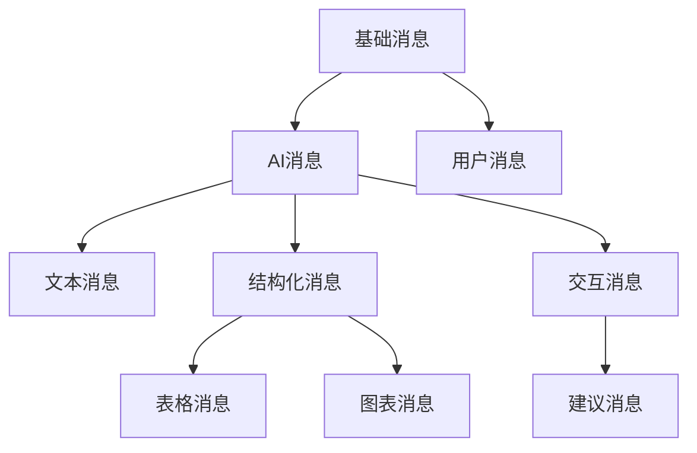
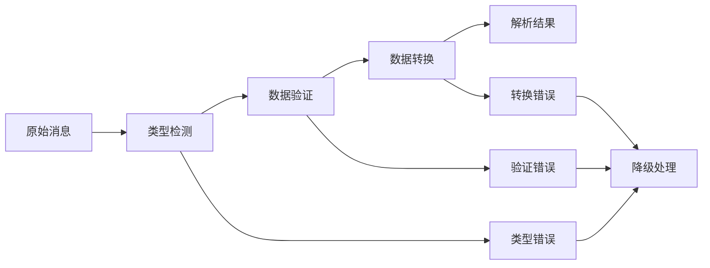
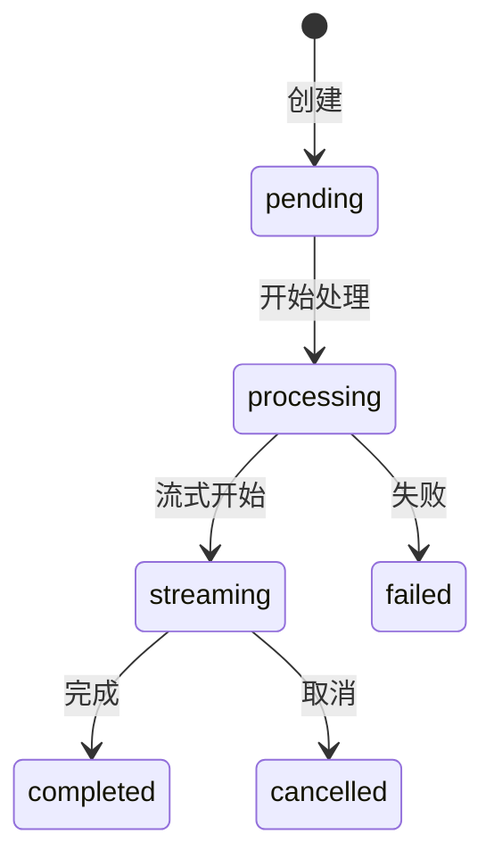

# AI Chat 消息模型设计

## 设计概览

建立统一的消息抽象层，支持多种消息类型和扩展机制。

## 消息类型体系



## 核心数据模型

### 基础消息
| 字段 | 类型 | 说明 |
|------|------|------|
| id | string | 消息唯一标识 |
| type | MessageType | 消息类型 |
| content | string | 消息内容 |
| timestamp | number | 创建时间戳 |
| status | MessageStatus | 消息状态 |

### AI消息扩展
| 字段 | 类型 | 说明 |
|------|------|------|
| model | string | AI模型标识 |
| reasoning | string | 推理过程 |
| suggestions | Suggestion[] | 建议列表 |
| entities | Entity[] | 实体信息 |
| references | Reference[] | 参考来源 |

## 解析流水线



### 解析策略
- **类型检测**: 基于数据结构自动识别消息类型
- **数据验证**: 必填字段和格式检查
- **错误降级**: 解析失败时回退到纯文本

## 渲染系统

### 组件映射
| 消息类型 | 渲染组件 | 特性 |
|----------|----------|------|
| text | TextMessageComponent | 基础文本渲染 |
| table | TableMessageComponent | 表格数据展示 |
| chart | ChartMessageComponent | 图表可视化 |
| suggestion | SuggestionComponent | 交互建议 |

### 渲染配置
```typescript
interface RenderConfig {
  theme: 'light' | 'dark';
  enableCopy: boolean;
  enableExport: boolean;
  virtualScroll: boolean;
}
```

## 交互系统

### 交互类型
- **复制**: 消息内容复制
- **分享**: 消息分享功能
- **导出**: 数据导出功能
- **建议**: 智能建议交互

### 建议消息
```typescript
interface Suggestion {
  id: string;
  text: string;
  type: 'question' | 'action';
  onSelect: () => void;
}
```

## 状态管理

### 状态流转


## 扩展机制

### 注册新类型
```typescript
// 注册解析器
MessageFactory.register('custom-type', CustomParser);

// 注册渲染器
MessageRendererRegistry.register('custom-type', CustomRenderer);
```

### 插件支持
- 解析插件：自定义消息解析逻辑
- 渲染插件：自定义渲染组件
- 交互插件：自定义交互行为

---

*相关实现: `src/types/ai-chat/`, `src/utils/ai-chat/messageParser.ts`*