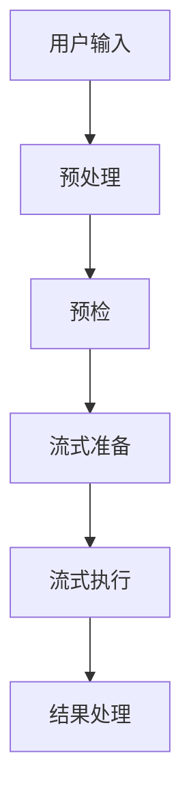
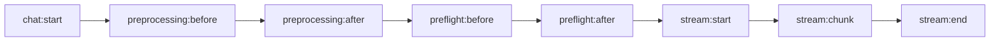
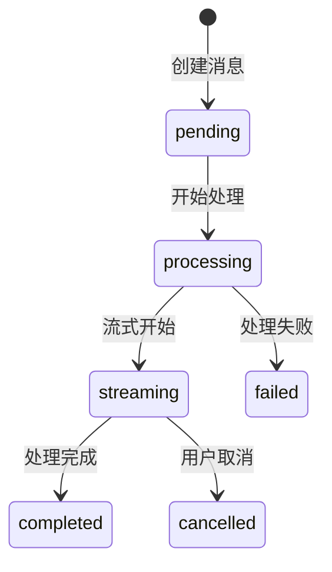

# AI Chat 流程设计

## 设计概览

定义四阶段处理流水线，建立清晰的消息流转和状态管理体系。

## 核心流程架构

### 处理阶段

| 阶段 | 职责 | 输入 | 输出 |
|------|------|------|------|
| 预处理 | 输入验证、格式化 | 原始输入 | 标准化消息 |
| 预检 | 权限检查、内容审核 | 标准化消息 | 预检结果 |
| 流式准备 | 上下文构建 | 预检结果 | 流式请求 |
| 流式执行 | 数据传输 | 流式请求 | 响应数据 |
| 结果处理 | 数据保存、状态更新 | 响应数据 | 会话状态 |

## 事件系统

### 扩展机制
- **前置监听**: 数据预处理、验证
- **后置监听**: 结果处理、状态更新
- **错误监听**: 异常捕获、恢复策略

## 状态管理

### 状态定义
- `pending`: 等待处理
- `processing`: 正在处理
- `streaming`: 流式传输中
- `completed`: 处理完成
- `failed`: 处理失败
- `cancelled`: 用户取消

---

*相关实现: `src/service/ai-chat/`, `src/hooks/aiChat/`*
*参见文档: [系统架构设计](./architecture-design.md)*