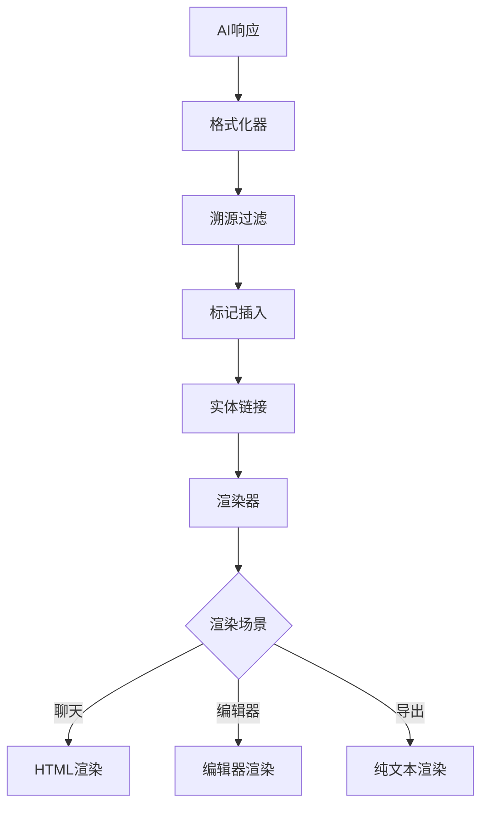

# AI Chat 渲染系统设计

## 设计概览

AI回答内容的完整渲染处理系统，涵盖溯源标记、实体链接、格式化渲染和多场景适配。

## 核心能力

- 实时流式渲染AI回答
- 溯源标记和实体高亮
- 多场景渲染适配
- 富文本交互支持
- 性能优化机制

## 渲染流水线

## 核心组件

### 溯源标记
| 组件 | 功能 | 渲染方式 |
|------|------|----------|
| 标记插入器 | 溯源数据插入 | 内联/上标/侧边栏 |
| 标记渲染器 | 溯源标记展示 | 可点击交互 |
| 标记管理器 | 溯源数据管理 | 缓存/更新 |

### 实体链接
| 组件 | 功能 | 支持类型 |
|------|------|----------|
| 实体识别器 | 文本实体识别 | 公司/人物/产品等 |
| 链接生成器 | 实体链接创建 | 内部/外部链接 |
| 链接渲染器 | 链接样式展示 | 文本/图标/卡片 |

## 渲染场景

| 场景 | 标记处理 | 交互支持 | 性能要求 |
|------|----------|----------|----------|
| 聊天界面 | 完整渲染 | 完整支持 | 实时性 |
| 编辑器 | 保护模式 | 有限支持 | 稳定性 |
| 导出 | 清除标记 | 无支持 | 完整性 |

## 性能优化

- **增量渲染**: 流式数据分块处理
- **虚拟滚动**: 长内容性能优化
- **缓存策略**: 多层次缓存机制
- **懒加载**: 按需加载渲染器

## 可访问性

- **键盘导航**: Tab切换、快捷键支持
- **屏幕阅读器**: 语义化HTML、aria标签
- **国际化**: 多语言支持、文本方向适配

---

*相关实现: `src/utils/ai-chat/rendering.ts`*