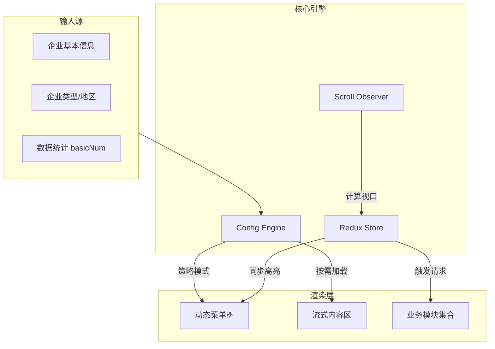

# 企业详情页重构：配置化驱动与高性能长列表优化 | 2023.06 - 至今

**角色**：核心开发
**项目背景**：
企业详情页是投资分析师的核心工作台，聚合了工商、财务、司法、舆情等 50+ 个业务维度的企业数据。旧版系统面临代码耦合严重、特殊企业（IPO、基金、海外）定制成本高、以及长列表加载卡顿等性能瓶颈。
**核心技术栈**：React 18, TypeScript, Redux Toolkit, Config-Driven UI, Virtual Scroll Strategy

## 1. 全景架构 (The Big Picture)

### 1.1 业务背景

一句话解释：**通过配置化引擎解决多企业类型的差异化展示难题，利用智能滚动策略实现海量数据的秒级渲染。**

### 1.2 架构视图



### 1.3 技术选型决策表 (ADR)

| 决策点       | 选择                         | 对比         | 理由/证据                                                                                                                      |
| :----------- | :--------------------------- | :----------- | :----------------------------------------------------------------------------------------------------------------------------- |
| **架构模式** | **配置驱动 (Config-Driven)** | 逻辑硬编码   | 页面需适配普通、IPO、公募/私募基金、海外等多种企业形态。配置化将“显示什么”与“如何渲染”解耦，逻辑复用率提升 80%。               |
| **加载策略** | **滚动懒加载 (Scroll Lazy)** | 一次性加载   | 50+ 个模块若全量请求会导致首屏 TTI > 3s。基于滚动的按需加载（可视区 + 预加载 N 个）将首屏接口数控制在 5 个以内。               |
| **状态同步** | **Redux + Throttling**       | Context + IO | 菜单高亮需实时响应滚动，IntersectionObserver 在快速滚动时有延迟。采用 Redux 管理滚动状态配合 rAF 节流，实现 60fps 的丝滑联动。 |

## 2. 核心功能实现 (Core Features & Implementation)

### Feature 1：配置驱动 UI 开发 (Logic Reuse)

- **目标**：一套代码支持所有企业类型的差异化展示，解决“改一个判断崩整个页面”的维护痛点。
- **实现逻辑**：
  - **元数据定义**：在 `listRowConfig` 中定义所有模块的标准元数据（API、UI 组件、依赖字段）。
  - **策略分发**：`useCorpMenuByType` Hook 根据 `corpType` (IPO/基金) 和 `areaCode` (海外) 自动匹配对应的菜单配置策略。
  - **数据驱动**：结合 `basicNum` 统计数据，动态过滤无数据模块，实现“千企千面”。

### Feature 2：长数据流性能优化 (Performance)

- **目标**：在包含 50+ 个复杂表格图表的长页面中，保持滚动流畅且不阻塞主线程。
- **实现逻辑**：
  - **虚拟占位**：未进入可视区的模块仅渲染高度固定的骨架屏（Skeleton），减少 DOM 节点数量。
  - **智能预加载**：基于滚动方向和速度，动态计算预加载阈值（通常为可视区下方 2 个模块），平衡网络请求与渲染压力。
  - **菜单联动优化**：将 DOM 查询操作（`offsetTop`）缓存至 Ref 中，滚动监听时仅做纯数值计算，避免强制重排（Reflow）。

## 3. 核心难点攻坚 (Deep Dive Case Study)

### 案例 A：多形态企业配置的逻辑复用

- **现象**：IPO 企业需要展示“募集资金”，而私募基金需要展示“基金管理人”。早期代码中充斥着 `if (isIPO) ... else if (isFund) ...`，维护极易出错。
- **方案**：
  - 引入 **配置合成策略 (Configuration Composition)**。
  - 基础配置 `BaseConfig` 包含工商、风险等通用模块。
  - 特殊配置（如 `IpoConfig`）仅定义增量差异。
  - 运行时通过 `merge(Base, Special)` 生成最终配置，并经过 `PermissionFilter` 过滤权限。
- **代码实证**：
  ```typescript
  // hooks/useCorpMenuByType.ts
  export const useCorpMenuByType = (info: CorpBasicInfo, basicNum: any) => {
    // 1. 获取基础策略
    let menuConfig = getBaseMenu();

    // 2. 应用特殊策略 (IPO/Fund/Overseas)
    if (isIPO(info)) {
      menuConfig = mergeConfig(menuConfig, IpoBusinessData);
    } else if (isPrivateFund(info)) {
      menuConfig = mergeConfig(menuConfig, PrivateFundData);
    }

    // 3. 数据驱动过滤 (Logic Reuse)
    return filterEmptyModules(menuConfig, basicNum);
  };
  ```

### 案例 B：滚动同步的高频事件优化

- **现象**：用户快速拖拽滚动条时，左侧菜单高亮延迟，且页面出现掉帧。
- **排查**：`onScroll` 事件触发频率极高（每秒 100+ 次），回调中执行了 `document.getElementById().offsetTop`，触发了浏览器强制同步布局（Synchronous Layout）。
- **方案**：
  - **读写分离**：在 `useEffect` 初始化时一次性读取所有模块的 `offsetTop` 并存入 `positionMap`。
  - **帧对齐**：使用 `requestAnimationFrame` 将状态更新锁定在每一帧的渲染周期内。
- **结果**：Script 执行时间从 30ms/帧 降至 2ms/帧，FPS 稳定在 58-60。

## 4. 事故与反思 (Post-Mortem)

- **Timeline**：
  - 上线后，运营反馈某“上海工商联”特供版企业页面显示空白。
- **Root Cause**：
  - 该企业的 `basicNum.__specialcorp` 标识为 `true`，触发了白名单过滤逻辑。
  - 但配置表中漏配了该类型对应的 `moduleKey`，导致过滤后模块列表为空。
- **Action Item**：
  - 增加 **配置完整性校验** 测试，确保所有注册的 `SpecialCorp` 都有对应的非空配置。
  - 增加兜底逻辑：当过滤结果为空时，自动降级显示基础工商信息，避免白屏。

## 5. 知识库 (Wiki / Snippets)

- **滚动监听器工厂**：
  ```typescript
  // misc/scroll.ts
  export const createCorpDetailScrollCallback = (
    positions: ModulePosition[],
    dispatch: Dispatch
  ) => {
    return throttle((scrollTop: number) => {
      // 纯数值查找，无 DOM 操作
      const active = positions.find(
        (p) => scrollTop >= p.top - OFFSET && scrollTop < p.bottom
      );
      if (active) dispatch(setHighlightKey(active.key));
    }, 16);
  };
  ```
