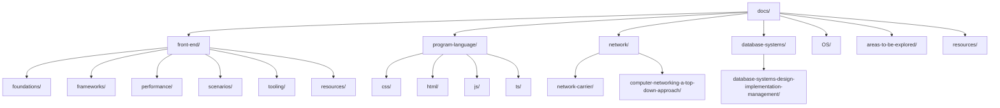

# Self Program Knowledge Database

> 综合性编程知识库，涵盖程序语言、数据库、网络、前端开发等多个技术领域的学习笔记和资源汇总。

## 📚 知识领域导航

### 🖥️ Program Language
- **入口**: [./program-language/README.md](./program-language/README.md)
- **HTML** - Web 标记语言基础
- **CSS** - 样式与布局技术  
- **JavaScript** - 核心语言概念与 ES6+ 特性
- **TypeScript** - 类型安全的 JavaScript 开发

### 🗄️ Database Systems
- **入口**: [./database-systems/README.md](./database-systems/README.md)
- **Database Concepts** - 数据库核心原理
- **Design & Implementation** - 数据库设计模式与最佳实践
- **读书笔记** - Database Systems: Design, Implementation & Management

### 🌐 Network
- **入口**: [./network/README.md](./network/README.md)
- **Computer Networking** - 网络协议与架构
- **Network Layers** - 应用层、传输层、网络层概念
- **Network Carrier** - 分层模型详解

### ⚡ Node.js
- **Learning Node** - 服务端 JavaScript 开发
- **Moving to Server Side** - Node.js 进阶概念

### 🎨 Web Front End
- **入口**: [./front-end/README.md](./front-end/README.md)
- **Foundations** - 浏览器原理、网络基础、安全实践
- **Frameworks** - React、Vue 等现代框架
- **Performance** - 性能优化技术
- **Scenarios** - 实际场景解决方案
- **Tooling** - 工程化工具（Webpack、Vite、包管理等）
- **Visualization** - 数据可视化

### 🔗 Web 3
- **Areas to be Explored** - 新兴 Web 技术探索

### 💡 Resources
- **全局资源**: [./resources/README.md](./resources/README.md)
- **前端资源**: [./front-end/resources/README.md](./front-end/resources/README.md)
- **程序资源**: [./program-resource.md](./program-resource.md)

---

## 📐 知识库架构

### 整体结构设计

本知识库采用 **领域（Domain）→ 子域（Subdomain）→ 主题（Topic）** 的三层组织结构：



### 目录结构说明

#### 已完成规范化的领域
- **front-end/** - 前端开发：已完成 foundations/frameworks/performance/scenarios/tooling/resources 分层
- **program-language/** - 编程语言：css/html/js/ts 子目录，每个子目录以 README.md 为入口
- **network/** - 计算机网络：包含理论知识（network-carrier）和读书笔记（computer-networking-a-top-down-approach）
- **database-systems/** - 数据库系统：以读书笔记为主（database-systems-design-implementation-management）

#### 待探索与临时区域
- **areas-to-be-explored/** - 待探索主题（AI、Web3、Bywork），保留为临时收纳区
- **resources-to-be-organized/** - 临时资源收集区，后续将并入对应领域的 resources/

### 统一约定

#### 命名规范
- **文件与目录**：统一使用英文 kebab-case（短横线分隔）
- **入口文件**：每个目录内统一使用 `README.md` 作为索引入口
- **资源文件**：描述性命名，如 `react-rendering-flow.png`

#### 导航策略
- **总索引**：`docs/README.md`（本文）提供全局概览
- **领域索引**：每个顶层领域都有 `README.md` 概览与导航
- **交叉引用**：使用相对路径，保持就近链接原则
- **延伸阅读**：同域页面末尾添加相关链接

#### 资源管理
- **就近原则**：各领域资源存放在对应的 `assets/` 目录下
  - 例如：`front-end/assets/`、`program-language/css/assets/`
- **避免跨域引用**：减少复杂的相对路径
- **外链集中**：外部资源链接集中在各域的 `resources/README.md`

#### 图示规范
- **优先使用** Mermaid 绘制流程图、架构图
- **位图格式**：使用 webp/png，控制尺寸与密度
- **图片说明**：添加清晰的 alt 文本和图注

---

## 🚀 快速开始

### 浏览文档

通过上方的[知识领域导航](#-知识领域导航)选择感兴趣的主题，点击入口链接开始学习。

**推荐学习路径：**

1. **前端开发者**：
   - 基础 → [Browser](./front-end/foundations/browser.md) + [Network](./front-end/foundations/network.md)
   - 框架 → [React](./front-end/frameworks/react/) 或 [Vue](./front-end/frameworks/vue/)
   - 工程化 → [Tooling](./front-end/tooling/)

2. **全栈开发者**：
   - 语言基础 → [JavaScript](./program-language/js/) + [TypeScript](./program-language/ts/)
   - 网络知识 → [Network](./network/)
   - 数据库 → [Database Systems](./database-systems/)

3. **系统工程师**：
   - 网络协议 → [Network Layers](./network/)
   - 操作系统 → [OS](./OS/)
   - 数据库原理 → [Database Concepts](./database-systems/)

### 搜索功能

使用站点搜索功能（通常在页面顶部）快速查找特定主题或关键词。

---

## 📖 文档编写指南

本知识库遵循统一的文档编写规范，详见 [WRITING_GUIDELINES.md](../WRITING_GUIDELINES.md)

### 核心原则

1. **内容优先**：避免过度拆分，单个文档可以较长（≤1000行）以保持主题完整性
2. **可读性**：清晰的层级结构，使用目录导航，合理的段落分隔
3. **可维护性**：统一命名、相对路径、定期检查
4. **渐进式**：从概述到细节，先核心后进阶

### 文档拆分决策

**保持单一文档的情况：**
- 内容紧密相关，需要连贯阅读
- 文档长度在 1000 行以内
- 主题单一且完整

**拆分文档的情况：**
- 文档超过 1000 行且包含多个独立子主题
- 内容可以独立阅读和理解
- 面向不同受众群体

### 快速参考

```markdown
# 文档标题（H1，每个文档只有一个）

## 主要章节（H2）

### 子章节（H3）

- 使用 kebab-case 命名文件
- 使用相对路径链接
- 代码块指定语言类型
- 图片存放在就近的 assets/ 目录
```

---

## 🔧 渐进式改进计划

### 已完成
- ✅ 前端领域完成结构规范化（foundations/frameworks/performance/scenarios/tooling）
- ✅ 建立统一的文档编写规范（WRITING_GUIDELINES.md）
- ✅ 统一命名约定（kebab-case）

### 进行中
- 🔄 完善各领域的 README.md 入口与导航
- 🔄 图片资源就近化（迁移到各域 assets/）
- 🔄 外链资源整理到 resources/

### 计划中
1. **补全入口导航**
   - 在 `network/`、`database-systems/`、`program-language/` 完善 README.md
   - 确保每个子域都有清晰的导航

2. **资源归位**
   - 将散落的图片迁至各自领域的 `assets/` 目录
   - 批量更新图片引用路径
   - 清理顶层 `assets/` 目录（仅保留通用资源）

3. **清理历史遗留**
   - 清理 `front-end/web-*` 旧目录（确认无引用后删除）
   - 将 `program-resource.md` 合并到 `resources/README.md`

4. **质量保证**
   - 增加链接检查脚本（markdown-link-check）
   - 增加图片引用检查
   - 统一 Lint/格式化工具

---

## 🎯 主要入口索引

| 领域 | 入口文档 | 说明 |
|------|---------|------|
| 总览 | [docs/README.md](./README.md) | 本文档 |
| 前端开发 | [front-end/README.md](./front-end/README.md) | 已完成规范化 |
| 编程语言 | [program-language/README.md](./program-language/README.md) | 建议完善 |
| 计算机网络 | [network/README.md](./network/README.md) | 建议新增 |
| 数据库系统 | [database-systems/README.md](./database-systems/README.md) | 建议新增 |
| 全局资源 | [resources/README.md](./resources/README.md) | 建议新增 |
| 编写规范 | [WRITING_GUIDELINES.md](../WRITING_GUIDELINES.md) | 文档标准 |

---

## 📝 贡献与反馈

### 添加新内容

1. **选择合适的领域**：确定内容归属的领域目录
2. **遵循命名规范**：使用 kebab-case 命名文件
3. **使用文档模板**：参考 WRITING_GUIDELINES.md 中的模板
4. **更新导航**：在对应领域的 README.md 中添加链接
5. **本地测试**：运行 `mkdocs serve` 检查效果

### 更新现有文档

1. **小改动**：直接编辑，保持原有风格
2. **大改动**：考虑版本备份，更新相关链接
3. **质量检查**：运行 `mkdocs build --strict` 检查断链

### 反馈问题

如发现文档错误、断链或有改进建议，欢迎提交 Issue 或 Pull Request。

---

## 🔗 相关资源

- **MkDocs 官方文档**: [https://www.mkdocs.org/](https://www.mkdocs.org/)
- **Material for MkDocs**: [https://squidfunk.github.io/mkdocs-material/](https://squidfunk.github.io/mkdocs-material/)
- **Markdown 指南**: [https://www.markdownguide.org/](https://www.markdownguide.org/)

---

*本知识库持续更新中，记录个人学习与探索的技术知识。* 

**最后更新**: 2024-10  
**维护者**: Hidetoshi Dekisugi
