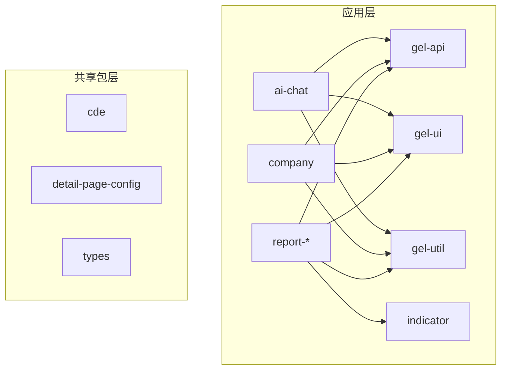
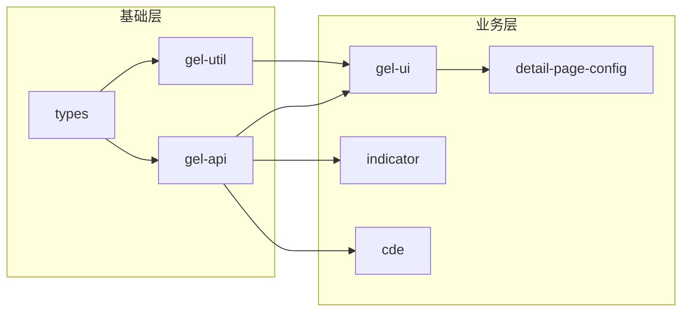
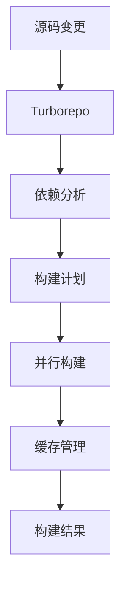
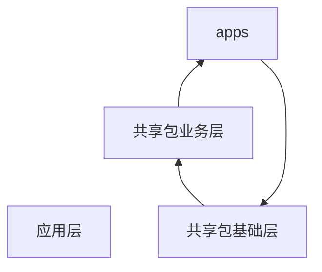

# 项目架构

GEL Workspace Monorepo 架构设计和模块说明。

## 🏗️ 架构概览

基于 Monorepo 架构的企业级前端项目，使用 Turborepo 管理多应用和共享包。

### 核心特性
- **统一构建**: Turborepo 统一构建管理
- **代码复用**: 共享包提供通用能力
- **并行开发**: 支持多应用同时开发
- **依赖管理**: 智能依赖分析和缓存

## 📁 Monorepo 结构

```
gel-workspace-dev/
├── apps/                          # 应用程序层
│   ├── ai-chat/                   # AI 聊天应用
│   ├── company/                   # 企业管理系统
│   ├── report-config/             # 报表配置应用
│   ├── report-preview/            # 报表预览应用
│   └── report-print/              # 报表打印应用
├── packages/                      # 共享包层
│   ├── gel-api/                   # API 统一管理
│   ├── gel-ui/                    # UI 组件库
│   ├── gel-util/                  # 工具函数库
│   ├── indicator/                 # 指标功能包
│   ├── cde/                       # CDE 功能包
│   ├── detail-page-config/        # 详情页配置包
│   └── types/                     # 类型定义包
├── docs/                          # 项目文档
└── scripts/                       # 构建和部署脚本
```

## 🏢 应用程序 (apps/)

### 应用架构图



### 应用详情

| 应用 | 功能描述 | 端口 | 主要依赖 |
|------|---------|------|---------|
| ai-chat | AI 聊天功能 | 3000 | gel-api, gel-ui, gel-util |
| company | 企业管理系统 | 3001 | gel-api, gel-ui, gel-util |
| report-config | 报表配置 | 3002 | gel-api, gel-ui, indicator |
| report-preview | 报表预览 | 3003 | report-preview-ui, report-util |
| report-print | 报表打印 | 3004 | report-util |

## 📦 共享包 (packages/)

### 包架构图



### 包详情

| 包名称 | 功能描述 | 主要导出 | 使用场景 |
|--------|---------|---------|---------|
| gel-api | API 统一管理 | 请求封装、错误处理 | 所有应用的基础API层 |
| gel-ui | UI 组件库 | 通用组件、设计系统 | 统一UI风格和交互 |
| gel-util | 工具函数库 | 数据处理、格式化 | 通用工具函数 |
| indicator | 指标功能 | 数据指标、图表组件 | 数据可视化场景 |
| cde | CDE 功能 | 业务逻辑、数据处理 | 特定业务场景 |
| detail-page-config | 详情页配置 | 页面配置、路由管理 | 动态页面生成 |
| types | 类型定义 | TypeScript 类型 | 类型安全和开发体验 |

## 🔧 构建系统

### Turborepo 工作流



### 构建特性
- **依赖分析**: 自动分析包间依赖关系
- **并行构建**: 多包同时构建，提升效率
- **智能缓存**: 避免重复构建
- **增量构建**: 只构建变更的包

## 🔄 依赖关系

### 依赖层次



### 依赖说明

- **apps** → **packages**: 应用依赖共享包
- **packages** 内部存在层级依赖关系
- **gel-types**: 作为最底层包，被其他包依赖
- **gel-api**: 提供基础 API 功能
- **gel-ui**: 依赖 gel-api 提供数据接口
- **indicator**: 依赖 gel-util 提供工具函数

## 🎯 技术栈

### 核心技术
- **框架**: React 18.x + TypeScript 5.x
- **构建**: Vite 5.x + Turborepo
- **包管理**: pnpm 8.x + Workspace
- **UI**: Ant Design 5.x

### 开发工具
- **开发服务器**: Vite Dev Server
- **代码检查**: ESLint + Prettier
- **类型检查**: TypeScript
- **构建优化**: Tree Shaking + 代码分割

## 📊 性能优化

### 构建性能
- **并行构建**: 多包同时构建，提升 3-5倍速度
- **智能缓存**: 避免重复构建，减少 70-90% 时间
- **增量构建**: 只构建变更的包及其依赖

### 运行性能
- **依赖外部化**: 减少包体积 60-80%
- **代码分割**: 动态导入，减少首屏加载时间
- **Tree Shaking**: 移除未使用代码，减少 10-30% 体积

## 📋 相关文档

- [开发指南](./development.md) - 开发流程和工具
- [部署文档](./deployment.md) - 本地部署流程
- [构建系统](./deployment.md#构建系统) - Turborepo 详细使用
- [脚本工具集](../scripts/README.md) - 脚本和工具说明