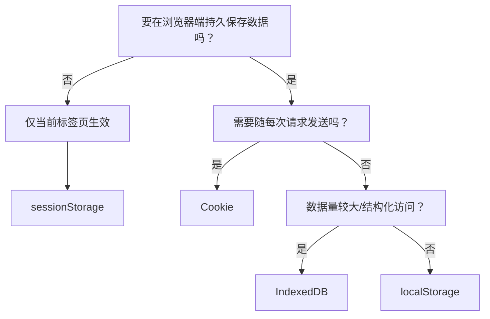
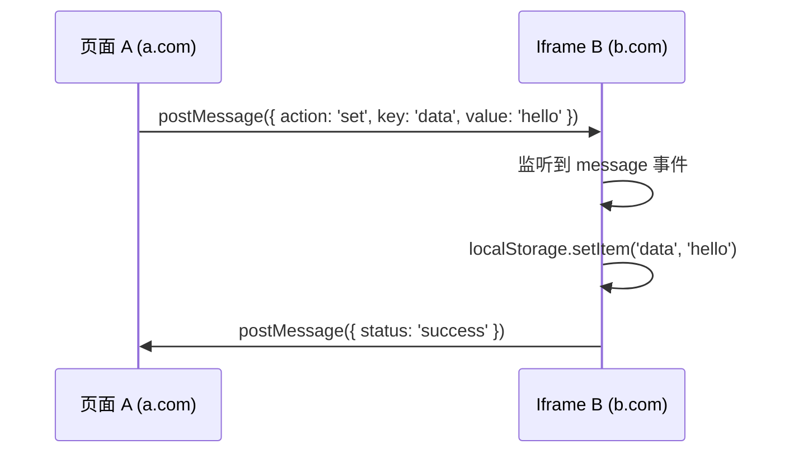
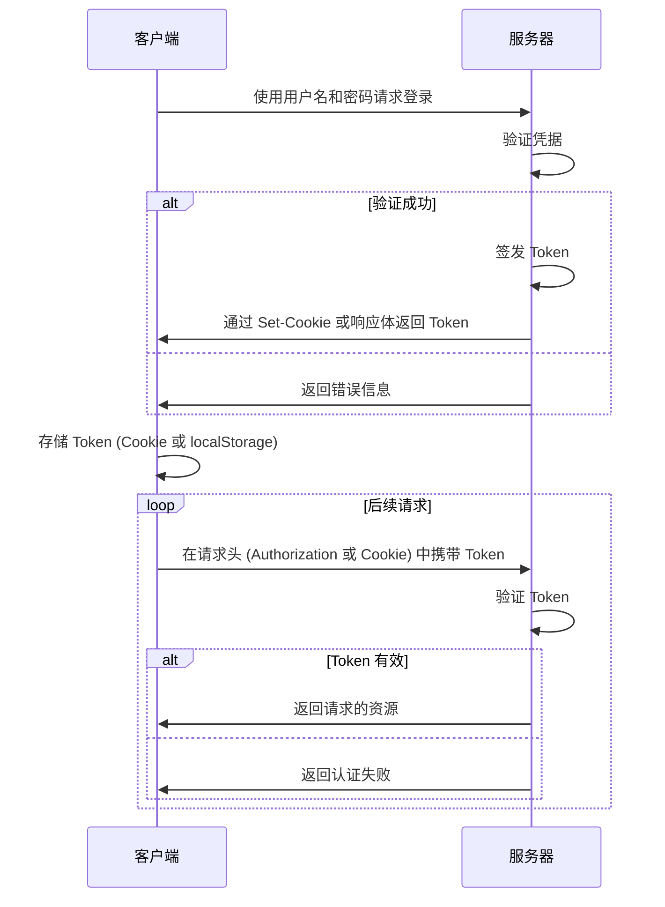
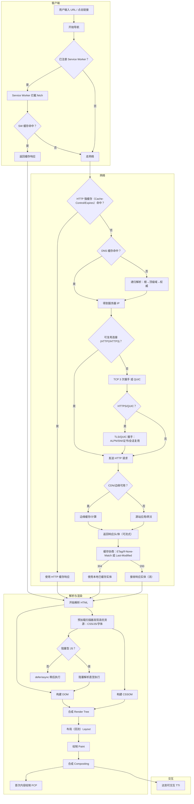
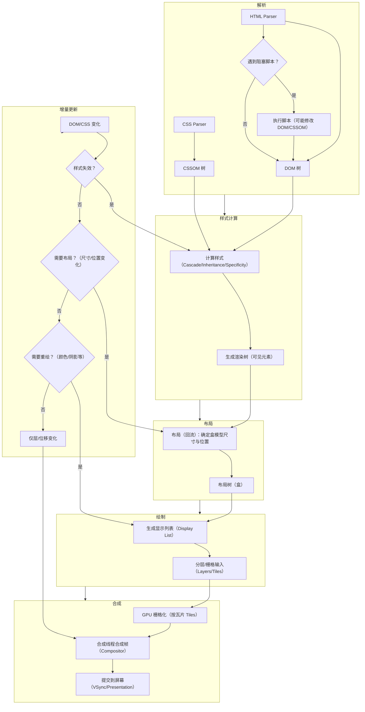
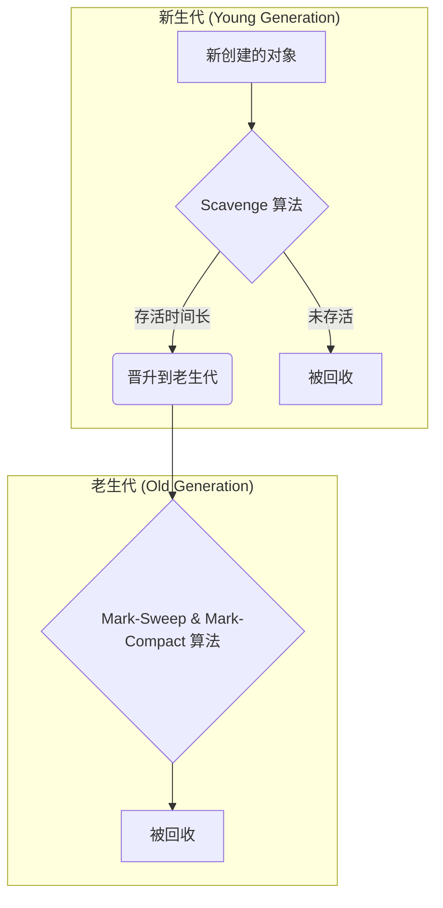
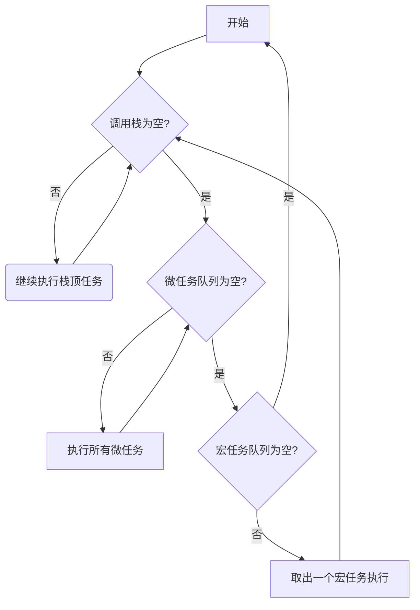

# 浏览器工作原理与存储机制
> 延伸阅读：
> - [Web 性能优化](../performance/README.md)
> - [Web 网络与跨域](./network.md)

## 目录

- [浏览器存储 (Storage)](#storage)
- [浏览器渲染 (Render)](#render)
- [事件循环 (Event Loop)](#event-loop)

> 待整理主题：浏览器崩溃边缘案例、内容更新与页面变化的关联、死锁问题、从编写 JS 到上线的过程

---

## 浏览器存储 (Storage) {#storage}

### 快速问答（Cheat Sheet）
- 使用哪种存储？
  - 仅当前标签页会话内、容量小：sessionStorage
  - 跨标签/持久化、容量中等（~5MB）：localStorage
  - 需要与服务端同行发送、跨请求携带：Cookie
  - 大容量、结构化查询、事务：IndexedDB
- 何时不要用 Cookie？
  - 频繁更新的大数据；敏感数据明文；非必须随请求发送的数据
- Token 放哪里？
  - 首选 HttpOnly Cookie（防 XSS），或短期放内存 + 刷新机制

### 选择存储的决策流


### Cookie, sessionStorage, localStorage 的区别

> 参考链接：[浏览器缓存控制详解（cookie、session、localStorage、Cache-Control等） - 掘金](https://juejin.cn/post/6951651005826072607)

**共同点**：都是保存在浏览器端、且同源的。

**详细区别**：

1.  **数据传递**：`cookie` 数据始终在同源的 http 请求中携带（即使不需要），即 `cookie` 在浏览器和服务器间来回传递，而 `sessionStorage` 和 `localStorage` 不会自动把数据发送给服务器，仅在本地保存。`cookie` 数据还有路径（path）的概念，可以限制 `cookie` 只属于某个路径下。
2.  **存储大小**：`cookie` 数据不能超过 4K，同时因为每次 http 请求都会携带 `cookie`、所以 `cookie` 只适合保存很小的数据，如会话标识。`sessionStorage` 和 `localStorage` 虽然也有存储大小的限制，但比 `cookie` 大得多，可以达到 5M 或更大。
3.  **生命周期**：`sessionStorage` 仅在当前浏览器窗口关闭之前有效；`localStorage` 始终有效，窗口或浏览器关闭也一直保存，因此用作持久数据；`cookie` 只在设置的 `cookie` 过期时间之前有效，即使窗口关闭或浏览器关闭。
4.  **作用域**：`sessionStorage` 不在不同的浏览器窗口中共享，即使是同一个页面；`localstorage` 在所有同源窗口中都是共享的；`cookie` 也是在所有同源窗口中都是共享的。
5.  **API**：`web Storage` (localStorage/sessionStorage) 支持事件通知机制，可以将数据更新的通知发送给监听者，API 也更方便使用。

**总结表格**：

| 特性 | Cookie | localStorage | sessionStorage |
| :--- | :--- | :--- | :--- |
| **数据传递** | 始终在同源 HTTP 请求中携带 | 仅本地保存，不自动发送 | 仅本地保存，不自动发送 |
| **存储大小** | ~4KB | ~5MB | ~5MB |
| **生命周期** | 可设置过期时间 | 永久，需手动清除 | 当前会话，窗口关闭即失效 |
| **作用域** | 所有同源窗口共享 | 所有同源窗口共享 | 仅当前窗口/标签页共享 |
| **应用场景** | 登录验证、会话标识 | 持久化数据、减轻服务器压力 | 临时数据、恢复页面状态 |

### 会过期的 `localStorage`

可以通过封装 `localStorage` 来模拟过期时间，例如在存储数据时，同时存储一个时间戳，在获取数据时进行检查。

### `localStorage` 能跨域吗？

不能。`localStorage` 严格遵守同源策略。

**解决方案**：

-   通过 `postMessage` 来实现跨源通信。
-   可以实现一个公共的 `iframe` 部署在某个域名中，作为共享域。
-   将需要实现 `localStorage` 跨域通信的页面嵌入这个 `iframe`。
-   接入对应的 SDK 操作共享域，从而实现 `localStorage` 的跨域存储。



### `localStorage` 的限制

1.  浏览器的大小不统一，并且在 IE8 以上的 IE 版本才支持 `localStorage` 这个属性。
2.  目前所有的浏览器中都会把 `localStorage` 的值类型限定为 `string` 类型，这个在对我们日常比较常见的 JSON 对象类型需要一些转换。
3.  `localStorage` 在浏览器的隐私模式下面是不可读取的。
4.  `localStorage` 本质上是对字符串的读取，如果存储内容多的话会消耗内存空间，会导致页面变卡。
5.  `localStorage` 不能被爬虫抓取到。

### `localStorage` 扩容

1.  `iframe` + `postMessage` ([参考链接](https://www.cnblogs.com/cherishSmile/p/8390754.html))
2.  `IndexedDB`

### `Cookie` 详解

-   **是什么？** `cookie` 是存储于访问者计算机中的变量。每当一台计算机通过浏览器来访问某个页面时，那么就可以通过 JavaScript 来创建和读取 `cookie`。实际上 `cookie` 是存于用户硬盘的一个文件，这个文件通常对应于一个域名，当浏览器再次访问这个域名时，便使这个 `cookie` 可用。因此，`cookie` 可以跨越一个域名下的多个网页，但不能跨越多个域名使用。
-   **能做什么？**
    -   保存登录信息，避免重复输入。
    -   实现购物车功能（现在多用数据库实现）。
    -   页面之间传递值。
-   **怎么使用？**
    -   语法: `document.cookie = “name=value;expires=evalue; path=pvalue; domain=dvalue; secure;”`

### `Cookie` 禁用与 `Session`

`sessionID` 通过 `cookie` 保存在客户端，如果将 `cookie` 禁用，必将对 `session` 的使用造成一定的影响。解决方案是 **URL 重写**，即通过 URL 参数来传递 `SessionID`。

### Token 能放在 Cookie 中吗？

能。`Token` 是在客户端频繁向服务端请求数据，服务端频繁的去数据库查询用户名和密码并进行对比，判断用户名和密码正确与否，并作出相应提示，在这样的背景下，`token` 便应运而生。

-   **简单 token 的组成**: `uid` (用户唯一的身份标识)、`time` (当前时间的时间戳)、`sign`（签名，token 的前几位以哈希算法压缩成的一定长度的十六进制字符串）。

**Token 认证流程:**



1.  客户端使用用户名跟密码请求登录。
2.  服务端收到请求，去验证用户名与密码。
3.  验证成功后，服务端签发一个 `token` ，并把它发送给客户端。
4.  客户端接收 `token` 以后会把它存储起来，比如放在 `cookie` 里或者 `localStorage` 里。
5.  客户端每次发送请求时都需要带着服务端签发的 `token`（把 `token` 放到 HTTP 的 Header 里）。
6.  服务端收到请求后，需要验证请求里带有的 `token` ，如验证成功则返回对应的数据。

---

## 浏览器渲染 (Render) {#render}

### 从输入 URL 到页面呈现发生了什么？

> 参考链接：[当你用浏览器打开一个链接的时候，计算机做了哪些工作_浏览器打开网址干了什么-CSDN博客](https://blog.csdn.net/qq_31960623/article/details/116207760)



### 浏览器渲染页面流程

> 参考链接：[浏览器渲染流程和性能优化【万字长文，超详细】 - 掘金](https://juejin.cn/post/6969494172151578660)

不同的浏览器内核（如 WebKit, Gecko）叫法有区别，但主要流程相同。



1.  HTML 被 HTML 解析器解析成 DOM 树；
2.  CSS 被 CSS 解析器解析成 CSSOM 树；
3.  结合 DOM 树和 CSSOM 树，生成渲染树；
4.  执行布局，确定每个盒的几何信息；
5.  生成显示列表并进行绘制与合成，最终展示到屏幕。

### 重绘 (Repaint) 与重排 (Reflow)

-   **重排(Reflow)**：当渲染树的一部分必须更新并且节点的尺寸发生了变化，浏览器会使渲染树中受到影响的部分失效，并重新构造渲染树。
-   **重绘(Repaint)**：是在一个元素的外观被改变所触发的浏览器行为，浏览器会根据元素的新属性重新绘制，使元素呈现新的外观。比如改变某个元素的背景色、文字颜色、边框颜色等等。
-   **区别**：**重绘不一定需要重排（比如颜色的改变），重排必然导致重绘（比如改变网页位置）**。

**如何优化/避免？**

-   **浏览器优化**：浏览器会维护一个队列，把所有会引起重排、重绘的操作放入这个队列，等队列中的操作到一定数量或者到了一定时间间隔，浏览器就会 flush 队列，进行一批处理。
-   **代码层面优化**：
    1.  不要一条一条地修改 DOM 的样式。可以先定义好 css 的 class，然后修改 DOM 的 `className`。
    2.  不要把 DOM 结点的属性值放在一个循环里当成循环里的变量。
    3.  为动画的 HTML 元件使用 `fixed` 或 `absolute` 的 `position`，那么修改它们的 CSS 是不会 reflow 的。
    4.  避免使用 `table` 布局。
    5.  不要在布局信息改变的时候做查询（会导致渲染队列强制刷新）。

---

## 内存管理与垃圾回收 (GC)

浏览器的 Javascript 具有自动垃圾回收机制(GC)，执行环境会负责管理代码执行过程中使用的内存。其原理是：**垃圾收集器会定期（周期性）找出那些不在继续使用的变量，然后释放其内存**。

### 垃圾回收算法

1.  **标记清除 (Mark-and-Sweep)**
    -   **原理**：当变量进入环境时，就将这个变量标记为“进入环境”。当变量离开环境时，则将其标记为“离开环境”。垃圾回收器在运行时会给所有变量都加上标记，然后去掉环境中的变量以及被引用的变量的标记。此后，再被加上标记的变量将被视为准备删除的变量。
    -   **优点**：实现简单，是 JS 中最常用的垃圾回收方式。

2.  **引用计数 (Reference Counting)**
    -   **原理**：跟踪记录每个值被引用的次数。当引用次数变成 0 时，则说明没有办法再访问这个值了，因而就可以将其占用的内存空间回收回来。
    -   **缺点**：会遇到**循环引用**的问题，导致内存泄漏。例如，对象 A 引用对象 B，对象 B 也引用对象 A，即使它们都已离开环境，但引用计数不为 0，导致无法回收。在 IE 的早期版本中，BOM 和 DOM 对象使用 C++ 的 COM 实现，其 GC 就是引用计数，因此存在循环引用问题。

```javascript
// 循环引用示例
function fn() {
    var a = {};
    var b = {};
    a.pro = b;
    b.pro = a;
}
fn(); // a 和 b 互相引用，在引用计数策略下无法被回收
```

### V8 引擎的 GC 优化策略

1.  **分代回收 (Generational GC)**
    -   **思想**：通过区分“临时”与“持久”对象；多回收“临时对象”区（young generation），少回收“持久对象”区（tenured generation），减少每次需遍历的对象，从而减少每次 GC 的耗时。



2.  **增量 GC (Incremental GC)**
    -   **思想**：将一次完整的垃圾回收过程分解成许多小步骤，交替在主线程上执行，从而避免长时间的“全停顿”（Stop-the-world）。

## 事件循环 (Event Loop) {#event-loop}

> 参考链接：[微任务/宏任务和同步/异步之间的关系 - 掘金](https://juejin.cn/post/6962312899960242213)

事件循环负责在浏览器中调度宏任务与微任务：
- 宏任务：setTimeout、setInterval、I/O、UI 渲染
- 微任务：Promise.then、MutationObserver、queueMicrotask



关键点：一次事件循环中，微任务总是先于下一次宏任务执行；避免在微任务中无限入队，造成渲染饥饿。

## Performance API {#performance}

Performance API 提供高精度时间戳与性能条目采集能力，是前端性能监控的基础工具。

- **核心接口**：`performance.now()` 获取毫秒级时间戳；`performance.mark()` / `performance.measure()` 标记自定义指标。
- **资源计时**：`performance.getEntriesByType('resource')` 分析脚本、样式、图片等资源加载耗时。
- **导航计时**：通过 Navigation Timing v2 获取 DNS、TCP、SSL、TTFB 等阶段耗时。
- **Web Vitals**：使用 `PerformanceObserver` 监听 `largest-contentful-paint`、`first-input` 等指标。

延伸阅读：详见 [性能优化索引](../performance/README.md)。
