# React 完整学习指南

> 全面的 React 知识体系,从基础概念到高级架构,涵盖状态管理、路由和生态系统的完整指南。

## 目录

1. [React 特性概览](#react-特性概览)
2. [虚拟 DOM 与 Diff 算法](#虚拟-dom-与-diff-算法)
3. [组件基础](#组件基础)
4. [React Hooks](#react-hooks)
5. [组件生命周期](#组件生命周期)
6. [事件系统](#事件系统)
7. [React 内部架构](#react-内部架构)
8. [Fiber 架构](#fiber-架构)
9. [高级组件模式](#高级组件模式)
10. [性能优化](#性能优化)
11. [错误处理与边界](#错误处理与边界)
12. [动画与过渡](#动画与过渡)
13. [组件通信](#组件通信)
14. [状态管理](#状态管理)
15. [React Router](#react-router)
16. [参考资源](#参考资源)

---

## React 特性概览

### 核心特性表格

| 特性 | 描述 | 优势 |
|---|---|---|
| **JSX 语法** | 在 JavaScript 中描述 UI 结构 | 类型安全,更好的工具支持 |
| **单向数据流** | 自上而下的数据流动,便于推理 | 可预测的状态变化 |
| **虚拟 DOM** | 基于 Diff 算法的高效更新 | 更好的性能 |
| **声明式编程** | 描述状态,React 负责渲染 | 更容易理解和调试 |
| **组件化** | 复用与组合 | 模块化开发 |

### React 架构概览

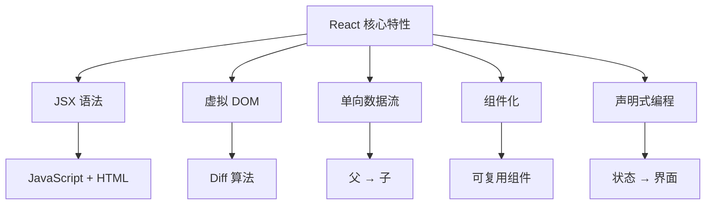

---

## 虚拟 DOM 与 Diff 算法

### 真实 DOM 与虚拟 DOM 对比

| 方面 | 真实 DOM | 虚拟 DOM |
|---|---|---|
| **本质** | 浏览器 DOM 节点 | JavaScript 对象 |
| **性能** | 操作缓慢 | 操作快速 |
| **内存使用** | 高 | 低 |
| **更新成本** | 昂贵 | 便宜 |
| **直接操作** | 可能 | 不可能 |

### 虚拟 DOM 创建过程

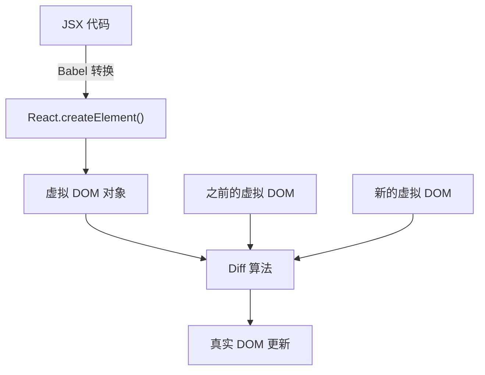

### JSX 到虚拟 DOM 示例

**JSX 代码:**
```jsx
const vDom = <h1 className="title">Hello World</h1>;
```

**Babel 转换:**
```jsx
const vDom = React.createElement(
  'h1',
  { className: 'title' },
  'Hello World'
);
```

**虚拟 DOM 对象:**
```json
{
  "type": "h1",
  "key": null,
  "ref": null,
  "props": {
    "className": "title",
    "children": "Hello World"
  }
}
```

### Diff 算法策略

| 策略 | 描述 | 示例 |
|---|---|---|
| **同层比较** | 只比较同一层级的节点 | 维持父子关系 |
| **组件类型检查** | 不同类型触发完全替换 | `<div>` → `<span>` = 完全重建 |
| **基于 key 的识别** | 使用 `key` 属性识别列表项 | 高效列表更新 |

### Key 选择最佳实践

| Key 类型 | 性能 | 稳定性 | 推荐度 |
|---|---|---|---|
| **唯一 ID** | ⭐⭐⭐ 优秀 | ⭐⭐⭐ 稳定 | ✅ 推荐 |
| **数组索引** | ⭐ 差 | ⭐ 不稳定 | ❌ 避免 |
| **随机值** | ⭐ 差 | ⭐ 不稳定 | ❌ 永不使用 |

---

## 组件基础

### 组件类型对比

| 方面 | 函数组件 | 类组件 |
|---|---|---|
| **语法** | 简单函数 | ES6 类 |
| **状态管理** | Hooks (useState, useReducer) | this.state, this.setState |
| **生命周期** | useEffect 和其他钩子 | 生命周期方法 |
| **性能** | 更好的优化 | 需要手动优化 |
| **包大小** | 更小 | 更大 |
| **学习曲线** | 更容易 | 更陡峭 |
| **未来支持** | ✅ 推荐 | ⚠️ 遗留 |

### 受控与非受控组件

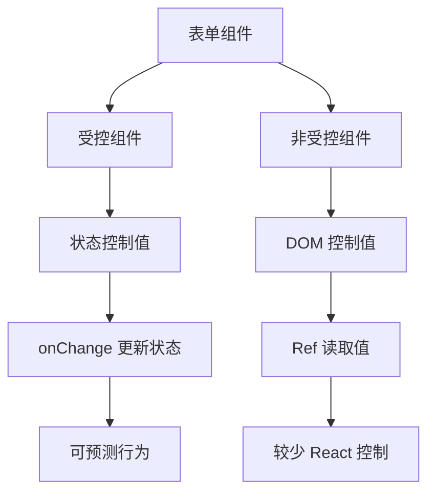

### 组件控制对比

| 特性 | 受控 | 非受控 |
|---|---|---|
| **数据源** | React 状态 | DOM 元素 |
| **值访问** | 直接从状态 | 通过 ref |
| **验证** | 实时 | 提交时 |
| **性能** | 更多重新渲染 | 更少重新渲染 |
| **使用场景** | 动态表单 | 简单表单 |

### Props 与 State 对比

| 方面 | Props | State |
|---|---|---|
| **来源** | 父组件 | 组件自身 |
| **可变性** | 不可变 | 可变 |
| **目的** | 配置 | 内部数据 |
| **触发重新渲染** | ✅ 是 | ✅ 是 |
| **访问模式** | `props.propName` | `state.stateName` |
| **更新方法** | 父组件更新 | `setState` / `useState` |

---

## React Hooks

### Hooks 概览

| Hook | 用途 | 返回值 | 常见用例 |
|---|---|---|---|
| **`useState`** | 管理组件状态 | `[state, setState]` | 表单输入,切换 |
| **`useEffect`** | 处理副作用 | 清理函数 | API 调用,订阅 |
| **`useContext`** | 访问上下文值 | 上下文值 | 主题,用户数据 |
| **`useReducer`** | 复杂状态逻辑 | `[state, dispatch]` | 状态机 |
| **`useMemo`** | 缓存昂贵计算 | 缓存值 | 性能优化 |
| **`useCallback`** | 缓存回调函数 | 缓存函数 | 防止重新渲染 |
| **`useRef`** | 访问 DOM 或存储可变值 | 引用对象 | DOM 操作 |

### Hooks 分类

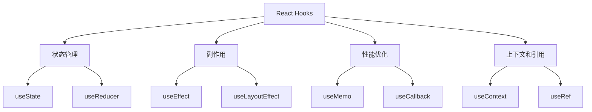

### useState Hook 详解

#### 不同上下文中的 setState 行为

| 上下文 | 行为 | 批处理 | 示例 |
|---|---|---|---|
| **React 生命周期方法** | 异步 | ✅ 是 | `componentDidMount`, `componentDidUpdate` |
| **React 合成事件** | 异步 | ✅ 是 | `onClick`, `onChange` |
| **setTimeout/setInterval** | 同步 | ❌ 否 | `setTimeout(() => setState(), 0)` |
| **原生 DOM 事件** | 同步 | ❌ 否 | `addEventListener('click', ...)` |
| **Promise 回调** | 同步 | ❌ 否 | `.then(() => setState())` |

#### useState 执行流程

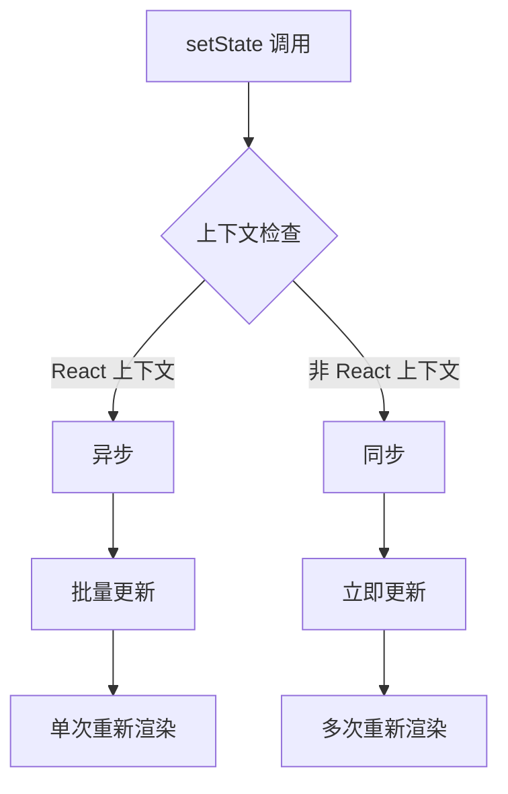

### useEffect Hook 详解

#### useEffect 与生命周期方法对比

| 生命周期方法 | useEffect 等价 | 依赖数组 |
|---|---|---|
| `componentDidMount` | `useEffect(() => {}, [])` | 空数组 |
| `componentDidUpdate` | `useEffect(() => {})` | 无依赖数组 |
| `componentWillUnmount` | `useEffect(() => { return () => {} }, [])` | 返回清理函数 |
| `componentDidMount` + `componentDidUpdate` | `useEffect(() => {}, [dependency])` | 特定依赖 |

#### useEffect 依赖模式

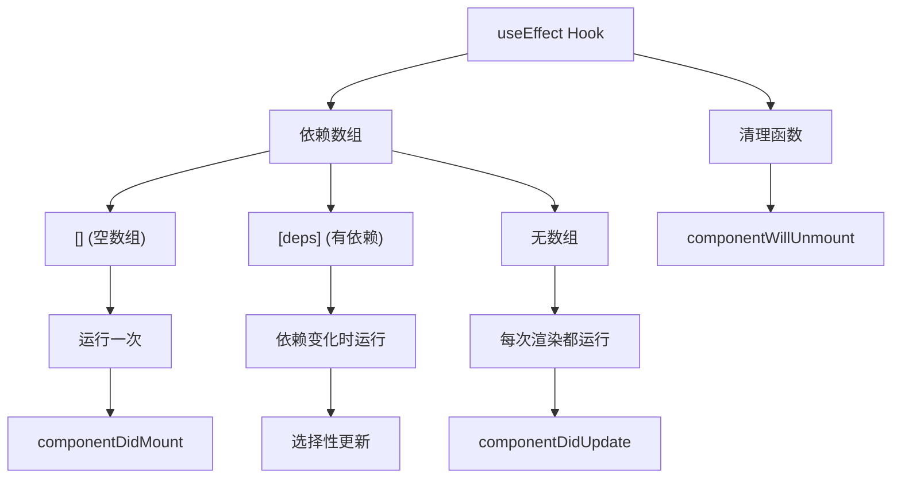

### useRequest (ahooks) 模式

#### 核心特性

| 特性 | 描述 | 优势 |
|---|---|---|
| **统一状态** | `{ loading, data, error }` | 一致的 API |
| **自动执行** | 挂载时运行 | 更少样板代码 |
| **手动触发** | `run()` 方法 | 按需请求 |
| **依赖刷新** | 依赖变化自动重试 | 响应式更新 |
| **内置优化** | 防抖、节流、轮询 | 更好的用户体验 |

#### 请求流程图

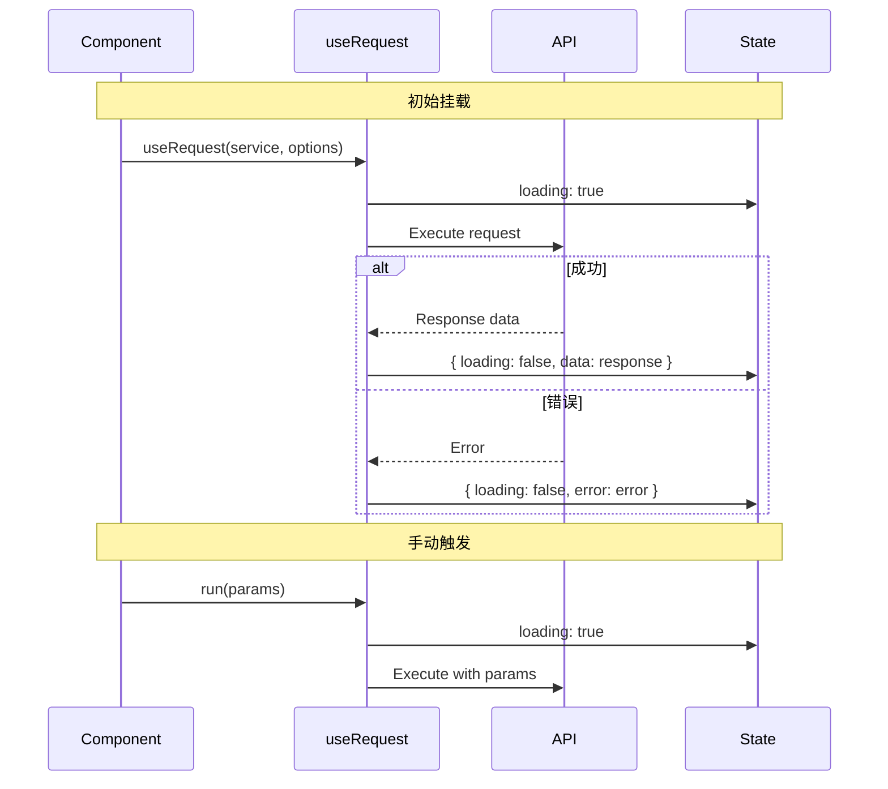

---

## 组件生命周期

### 生命周期阶段概览

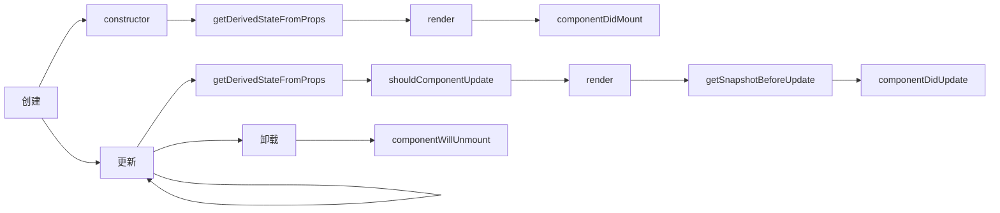

### 生命周期方法对比

| 阶段 | 方法 | 用途 | 可以 setState? | 常见用例 |
|---|---|---|---|---|
| **创建** | `constructor` | 初始化状态和绑定方法 | ✅ | 设置初始状态 |
| | `getDerivedStateFromProps` | 同步状态与属性 | ❌ | 罕见边缘情况 |
| | `render` | 返回 JSX | ❌ | 定义 UI 结构 |
| | `componentDidMount` | 首次渲染后 | ✅ | API 调用,DOM 操作 |
| **更新** | `getDerivedStateFromProps` | 同步状态与属性 | ❌ | 罕见边缘情况 |
| | `shouldComponentUpdate` | 控制重新渲染 | ❌ | 性能优化 |
| | `render` | 返回更新的 JSX | ❌ | 定义 UI 结构 |
| | `getSnapshotBeforeUpdate` | DOM 更新前捕获信息 | ❌ | 滚动位置 |
| | `componentDidUpdate` | 更新后 | ✅ | DOM 操作,API 调用 |
| **卸载** | `componentWillUnmount` | 清理 | ❌ | 移除监听器,取消请求 |

### 关键生命周期规则

| 规则 | 解释 | 原因 |
|---|---|---|
| render 中不要调用 setState | 导致无限重新渲染循环 | 性能和稳定性 |
| 谨慎使用 getSnapshotBeforeUpdate | 返回值传递给 componentDidUpdate | 维护滚动位置 |
| 在 componentWillUnmount 中清理 | 防止内存泄漏 | 资源管理 |

---

## 事件系统

### 事件架构

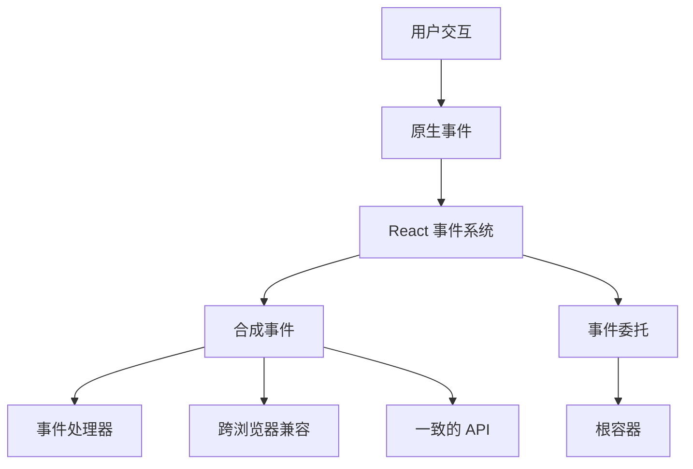

### 合成事件与原生事件对比

| 方面 | 合成事件 | 原生事件 |
|---|---|---|
| **浏览器兼容性** | 跨浏览器一致 | 浏览器特定差异 |
| **事件委托** | 自动 | 需要手动设置 |
| **性能** | React 优化 | 浏览器直接处理 |
| **内存使用** | 事件池化 | 独立事件对象 |
| **API 一致性** | 标准化 | 因浏览器而异 |

### 事件绑定性能对比

| 方法 | 性能 | 内存影响 | 推荐度 | 示例 |
|---|---|---|---|---|
| **构造器绑定** | ✅ 高 | ✅ 低 | ✅ 推荐 | `this.handleClick = this.handleClick.bind(this)` |
| **类字段箭头函数** | ✅ 高 | ✅ 低 | ✅ 推荐 | `handleClick = () => {}` |
| **渲染方法绑定** | ❌ 低 | ❌ 高 | ❌ 避免 | `onClick={this.handleClick.bind(this)}` |
| **渲染箭头函数** | ❌ 低 | ❌ 高 | ❌ 避免 | `onClick={() => this.handleClick()}` |

### 事件传播控制

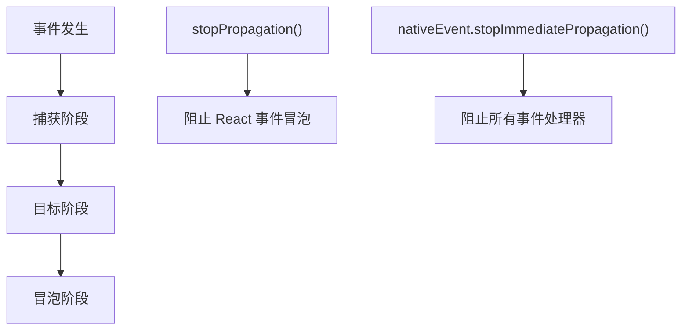

### 事件控制方法

| 方法 | 作用范围 | 使用场景 |
|---|---|---|
| `e.stopPropagation()` | 仅 React 合成事件 | 阻止父级 React 处理器 |
| `e.nativeEvent.stopImmediatePropagation()` | 所有事件处理器 | 阻止包括原生在内的所有处理器 |
| `e.preventDefault()` | 默认浏览器行为 | 阻止表单提交,链接导航 |

---

## React 内部架构

### React 渲染管道

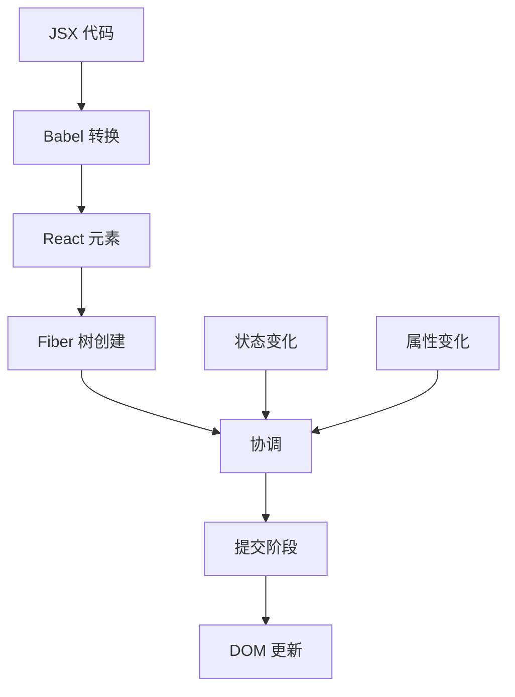

### React 架构层次

| 层次 | 职责 | 关键组件 |
|---|---|---|
| **React 核心** | 组件定义和生命周期 | Components, Hooks, Context |
| **React 协调器** | Diff 算法和 Fiber 管理 | Fiber, Scheduler, Reconciler |
| **React 渲染器** | 平台特定渲染 | ReactDOM, React Native |

---

## Fiber 架构

### 什么是 Fiber?

**Fiber** 是一个代表工作单元的 JavaScript 对象。它对应组件实例、DOM 节点或 React 树中的任何其他元素。

### Fiber 节点结构

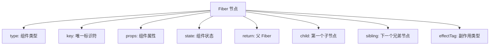

### Fiber 树遍历

| 指针 | 用途 | 导航 |
|---|---|---|
| **`return`** | 指向父 Fiber | 向上遍历 |
| **`child`** | 指向第一个子 Fiber | 向下遍历 |
| **`sibling`** | 指向下一个兄弟 Fiber | 水平遍历 |

### 为什么使用 Fiber?

| 问题 | 解决方案 | 优势 |
|---|---|---|
| **阻塞渲染** | 可中断工作 | 流畅用户体验 |
| **无优先级** | 基于优先级的调度 | 重要更新优先 |
| **同步更新** | 时间切片 | 更好的性能 |

### React 渲染阶段

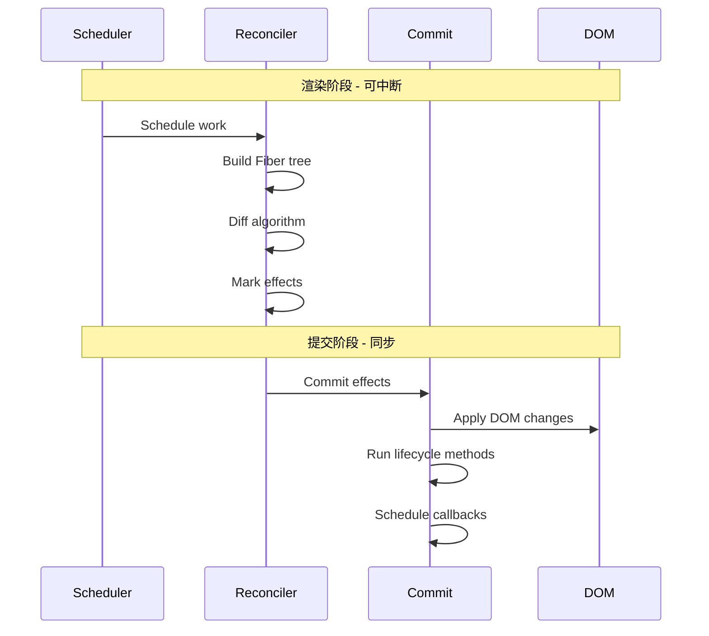

### 渲染阶段与提交阶段对比

| 方面 | 渲染阶段 | 提交阶段 |
|---|---|---|
| **可中断性** | ✅ 可中断 | ❌ 同步 |
| **副作用** | ❌ 无副作用 | ✅ 允许副作用 |
| **DOM 访问** | ❌ 不修改 DOM | ✅ 修改 DOM |
| **生命周期方法** | 部分方法 | 大部分方法 |

---

## 高级组件模式

### 高阶组件 (HOC)

#### HOC 模式

```jsx
// HOC 示例
function withLoading(WrappedComponent) {
  return function WithLoadingComponent(props) {
    if (props.isLoading) {
      return <div>Loading...</div>;
    }
    return <WrappedComponent {...props} />;
  };
}

// 使用
const EnhancedComponent = withLoading(MyComponent);
```

#### HOC 与 Hooks 对比

| 方面 | HOC | Hooks |
|---|---|---|
| **复用性** | ✅ 高 | ✅ 高 |
| **组合** | 包装地狱 | ✅ 清洁 |
| **属性钻取** | ❌ 可能导致问题 | ✅ 无问题 |
| **类型安全** | ❌ 复杂 | ✅ 更好 |
| **性能** | ❌ 额外组件 | ✅ 直接 |

### 渲染属性模式

```jsx
// Render Props 示例
function DataProvider({ render }) {
  const [data, setData] = useState(null);
  
  useEffect(() => {
    fetchData().then(setData);
  }, []);
  
  return render(data);
}

// 使用
<DataProvider
  render={(data) => (
    <div>{data ? data.name : 'Loading...'}</div>
  )}
/>
```

### 复合组件模式

```jsx
// 复合组件示例
function Tabs({ children, defaultTab }) {
  const [activeTab, setActiveTab] = useState(defaultTab);
  
  return (
    <div className="tabs">
      {React.Children.map(children, (child) =>
        React.cloneElement(child, { activeTab, setActiveTab })
      )}
    </div>
  );
}

Tabs.Tab = function Tab({ label, children, activeTab, setActiveTab }) {
  return (
    <div
      className={activeTab === label ? 'active' : ''}
      onClick={() => setActiveTab(label)}
    >
      {children}
    </div>
  );
};
```

---

## 性能优化

### 性能优化技术

| 技术 | 影响 | 复杂度 | 使用场景 | 示例 |
|---|---|---|---|---|
| **React.memo** | ⭐⭐⭐ 高 | ⭐ 低 | 防止不必要重新渲染 | `React.memo(Component)` |
| **useMemo** | ⭐⭐ 中等 | ⭐⭐ 中等 | 昂贵计算 | `useMemo(() => expensiveCalc(), [deps])` |
| **useCallback** | ⭐⭐ 中等 | ⭐⭐ 中等 | 稳定函数引用 | `useCallback(fn, [deps])` |
| **React.lazy** | ⭐⭐⭐ 高 | ⭐⭐ 中等 | 代码分割 | `React.lazy(() => import('./Component'))` |
| **Fragments** | ⭐ 低 | ⭐ 低 | 减少 DOM 节点 | `<React.Fragment>` or `<>` |
| **Immutable Data** | ⭐⭐⭐ 高 | ⭐⭐⭐ 高 | 浅比较优化 | `const newState = {...oldState, updated: true}` |

### 性能优化流程

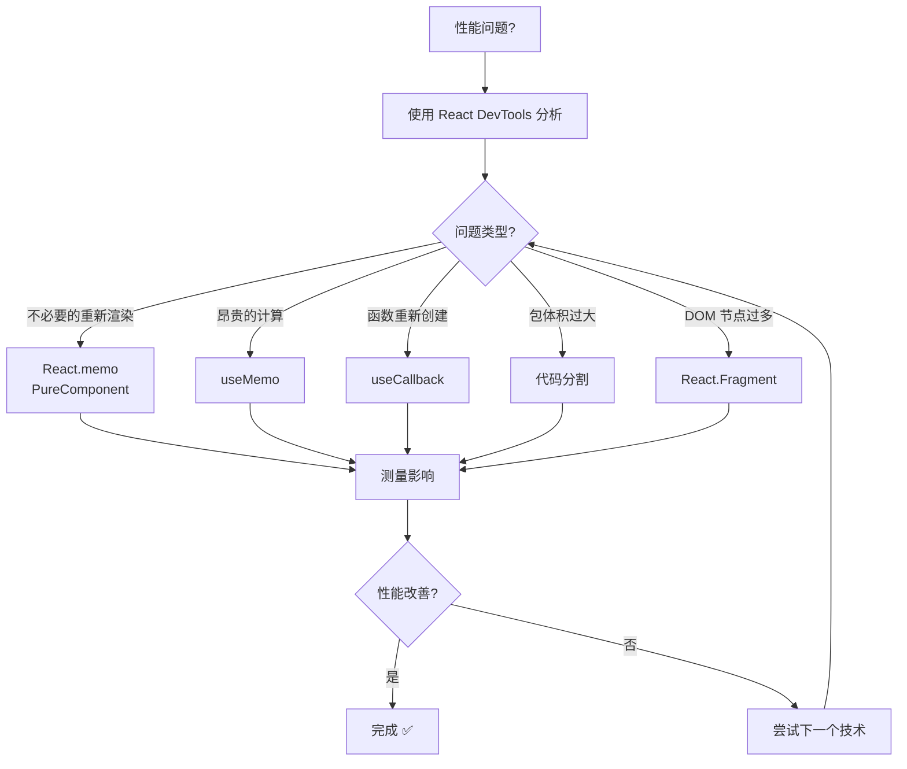

### React.memo vs PureComponent vs shouldComponentUpdate

| 方法 | 组件类型 | 比较类型 | 可定制 |
|---|---|---|---|
| **React.memo** | 函数组件 | 浅层 props 比较 | ✅ 自定义比较函数 |
| **PureComponent** | 类组件 | 浅层 props + state 比较 | ❌ 固定行为 |
| **shouldComponentUpdate** | 类组件 | 自定义逻辑 | ✅ 完全控制 |

### 代码分割策略

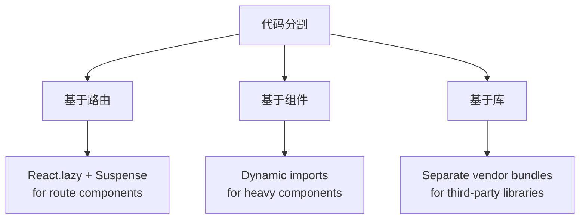

### 包优化技术

| 技术 | 包大小影响 | 性能影响 | 实现 |
|---|---|---|---|
| **摇树优化** | ⭐⭐⭐ 高 | ⭐⭐⭐ 高 | ES6 modules + webpack |
| **代码分割** | ⭐⭐⭐ 高 | ⭐⭐⭐ 高 | Dynamic imports |
| **懒加载** | ⭐⭐ 中等 | ⭐⭐⭐ 高 | React.lazy + Suspense |
| **包分析** | ⭐⭐ 中等 | ⭐⭐ 中等 | webpack-bundle-analyzer |

---

## 错误处理与边界

### 错误边界能力

| 可以捕获 | 无法捕获 | 替代方案 |
|---|---|---|
| **渲染错误** | **事件处理器** | 在处理器中使用 try/catch |
| **生命周期方法** | **异步代码** | Promise.catch() 或 async/await try/catch |
| **构造器错误** | **setTimeout 回调** | 在回调中使用 try/catch |
| **子组件错误** | **服务端渲染** | 服务端错误处理 |
| | **错误边界自身** | 父级错误边界 |

### 错误边界方法对比

| 方法 | 目的 | 返回值 | 何时调用 |
|---|---|---|---|
| **`getDerivedStateFromError`** | 更新状态以显示降级 UI | 新状态对象 | 渲染阶段 |
| **`componentDidCatch`** | 记录错误信息 | void | 渲染阶段后 |

### 错误边界流程

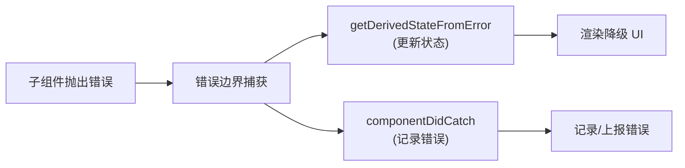

### 错误边界实现

```jsx
class ErrorBoundary extends React.Component {
  constructor(props) {
    super(props);
    this.state = { hasError: false, error: null };
  }

  static getDerivedStateFromError(error) {
    // 更新状态以显示降级 UI
    return { hasError: true, error };
  }

  componentDidCatch(error, errorInfo) {
    // 记录错误到错误报告服务
    console.error('Error caught by boundary:', error, errorInfo);
  }

  render() {
    if (this.state.hasError) {
      return (
        <div className="error-fallback">
          <h2>Something went wrong.</h2>
          <details style={{ whiteSpace: 'pre-wrap' }}>
            {this.state.error && this.state.error.toString()}
          </details>
        </div>
      );
    }

    return this.props.children;
  }
}
```

### 错误处理最佳实践

| 实践 | 描述 | 优势 |
|---|---|---|
| **细粒度错误边界** | 在特定功能周围放置边界 | 隔离故障 |
| **降级 UI 设计** | 提供有意义的错误信息 | 更好的用户体验 |
| **错误报告** | 将错误记录到监控服务 | 生产环境调试 |
| **恢复机制** | 允许用户重试或重置 | 优雅降级 |

---

## 动画与过渡

### 动画库对比

| 库 | 包大小 | 学习曲线 | 性能 | 使用场景 |
|---|---|---|---|---|
| **react-transition-group** | ⭐⭐ 小 | ⭐⭐ 简单 | ⭐⭐⭐ 良好 | 基于 CSS 的过渡 |
| **Framer Motion** | ⭐ 大 | ⭐⭐ 中等 | ⭐⭐⭐ 优秀 | 复杂动画 |
| **React Spring** | ⭐⭐ 中等 | ⭐⭐⭐ 复杂 | ⭐⭐⭐ 优秀 | 基于物理的动画 |
| **Lottie React** | ⭐⭐ 中等 | ⭐ 简单 | ⭐⭐ 良好 | After Effects 动画 |

### CSS 过渡生命周期

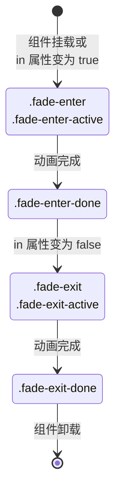

### 动画类钩子

| 阶段 | CSS 类 | 持续时间 | 目的 |
|---|---|---|---|
| **进入开始** | `.fade-enter` | 1帧 | 设置初始状态 |
| **进入激活** | `.fade-enter-active` | 完整过渡 | 定义过渡属性 |
| **进入完成** | `.fade-enter-done` | 持续 | 最终状态 |
| **退出开始** | `.fade-exit` | 1帧 | 设置退出初始状态 |
| **退出激活** | `.fade-exit-active` | 完整过渡 | 定义退出过渡 |
| **退出完成** | `.fade-exit-done` | 直到卸载 | 隐藏状态 |

### 动画性能提示

| 提示 | 描述 | 影响 |
|---|---|---|
| **使用 CSS 变换** | 优先使用 transform 而不是改变布局属性 | ⭐⭐⭐ 高 |
| **启用 GPU 加速** | 使用 `will-change` 或 `transform3d` | ⭐⭐⭐ 高 |
| **最小化重排** | 避免动画化宽度、高度、内边距 | ⭐⭐⭐ 高 |
| **使用 requestAnimationFrame** | 用于基于 JavaScript 的动画 | ⭐⭐ 中等 |

---

## 组件通信

### 通信模式概览

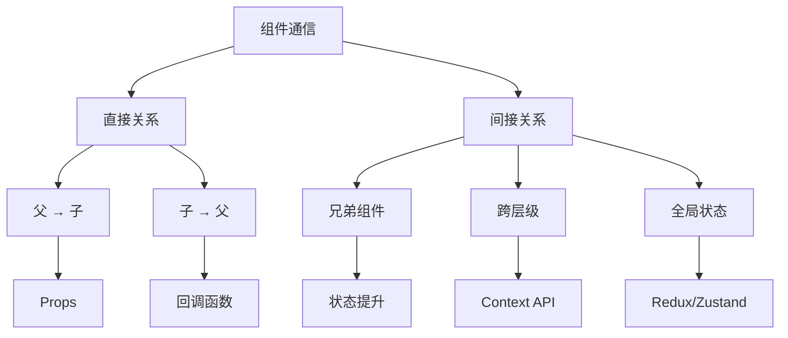

### 通信方法对比

| 模式 | 复杂度 | 性能 | 使用场景 | 示例 |
|---|---|---|---|---|
| **Props** | ⭐ 简单 | ⭐⭐⭐ 高 | 父到子 | `<Child name={name} />` |
| **Callbacks** | ⭐⭐ 中等 | ⭐⭐⭐ 高 | 子到父 | `<Child onClick={handleClick} />` |
| **状态提升** | ⭐⭐ 中等 | ⭐⭐ 中等 | 兄弟通信 | 共同父级状态 |
| **Context API** | ⭐⭐⭐ 复杂 | ⭐⭐ 中等 | 跨层级共享 | 主题,用户数据 |
| **Redux/Zustand** | ⭐⭐⭐⭐ 很复杂 | ⭐ 低 | 全局状态管理 | 大型应用 |

---

## 状态管理

### Context API

**何时使用:**
- **全局配置/轻共享**: 主题、国际化、用户会话等
- **局部范围 Provider**: 避免全局污染

### Redux 要点

**三原则:**
1. **单一数据源**: 整个应用的状态存储在一个 store 中
2. **只读 state**: 唯一改变 state 的方法是触发 action
3. **纯函数修改**: 使用纯函数 reducer 来执行修改

**react-redux:**
- Provider + connect/hooks
- useSelector / useDispatch

**中间件:**
- thunk, logger
- 链式增强 dispatch

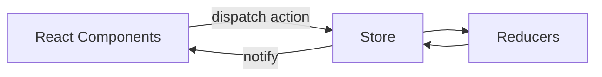

### 目录组织建议

- **按功能模块拆分**: actions/reducer/views 同目录
- **或按角色**: actions/reducers/...
- **统一导出入口**: index.ts 便于按需引入

### 状态管理决策树

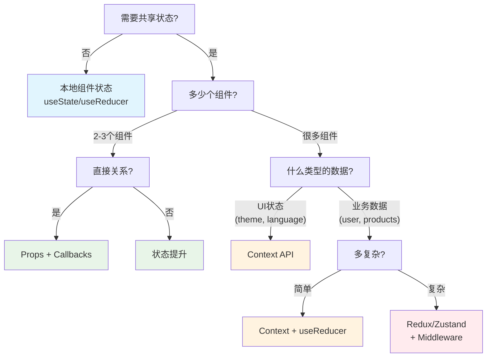

### 选择指南表格

| 场景 | 推荐方案 | 优点 | 缺点 |
|---|---|---|---|
| **单个组件** | `useState` / `useReducer` | 简单,快速 | 不可共享 |
| **父子组件** | Props + Callbacks | 直接,高性能 | 范围有限 |
| **兄弟组件** | 状态提升 | 清晰数据流 | 可能导致属性钻取 |
| **主题/语言** | Context API | 内置,简单 | 重新渲染所有消费者 |
| **用户会话** | Context + `useRequest` | 响应式更新 | 中等复杂度 |
| **复杂业务逻辑** | Redux/Zustand | 可预测,可调试 | 学习曲线 |
| **实时数据** | `useRequest` + polling | 自动更新 | 网络开销 |

### 性能对比

| 方案 | 包大小 | 运行时性能 | 开发体验 |
|---|---|---|---|
| **本地状态** | ⭐⭐⭐ 最小 | ⭐⭐⭐ 优秀 | ⭐⭐⭐ 简单 |
| **Props/Callbacks** | ⭐⭐⭐ 最小 | ⭐⭐⭐ 优秀 | ⭐⭐ 良好 |
| **Context API** | ⭐⭐⭐ 最小 | ⭐⭐ 良好 | ⭐⭐ 良好 |
| **Redux** | ⭐ 大 | ⭐ 一般 | ⭐⭐⭐ 优秀 |
| **Zustand** | ⭐⭐ 小 | ⭐⭐ 良好 | ⭐⭐⭐ 优秀 |

---

## React Router

### 路由类型对比

| 路由类型 | URL 格式 | 服务器配置 | SEO 友好 | 使用场景 |
|---|---|---|---|---|
| **BrowserRouter** | `/about` | 需要回退 | ✅ 是 | 生产应用 |
| **HashRouter** | `/#/about` | 无需配置 | ❌ 否 | 静态托管 |

### React Router 架构

```mermaid
graph TD
    A["URL 变化"] --> B["路由检测"]
    
    B --> C["BrowserRouter<br/>(History API)"]
    B --> D["HashRouter<br/>(Hash Change)"]
    
    C --> E["路由匹配"]
    D --> E
    
    E --> F["组件渲染"]
    
    G["导航"] --> G1["Link/NavLink"]
    G --> G2["useNavigate (v6)"]
    G --> G3["useHistory (v5)"]
    
    G1 --> A
    G2 --> A
    G3 --> A
```

### 路由钩子对比

| 钩子 | 版本 | 用途 | 返回值 |
|---|---|---|---|
| **useParams** | v5 & v6 | 获取 URL 参数 | 参数对象 |
| **useLocation** | v5 & v6 | 获取当前位置 | 位置对象 |
| **useHistory** | v5 only | 编程式导航 | 历史对象 |
| **useNavigate** | v6 only | 编程式导航 | 导航函数 |

### 参数传递方法

| 方法 | 语法 | 使用场景 | 示例 |
|---|---|---|---|
| **动态路由** | `/user/:id` | 必需参数 | `/user/123` |
| **查询参数** | `?name=value` | 可选参数 | `/search?q=react` |
| **状态对象** | `{ state: data }` | 复杂数据 | 携带数据导航 |

---

## 参考资源

### 官方文档

- [React 官方文档](https://reactjs.org/)
- [React Hooks 文档](https://reactjs.org/docs/hooks-intro.html)
- [React Fiber 架构](https://github.com/acdlite/react-fiber-architecture)
- [React DevTools Profiler](https://reactjs.org/blog/2018/09/10/introducing-the-react-profiler.html)
- [Redux 官方文档](https://redux.js.org/)
- [React Router 官方文档](https://reactrouter.com/)

### 性能资源

- [React 性能优化](https://reactjs.org/docs/optimizing-performance.html)
- [Web Vitals](https://web.dev/vitals/)
- [Bundle Analysis Tools](https://webpack.js.org/guides/code-splitting/)

### 动画资源

- [react-transition-group Documentation](https://reactcommunity.org/react-transition-group/)
- [Framer Motion Documentation](https://www.framer.com/motion/)
- [React Spring Documentation](https://react-spring.io/)

### 社区资源

- [ahooks - React Hooks Library](https://ahooks.js.org/zh-CN/)
- [React Hooks 入门教程 - 阮一峰](https://www.ruanyifeng.com/blog/2019/09/react-hooks.html)
- [Redux 入门教程（二）：中间件与异步操作 - 阮一峰](https://www.ruanyifeng.com/blog/2016/09/redux_tutorial_part_two_async_operations.html)
- [揭密 React setState](https://juejin.cn/post/6844903667426918408)
- [你想知道的关于 Refs 的知识都在这了](https://segmentfault.com/a/1190000020842342)

---

**最后更新**: 2024-10

*本文档遵循"大型、结构良好的文档"原则,提供更好的学习体验并减少碎片化。*

