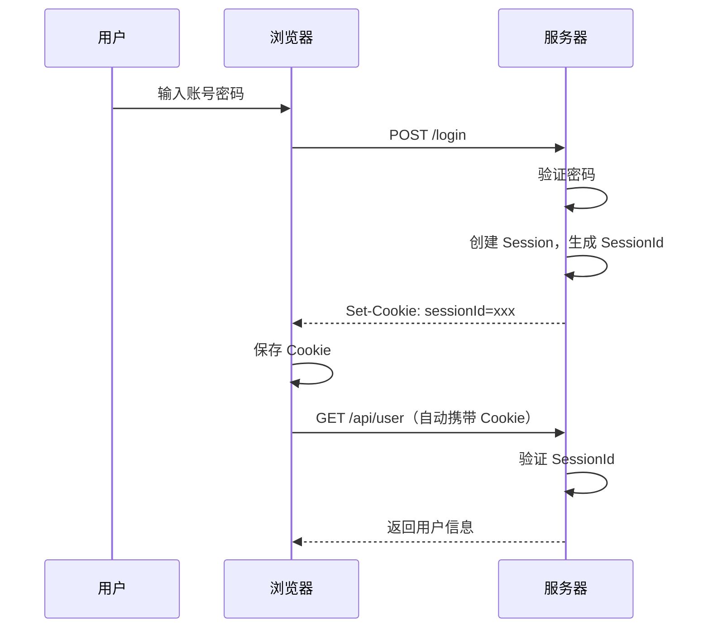
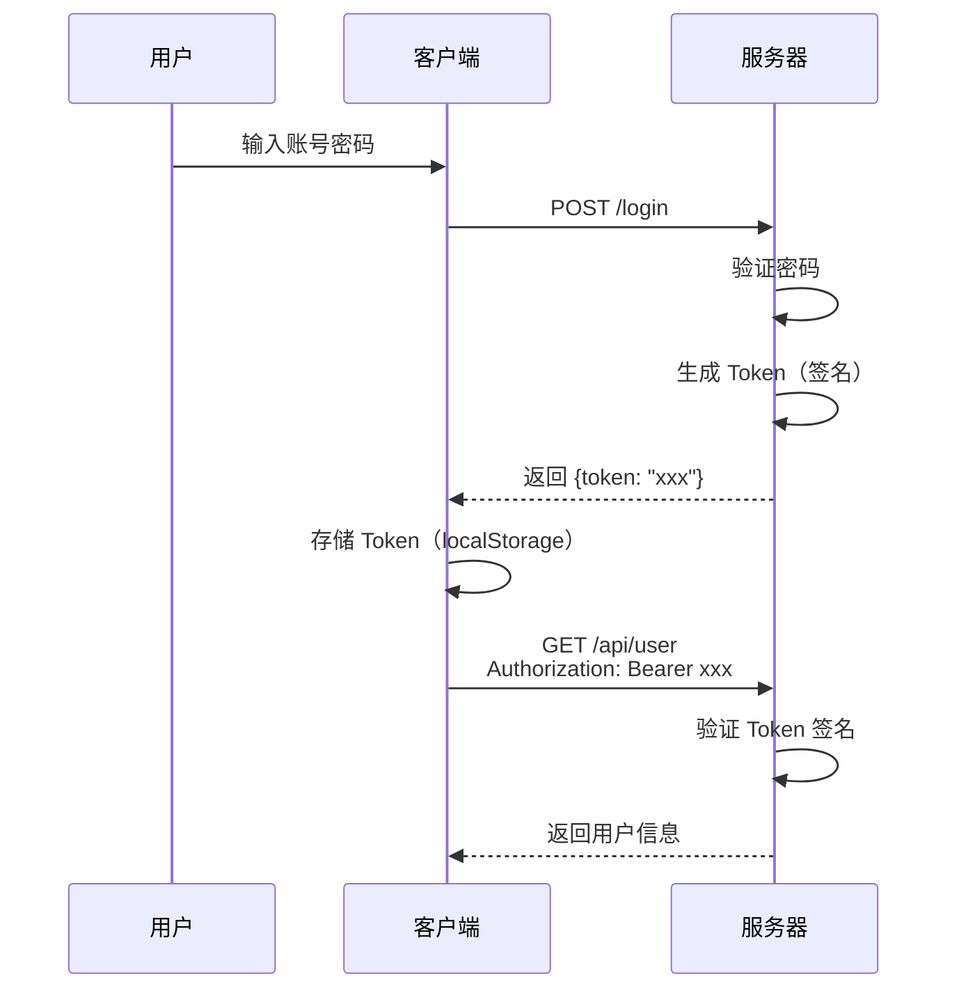
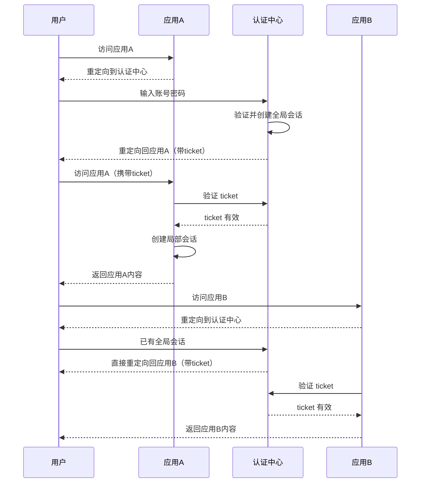
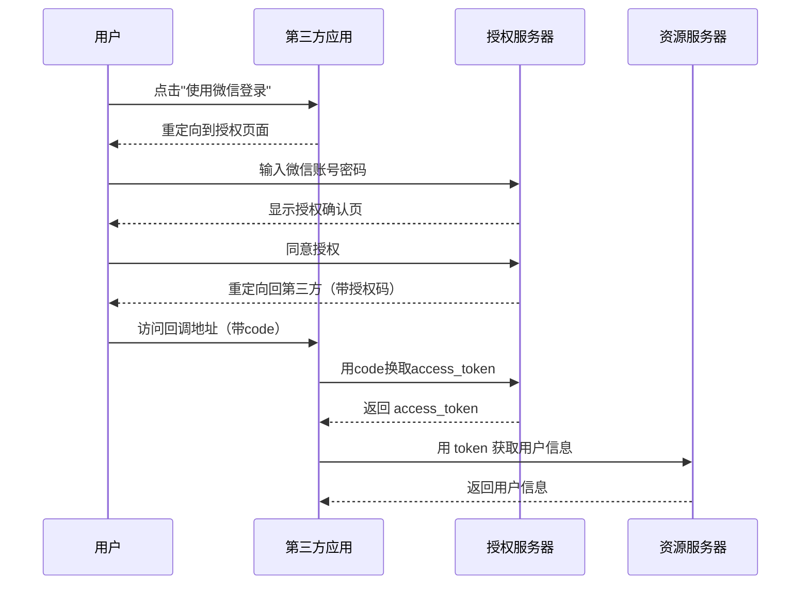
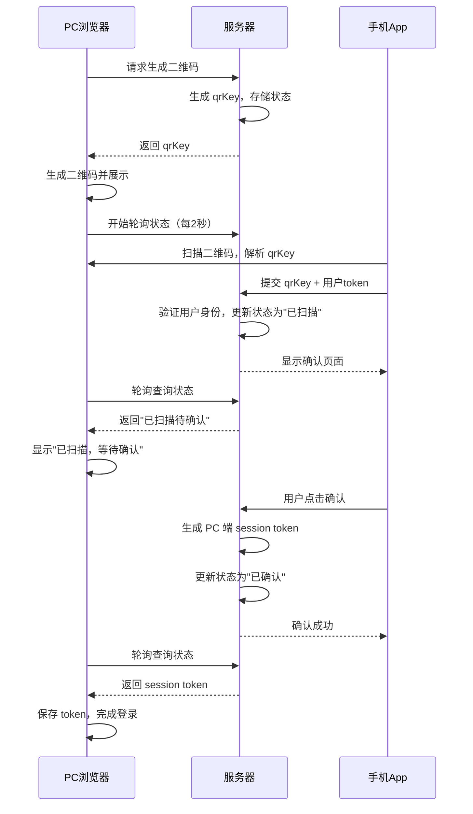

# 认证与会话场景题

> 本文档整理前端开发中认证与会话管理的高频面试题，包括各种登录方式的实现原理、技术选型和安全要点。

## 目录

- [Cookie + Session 登录](#cookie--session-登录)
- [Token 登录](#token-登录)
- [JWT 认证](#jwt-认证)
- [单点登录 SSO](#单点登录-sso)
- [OAuth 2.0](#oauth-20)
- [扫码登录](#扫码登录)
- [Cookie 构成部分](#cookie-构成部分)
- [相关知识点](#相关知识点)

---

## Cookie + Session 登录

### 问题背景

HTTP 是无状态协议，服务器无法识别多个请求是否来自同一用户。Cookie + Session 是最经典的解决方案。

### 实现原理

**核心流程**：



**关键步骤**：

1. **首次登录**
   - 用户提交账号密码
   - 服务器验证通过后，创建 Session 对象存储在服务端（内存/Redis/数据库）
   - 生成 SessionId，通过 `Set-Cookie` 响应头发送给浏览器
   - 浏览器自动保存 Cookie

2. **后续请求**
   - 浏览器每次请求自动携带 Cookie
   - 服务器根据 SessionId 查找 Session，验证用户身份
   - 验证通过则返回数据

### 技术要点

**Cookie 属性配置**：
```http
Set-Cookie: sessionId=abc123; 
            HttpOnly;           # 禁止 JS 访问，防 XSS
            Secure;             # 仅 HTTPS 传输
            SameSite=Lax;       # 防 CSRF 攻击
            Path=/;             # 作用路径
            Domain=.example.com;# 作用域
            Max-Age=86400       # 过期时间（秒）
```

**Session 存储方案**：
- **内存**：性能最好，服务重启丢失
- **Redis**：分布式共享，持久化
- **数据库**：可靠但性能较低

### 存在的问题

1. **服务器压力大**：需要存储大量 Session
2. **分布式困难**：多服务器需要 Session 同步
3. **CSRF 攻击风险**：Cookie 自动携带的特性

### 常见追问

**Q1: 如何实现"记住我"功能？**

A: 延长 Cookie 的 `Max-Age`，同时服务端 Session 也设置更长的过期时间（如 7 天或 30 天）。

**Q2: 如何实现单点退出？**

A: 服务端删除对应的 Session，同时清除客户端 Cookie（`Set-Cookie: sessionId=; Max-Age=0`）。

**Q3: 跨域场景如何处理？**

A: 
- 设置 CORS 响应头 `Access-Control-Allow-Credentials: true`
- 客户端请求携带 `credentials: 'include'`
- Cookie 的 `Domain` 设置为顶级域名

---

## Token 登录

### 问题背景

为了解决 Cookie + Session 的扩展性问题，使用 Token 实现无状态认证。

### 实现原理

**核心流程**：



**关键步骤**：

1. **登录认证**
   - 服务器验证用户名密码
   - 生成 Token（包含用户信息 + 签名）
   - 返回 Token 给客户端

2. **Token 存储**
   - 通常存储在 `localStorage` 或 `sessionStorage`
   - 每次请求手动添加到请求头

3. **验证 Token**
   - 服务器验证 Token 签名是否有效
   - 检查 Token 是否过期
   - 从 Token 中解析用户信息

### 技术要点

**Token 生成**：
```javascript
// 简化示例
const token = base64(header) + '.' + base64(payload) + '.' + signature
```

**请求携带方式**：
```javascript
// 方式 1：Authorization 头（推荐）
fetch('/api/user', {
  headers: {
    'Authorization': 'Bearer ' + token
  }
});

// 方式 2：自定义请求头
fetch('/api/user', {
  headers: {
    'X-Access-Token': token
  }
});
```

**Token 刷新机制**：
- **Access Token**：短期有效（如 2 小时），用于日常请求
- **Refresh Token**：长期有效（如 7 天），用于刷新 Access Token

### 优势与问题

**优势**：
- 无状态，服务器不需要存储
- 支持跨域，可在多个服务间使用
- 移动端友好

**问题**：
- Token 泄露风险（XSS 攻击）
- Token 无法主动失效（除非服务端维护黑名单）
- Token 体积较大

### 常见追问

**Q1: Token 存储在哪里更安全？**

A: 
- `localStorage`：持久化，但容易受 XSS 攻击
- `sessionStorage`：标签页关闭即清除，相对安全
- `Memory`（仅内存）：最安全，但刷新页面丢失
- `HttpOnly Cookie`：防 XSS，但需要处理 CSRF

**Q2: 如何防止 Token 被盗用？**

A:
- 使用 HTTPS 防止中间人攻击
- 设置较短的过期时间
- 实现 Token 刷新机制
- 记录 Token 使用的 IP/设备，异常时强制重新登录

---

## JWT 认证

### 问题背景

JWT (JSON Web Token) 是 Token 认证的一种具体实现规范。

### 实现原理

**JWT 结构**：
```
Header.Payload.Signature

eyJhbGciOiJIUzI1NiIsInR5cCI6IkpXVCJ9.
eyJ1c2VySWQiOjEyMywibmFtZSI6IkpvaG4iLCJleHAiOjE3MzAwMDAwMDB9.
SflKxwRJSMeKKF2QT4fwpMeJf36POk6yJV_adQssw5c
```

**三部分说明**：

1. **Header（头部）**
```json
{
  "alg": "HS256",    // 签名算法
  "typ": "JWT"       // 令牌类型
}
```

2. **Payload（负载）**
```json
{
  "userId": 123,
  "name": "John",
  "exp": 1730000000,  // 过期时间
  "iat": 1729900000   // 签发时间
}
```

3. **Signature（签名）**
```javascript
HMACSHA256(
  base64UrlEncode(header) + "." + base64UrlEncode(payload),
  secret
)
```

### 技术要点

**标准声明（Claims）**：
- `iss` (issuer)：签发人
- `exp` (expiration time)：过期时间
- `sub` (subject)：主题
- `aud` (audience)：受众
- `nbf` (not before)：生效时间
- `iat` (issued at)：签发时间
- `jti` (JWT ID)：编号

**使用示例**：
```javascript
// 服务端生成
const jwt = require('jsonwebtoken');
const token = jwt.sign(
  { userId: 123, name: 'John' },
  'secret-key',
  { expiresIn: '2h' }
);

// 服务端验证
try {
  const decoded = jwt.verify(token, 'secret-key');
  console.log(decoded.userId); // 123
} catch(err) {
  // Token 无效或过期
}
```

### 优势与注意事项

**优势**：
- 自包含，包含用户信息，减少数据库查询
- 跨语言，各语言都有 JWT 库
- 可扩展，可添加自定义字段

**注意事项**：
- Payload 是 Base64 编码，可被解码，不要存敏感信息
- 无法主动让 Token 失效（除非服务端维护黑名单）
- Token 体积较大，每次请求都要传输

### 常见追问

**Q1: JWT 和普通 Token 的区别？**

A: JWT 是 Token 的一种标准化实现，特点是自包含（包含用户信息）和可验证（签名机制）。普通 Token 通常是随机字符串，需要服务端存储映射关系。

**Q2: JWT 如何实现主动失效？**

A: 
- 方案 1：维护黑名单（Redis），失效的 Token 加入黑名单
- 方案 2：引入版本号，用户修改密码时版本号递增
- 方案 3：使用短期 JWT + Refresh Token 机制

---

## 单点登录 SSO

### 问题背景

企业内部通常有多个系统，希望用户只需登录一次就能访问所有系统。

### 实现原理

**CAS 模式流程**：



### 技术要点

**核心组件**：
- **认证中心（SSO Server）**：统一认证入口
- **子应用（Client）**：各个业务系统
- **Ticket**：临时令牌，用于在认证中心和子应用间传递
- **全局会话**：认证中心维护
- **局部会话**：各子应用维护

**关键机制**：
1. **Ticket 验证**：子应用向认证中心验证 ticket 有效性
2. **会话联动**：全局会话失效时，通知所有子应用清除局部会话
3. **单点登出**：用户在任一应用登出，清除所有会话

### 实现方案

**方案一：基于 Cookie 的 SSO**
- 所有应用共享顶级域名（如 `*.example.com`）
- 认证中心设置域级 Cookie
- 子应用读取共享 Cookie

**方案二：基于 Token 的 SSO**
- 认证中心生成 JWT Token
- 通过 URL 参数传递 Token
- 子应用验证 Token 并创建局部会话

**方案三：OAuth 2.0 / OIDC**
- 标准化的 SSO 实现
- 支持第三方应用接入

### 常见追问

**Q1: 单点登出如何实现？**

A: 
- 用户在应用A登出，应用A通知认证中心
- 认证中心清除全局会话
- 认证中心通知所有已登录的应用清除局部会话（通过回调或轮询）

**Q2: 如何防止 ticket 被盗用？**

A:
- Ticket 只能使用一次
- Ticket 设置短期有效（通常几分钟）
- Ticket 与客户端 IP 绑定

---

## OAuth 2.0

### 问题背景

允许第三方应用在用户授权下访问用户在某服务上的资源，而无需获取用户密码。

### 实现原理

**授权码模式流程**（最常用）：



### 四种授权模式

**1. 授权码模式（Authorization Code）**
- 最安全，适用于有服务端的应用
- code 只能使用一次
- access_token 不暴露给前端

**2. 隐式模式（Implicit）**
- 简化流程，直接返回 token
- 适用于纯前端应用
- 安全性较低

**3. 密码模式（Password）**
- 直接使用用户名密码换取 token
- 仅适用于高度信任的应用

**4. 客户端模式（Client Credentials）**
- 应用以自己的名义访问资源
- 不涉及用户授权

### 技术要点

**核心概念**：
- **Client ID**：应用标识
- **Client Secret**：应用密钥
- **Authorization Code**：授权码（临时）
- **Access Token**：访问令牌（用于访问资源）
- **Refresh Token**：刷新令牌（用于刷新 Access Token）

**关键参数**：
```javascript
// 步骤1：跳转授权页
https://auth.example.com/authorize?
  response_type=code&          // 授权类型
  client_id=APP_ID&           // 应用ID
  redirect_uri=CALLBACK_URL&  // 回调地址
  scope=read write&           // 权限范围
  state=RANDOM_STRING         // 防CSRF

// 步骤2：换取 token
POST https://auth.example.com/token
{
  grant_type: 'authorization_code',
  code: 'AUTH_CODE',
  client_id: 'APP_ID',
  client_secret: 'APP_SECRET',
  redirect_uri: 'CALLBACK_URL'
}
```

### 常见追问

**Q1: state 参数的作用？**

A: 防止 CSRF 攻击。应用在发起授权请求时生成随机 state，授权服务器原样返回，应用验证 state 是否一致。

**Q2: OAuth 和 SSO 的区别？**

A: 
- **OAuth**：授权协议，允许第三方访问资源
- **SSO**：认证机制，一次登录访问多个系统
- OAuth 可以实现 SSO 的效果，但目的不同

---

## 扫码登录

### 问题背景

移动端普及后，扫码登录成为常见的跨设备认证方式，用户体验好且安全。

### 实现原理

**完整流程**：



### 技术要点

**状态机**：
```
pending（未扫描）
  ↓ 扫码
scanned（已扫描待确认）
  ↓ 确认
confirmed（已确认）
  ↓ PC取走token
used（已使用）
```

**安全机制**：
- **一次性 qrKey**：使用后即失效
- **短时效**：2-3 分钟过期
- **HTTPS 加密**：全程 HTTPS 传输
- **设备绑定**：记录扫码设备信息
- **签名验证**：防止重放攻击

**通信方式选择**：
- **短轮询**：简单，延迟 2-3 秒
- **长轮询**：实时性好，服务端压力大
- **WebSocket**：最佳实时性，需要额外支持
- **SSE**：单向推送，浏览器支持好

### 核心代码片段

```javascript
// 生成二维码（服务端）
const qrKey = crypto.randomBytes(16).toString('hex');
await redis.setex(`qr:${qrKey}`, 180, JSON.stringify({
  status: 'pending',
  createTime: Date.now()
}));

// 轮询状态（前端）
const checkStatus = async () => {
  const { status, token } = await fetch(`/api/qr/status?key=${qrKey}`);
  
  if (status === 'confirmed') {
    localStorage.setItem('token', token);
    window.location.href = '/home';
  } else if (status === 'scanned') {
    showMessage('已扫描，请在手机上确认');
  }
};

setInterval(checkStatus, 2000);
```

### 常见追问

**Q1: 为什么不用 WebSocket 而用轮询？**

A: 
- 轮询实现简单，兼容性好
- 扫码登录不需要极高实时性（2-3秒延迟可接受）
- WebSocket 需要维护长连接，服务端成本较高
- 如果要求实时性，可以用 SSE（服务器推送事件）

**Q2: 二维码被截图后如何防止盗用？**

A:
- 设置短期过期时间（2-3 分钟）
- 扫码后立即失效
- 记录和验证扫码设备信息
- 异地登录提醒

**Q3: 如何防止中间人攻击？**

A:
- 全程使用 HTTPS
- qrKey 使用加密随机数
- 添加时间戳和签名验证
- Token 传输时加密

---

---

## Cookie 构成部分

### 问题背景

【百度一面】Cookie 由哪些部分构成？每个部分的作用是什么？

### Cookie 组成

（待补充）

### 技术要点

（待补充）

### 常见追问

（待补充）

---

## 相关知识点

### 安全相关
- [Web 安全](../foundations/security/) - XSS、CSRF、点击劫持
- [网络基础](../foundations/network.md) - HTTPS、CORS

### 存储方案
- [浏览器基础](../foundations/browser.md) - Cookie、localStorage、sessionStorage

### 框架实现
- [React 状态管理](../frameworks/react/state-and-communication.md) - 认证状态管理
- [Vue 状态管理](../frameworks/vue/state-management.md) - 登录态管理

---

**最后更新**：2024-10  
**维护者**：Hidetoshi Dekisugi  
**说明**：面试回答时注意结合实际项目经验，说明技术选型的考虑因素

