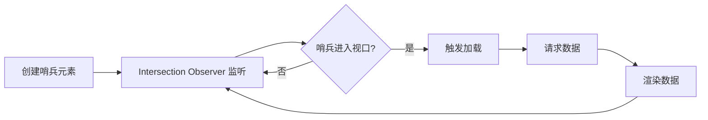

# 页面交互场景题

> 本文档整理前端开发中页面交互相关的高频面试题，包括路由导航、滚动加载、输入处理等常见交互场景。

## 目录

- [路由导航方式](#路由导航方式)
- [Hash 路由与 History 路由](#hash-路由与-history-路由)
- [下拉刷新实现](#下拉刷新实现)
- [无限滚动实现](#无限滚动实现)
- [输入事件监听](#输入事件监听)
- [PC/H5 同链接适配](#pch5-同链接适配)
- [一键换肤实现](#一键换肤实现)
- [相关知识点](#相关知识点)

---

## 路由导航方式

### 问题背景

前端路由是 SPA（单页应用）的核心，需要了解各种跳转方式的区别和适用场景。

### 常见导航方式

**1. 超链接跳转**
```html
<a href="/page">标准跳转</a>
```
- 特点：整页刷新，SEO 友好，保留浏览器默认行为
- 适用：传统多页应用、需要 SEO 的页面

**2. JavaScript 脚本跳转**
```javascript
location.href = '/page';      // 跳转并保留历史
location.replace('/page');    // 跳转不保留历史
location.reload();            // 重新加载
window.open('/page', '_blank'); // 新窗口打开
```
- 特点：编程式控制，可添加跳转逻辑
- 适用：条件跳转、延迟跳转

**3. SPA 框架路由**
```javascript
// React Router
navigate('/page');

// Vue Router
router.push('/page');
router.replace('/page');
```
- 特点：不刷新页面，体验流畅
- 适用：单页应用

---

## Hash 路由与 History 路由

### 实现原理对比

**Hash 路由**：
- URL 格式：`https://example.com/#/page`
- 原理：监听 `hashchange` 事件
- 特点：兼容性好（IE8+），不需要服务端配置

**History 路由**：
- URL 格式：`https://example.com/page`
- 原理：使用 `pushState/replaceState` API
- 特点：URL 更美观，SEO 友好，需要服务端支持

### 核心 API

**Hash 路由**：
```javascript
// 路由跳转
location.hash = '#/page';

// 监听变化
window.addEventListener('hashchange', () => {
  const hash = location.hash.slice(1); // 去掉 #
  render(hash);
});
```

**History 路由**：
```javascript
// 路由跳转
history.pushState(state, title, '/page');  // 添加历史记录
history.replaceState(state, title, '/page'); // 替换当前记录

// 监听浏览器前进/后退
window.addEventListener('popstate', (event) => {
  const path = location.pathname;
  render(path);
});

// 拦截链接点击
document.addEventListener('click', (e) => {
  if (e.target.tagName === 'A') {
    e.preventDefault();
    const href = e.target.getAttribute('href');
    history.pushState(null, '', href);
    render(href);
  }
});
```

### 服务端配置

History 路由需要服务器配置，所有路由都指向 `index.html`：

**Nginx**：
```nginx
location / {
  try_files $uri $uri/ /index.html;
}
```

**Apache**：
```apache
RewriteEngine On
RewriteCond %{REQUEST_FILENAME} !-f
RewriteCond %{REQUEST_FILENAME} !-d
RewriteRule . /index.html [L]
```

### 常见追问

**Q1: 为什么 History 路由需要服务端配置？**

A: 用户直接访问 `/page/detail` 时，服务器会找该路径的文件。没有配置的话返回 404。配置后所有路径都返回 `index.html`，由前端路由接管。

**Q2: Hash 路由的 # 能去掉吗？**

A: 不能。`#` 后的内容不会发送给服务器，这是 Hash 路由的工作原理。如果想要美观 URL，应该使用 History 路由。

**Q3: 如何选择路由模式？**

A: 
- 需要 IE8/9 支持 → Hash 路由
- 需要 SEO → History 路由
- 简单项目，不想配置服务器 → Hash 路由
- 现代应用 → History 路由（主流）

---

## 下拉刷新实现

### 问题背景

下拉刷新是移动端常见的交互模式，用户体验好但实现有细节要处理。

### 实现原理

**核心思路**：
1. 监听 `touchstart/touchmove/touchend` 事件
2. 计算下拉距离，超过阈值时触发刷新
3. 显示加载动画，数据加载完成后回弹复位

**状态流转**：
```
未拉动 → 拉动中 → 达到阈值 → 释放刷新 → 刷新中 → 完成
```

### 技术要点

**1. 阻尼效果**
```javascript
// 使用阻尼系数（0.3-0.5）让手感更自然
const distance = (currentY - startY) * 0.5;
```

**2. 防止滚动冲突**
```css
.container {
  overscroll-behavior-y: contain; /* 防止与浏览器下拉刷新冲突 */
}
```

```javascript
// 只在容器顶部时允许下拉
if (container.scrollTop === 0 && distance > 0) {
  e.preventDefault(); // 阻止默认滚动
  // 执行下拉逻辑
}
```

**3. 状态管理**
```javascript
const states = {
  idle: '下拉刷新',
  pulling: '下拉刷新',
  ready: '松开刷新',      // 达到阈值
  refreshing: '刷新中...',
  success: '刷新成功'
};
```

### 核心代码片段

```javascript
let startY = 0;
let isPulling = false;
const threshold = 60; // 触发阈值

container.addEventListener('touchstart', (e) => {
  if (container.scrollTop === 0) {
    startY = e.touches[0].clientY;
    isPulling = true;
  }
});

container.addEventListener('touchmove', (e) => {
  if (!isPulling) return;
  
  const currentY = e.touches[0].clientY;
  const distance = (currentY - startY) * 0.5; // 阻尼
  
  if (distance > 0) {
    e.preventDefault();
    indicator.style.transform = `translateY(${distance}px)`;
    
    if (distance >= threshold) {
      indicator.textContent = '松开刷新';
    }
  }
});

container.addEventListener('touchend', async (e) => {
  if (!isPulling) return;
  
  const distance = (e.changedTouches[0].clientY - startY) * 0.5;
  
  if (distance >= threshold) {
    // 触发刷新
    indicator.textContent = '刷新中...';
    await fetchData();
    indicator.textContent = '刷新成功';
  }
  
  // 回弹动画
  indicator.style.transform = '';
  isPulling = false;
});
```

### 常见追问

**Q1: 如何避免与原生下拉刷新冲突？**

A: 
- 使用 `overscroll-behavior: contain` CSS 属性
- 在容器而非 body 上实现下拉
- 禁用浏览器默认行为 `e.preventDefault()`

**Q2: 如何优化手感体验？**

A:
- 使用阻尼系数（通常 0.3-0.5）
- 添加弹性动画（CSS transition 或 spring 动画）
- 提供清晰的视觉反馈（loading 动画）

---

## 无限滚动实现

### 问题背景

长列表加载优化，用户滚动到底部时自动加载更多数据。

### 实现原理

**方案一：Intersection Observer（推荐）**



**核心代码**：
```javascript
// 1. 创建哨兵元素
const sentinel = document.createElement('div');
sentinel.className = 'sentinel';
container.appendChild(sentinel);

// 2. 创建观察器
const observer = new IntersectionObserver((entries) => {
  if (entries[0].isIntersecting && !loading && hasMore) {
    loadMore();
  }
}, {
  rootMargin: '200px' // 提前 200px 触发
});

// 3. 开始观察
observer.observe(sentinel);

// 4. 加载数据
async function loadMore() {
  loading = true;
  const data = await fetch(`/api/items?page=${page++}`);
  renderItems(data.items);
  hasMore = data.hasMore;
  loading = false;
}
```

**方案二：Scroll 事件（兼容方案）**

```javascript
let loading = false;
let hasMore = true;

container.addEventListener('scroll', throttle(() => {
  if (loading || !hasMore) return;
  
  const { scrollTop, scrollHeight, clientHeight } = container;
  const threshold = 200; // 距底部 200px 触发
  
  if (scrollTop + clientHeight >= scrollHeight - threshold) {
    loadMore();
  }
}, 200));
```

### 技术要点

**1. 性能优化**
- 使用节流（throttle）防止频繁触发
- 提前加载（rootMargin 或 threshold）
- 虚拟滚动（大数据量）

**2. 状态管理**
```javascript
const states = {
  loading: false,     // 正在加载
  hasMore: true,      // 还有更多数据
  error: null         // 错误信息
};
```

**3. 用户体验**
- 显示 loading 状态
- 到底提示"没有更多了"
- 加载失败提供重试

### 虚拟滚动

对于超大列表（10000+ 条），使用虚拟滚动只渲染可见区域：

```javascript
// React - react-window
import { FixedSizeList } from 'react-window';

<FixedSizeList
  height={600}
  itemCount={items.length}
  itemSize={50}
>
  {({ index, style }) => (
    <div style={style}>{items[index].name}</div>
  )}
</FixedSizeList>

// Vue - vue-virtual-scroller
<RecycleScroller
  :items="items"
  :item-size="50"
  key-field="id"
>
  <template #default="{ item }">
    <div>{{ item.name }}</div>
  </template>
</RecycleScroller>
```

### 常见追问

**Q1: Intersection Observer 的优势是什么？**

A:
- 异步执行，不阻塞主线程
- 自动处理可见性判断
- 性能更好，浏览器优化
- 代码更简洁

**Q2: 如何处理快速滚动导致的重复请求？**

A:
- 添加 loading 标志位防止重复触发
- 使用 AbortController 取消前一个未完成的请求
- 请求去重（相同参数不重复请求）

---

## 输入事件监听

### 问题背景

处理用户输入时需要考虑 IME（输入法）、性能优化等问题。

### 核心事件

**1. input 事件**
- 每次输入都触发（包括删除、粘贴）
- 受 IME 影响

**2. change 事件**
- 失去焦点或回车时触发
- `<select>`、`<checkbox>` 等选择变化时立即触发

**3. IME 合成事件**
```javascript
let isComposing = false;

input.addEventListener('compositionstart', () => {
  isComposing = true; // 开始输入法输入
});

input.addEventListener('compositionend', (e) => {
  isComposing = false; // 输入法输入完成
  handleInput(e.target.value); // 处理最终输入
});

input.addEventListener('input', (e) => {
  if (!isComposing) {
    handleInput(e.target.value); // 处理非输入法输入
  }
});
```

### 性能优化

**防抖（Debounce）** - 停止输入后才执行
```javascript
function debounce(func, delay) {
  let timeoutId;
  return function(...args) {
    clearTimeout(timeoutId);
    timeoutId = setTimeout(() => func.apply(this, args), delay);
  };
}

const search = debounce((value) => {
  console.log('搜索:', value);
}, 300);

input.addEventListener('input', (e) => search(e.target.value));
```

**节流（Throttle）** - 限制执行频率
```javascript
function throttle(func, delay) {
  let lastTime = 0;
  return function(...args) {
    const now = Date.now();
    if (now - lastTime >= delay) {
      func.apply(this, args);
      lastTime = now;
    }
  };
}

const handleScroll = throttle(() => {
  console.log('滚动位置:', window.scrollY);
}, 200);
```

### 技术要点

**1. IME 处理原因**
```
用户输入"你好"时：
compositionstart → 'n' → 'ni' → 'nih' → 'niha' → compositionend → '你好'
```
如果不处理，会触发多次搜索请求（搜索 n、ni、nih...）

**2. 防抖 vs 节流选择**
- **防抖**：搜索输入、自动保存、窗口 resize
- **节流**：滚动加载、鼠标移动、动画帧

**3. 事件委托**
```javascript
// 大量输入框时使用事件委托
form.addEventListener('input', (e) => {
  if (e.target.tagName === 'INPUT') {
    handleInput(e.target);
  }
});
```

### 常见追问

**Q1: 为什么需要处理 IME 事件？**

A: 中文、日文等需要输入法的语言，输入过程会触发多次 input 事件。不处理的话会造成：
- 搜索请求过多
- 输入体验卡顿
- 服务器压力大

**Q2: 防抖和节流有什么区别？**

A:
- **防抖**：等待停止触发一段时间后才执行（如停止输入 300ms 后搜索）
- **节流**：固定时间间隔执行一次（如每 200ms 执行一次）

选择依据：
- 需要等待用户输入完成 → 防抖
- 需要持续响应但限制频率 → 节流

**Q3: contenteditable 如何监听变化？**

A:
```javascript
const editor = document.querySelector('[contenteditable]');

// input 事件
editor.addEventListener('input', () => {
  console.log('内容变化:', editor.innerHTML);
});

// MutationObserver 监听 DOM 变化
const observer = new MutationObserver((mutations) => {
  console.log('DOM 变化', mutations);
});

observer.observe(editor, {
  childList: true,
  subtree: true,
  characterData: true
});
```

---

---

## PC/H5 同链接适配

### 问题背景

【腾讯二面】使用同一个链接，如何实现 PC 打开是 web 应用、手机打开是 H5 应用？

### 解决方案

（待补充）

### 技术要点

（待补充）

### 常见追问

（待补充）

---

## 一键换肤实现

### 问题背景

【美团一面】点击一键换肤的实现方式有哪些？

### 解决方案

（待补充）

### 技术要点

（待补充）

### 常见追问

（待补充）

---

## 相关知识点

### 浏览器 API
- [浏览器基础](../foundations/browser.md) - DOM 事件、API
- [Performance API](../foundations/browser.md#performance) - 性能监控

### 框架实现
- [React Router](../frameworks/react/README.md) - React 路由
- [Vue Router](../frameworks/vue/router.md) - Vue 路由

### 性能优化
- [性能优化](../performance/README.md) - 渲染优化
- [数据展示优化](data-display-optimization.md) - 列表优化

---

**最后更新**：2024-10  
**维护者**：Hidetoshi Dekisugi  
**说明**：面试时注意说明技术选型的权衡，以及实际项目中遇到的坑

