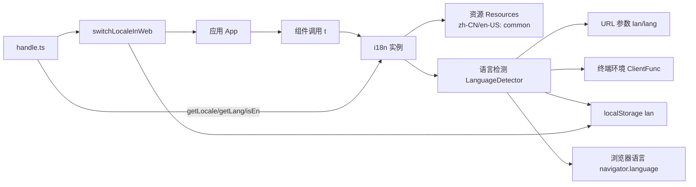

# 国际化（intl）模块

## 概述
提供前端国际化能力：统一的语言检测与切换、翻译资源管理，以及在 React 场景下的安全插值渲染。目标是以最少配置提供稳定、可维护、可观测的多语言支持。

## 功能范围
- 语言检测：URL 参数 > 终端环境 > localStorage > 浏览器语言 > 默认
- 语言切换（Web）：一键切换并自动刷新，支持回退到浏览器默认
- 语言持久化：使用 `localStorage` 键 `lan`
- 翻译查询：基于 `i18next` 与 `react-i18next` 的 `t`（支持 React 节点插值）
- 资源管理：内置 `zh-CN`、`en-US` 两套 `common` 命名空间资源
- 兼容层：少量历史 API（已标注废弃），提供迁移指引

## 架构图

## 技术栈
- i18next、react-i18next
- i18next-browser-languagedetector
- TypeScript（严格类型：`SupportedLocale`, `SupportedLang`）

## 关键约定
- 受支持语言：`zh-CN`、`en-US`；URL 简写：`cn`、`en`
- 命名空间：默认使用 `common`
- 存储键：`lan`
- 默认语言：`zh-CN`

## 相关文档
- 需求说明：`./requirements.md`
- 设计说明：`./design.md`
- API 文档：`./api.md`
- 批量翻译工具（复杂数据结构）：`./translate.md`
- 企业名称展示与取值规则：`./company-name.md`
- 全局显示模式：`./i18n-display-modes.md`

## 注意事项
- 遵循检测优先级，避免切换时状态不一致
- Web 端切换语言会刷新页面以确保资源与 UI 一致
- 历史 API `intl`、`tNoNO` 已标注废弃，请统一迁移到 `t`
