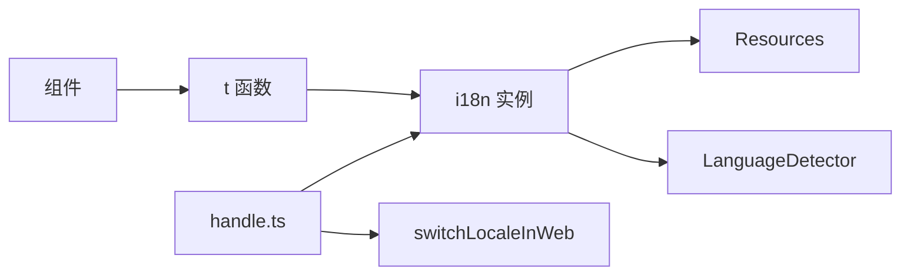

# 国际化（intl）模块

## 概述

提供前端国际化能力：语言检测与切换、翻译资源管理、React 安全插值渲染。

## 核心功能

- 语言检测：URL > 终端环境 > localStorage > 浏览器 > 默认
- 语言切换：一键切换并刷新（Web）
- 翻译查询：基于 i18next 的 `t` 函数
- 资源管理：内置 `zh-CN`、`en-US` 资源

## 架构图



## 技术栈

- i18next、react-i18next
- i18next-browser-languagedetector
- TypeScript

## 关键约定

- 支持语言：`zh-CN`、`en-US`
- URL 简写：`cn`、`en`
- 存储键：`lan`
- 默认语言：`zh-CN`

## 文档导航

### 基础文档

- [API 文档](./api.md) - 函数列表与类型定义
- [全局显示模式](./i18n-display-modes.md) - 翻译展示策略

### 企业名称专题

- [企业名称总览](./company-name/) - 规则索引
- [后端数据取值](./company-name/backend.md) - 数据来源与字段映射
- [API 定义](./company-name/api.md) - 接口契约
- [前端展示逻辑](./company-name/frontend.md) - UI 呈现规则

### 工具文档

- [批量翻译工具](./translate.md) - 复杂数据结构翻译

## 快速开始

### 获取当前语言

```typescript
import { getLocale, isEn } from '@/intl'

const locale = getLocale() // 'zh-CN' | 'en-US'
const isEnglish = isEn() // boolean
```

### 翻译文本

```typescript
import { t } from '@/intl'

const text = t('common.welcome', '欢迎')
```

### 切换语言

```typescript
import { switchLocaleInWeb } from '@/intl'

switchLocaleInWeb() // 切换并刷新
```

## 注意事项

- Web 端切换语言会刷新页面
- 历史 API `intl`、`tNoNO` 已废弃，请使用 `t`
