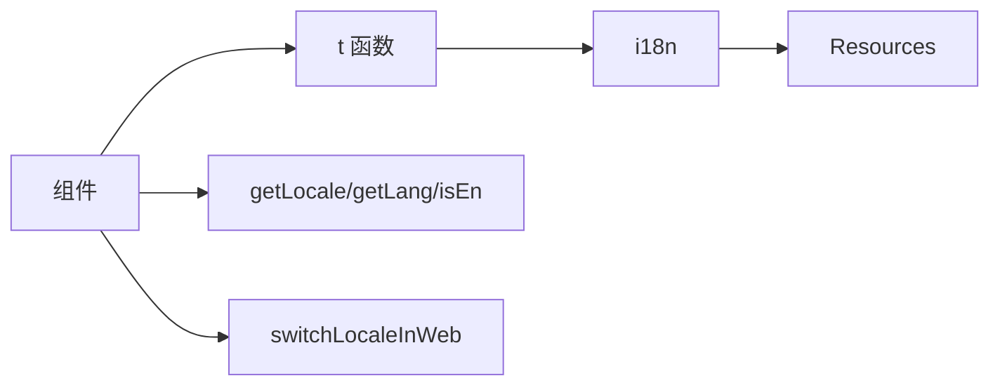

# 国际化 API 文档

## 概述

提供语言检测、切换、翻译调用等前端 API，面向组件开发与业务场景统一接入。

## 调用流程

## 函数列表

| 名称              | 说明                 | 参数                          | 返回值               |
| ----------------- | -------------------- | ----------------------------- | -------------------- |
| getLocale         | 获取当前区域语言     | -                             | `'zh-CN' \| 'en-US'` |
| getLang           | 获取 URL 友好简写    | -                             | `'cn' \| 'en'`       |
| isEn              | 是否英文环境         | -                             | `boolean`            |
| switchLocaleInWeb | Web 端切换语言并刷新 | -                             | `void`               |
| t                 | 翻译查询，支持插值   | `key`, `default?`, `options?` | `string` 或混合数组  |
| i18n              | i18n 实例（只读）    | -                             | i18n 实例            |

## 类型定义

| 类型            | 用途     | 取值             |
| --------------- | -------- | ---------------- |
| SupportedLocale | 区域语言 | `zh-CN`、`en-US` |
| SupportedLang   | URL 简写 | `cn`、`en`       |

## 配置约定

| 项       | 值                       |
| -------- | ------------------------ |
| 命名空间 | `common`                 |
| 存储键   | `lan`（localStorage）    |
| 默认语言 | `zh-CN`                  |
| 资源     | `zh-CN`/`en-US` 内置文案 |

## 请求参数规范

- 推荐：`locale` ∈ {`zh-CN`, `en-US`}
- 兼容：`lang` ∈ {`cn`, `en`}
- 规则：
  - 至少提供其一，同时提供时以 `locale` 为准
  - 后端需标准化 `lang` 为 `locale`
  - 翻译字段必须与请求语言一致
  - 无法翻译时返回空值，由前端降级

## 通用翻译字段契约

### 三字段设计（v2）

适用于需要翻译的实体名称字段：

| 字段模式             | 类型     | 说明                                 |
| -------------------- | -------- | ------------------------------------ |
| `{field}Original`    | string   | 原始值，不做翻译（新增）             |
| `{field}Trans`       | string?  | 翻译值，优先级：官方 → TRANS → AI    |
| `{field}AITransFlag` | boolean? | true=TRANS/AI，false=官方，空=无翻译 |

**重要变更**：

- ⚠️ 原 `{field}` 字段已废弃，不再使用
- ✅ 新增 `{field}Original` 字段存储原始值

### 使用规则

- 主要位置：使用全部三字段
- 其余位置：仅使用 `{field}Original` 原始字段
- 翻译值语种必须与请求 `locale/lang` 一致

### 企业名称实现

详见：[企业名称 API 定义](./company-name/api.md)

## 相关文档

- [批量翻译工具](./translate.md) - 复杂数据结构翻译
- [企业名称规则](./company-name/) - 企业名称展示与取值
- [全局显示模式](./i18n-display-modes.md) - 翻译展示策略
- [README](./README.md) - 模块总览
