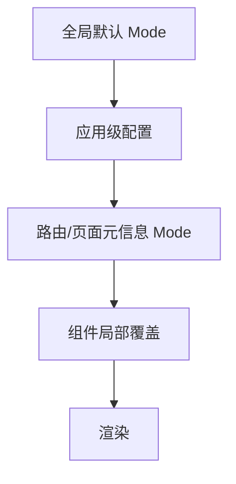

# 全局显示模式（i18n Display Modes）

## 概述
显示模式（Mode 1/2/3）是全局页面设置，用于统一控制多业务场景下的“原始名称/翻译名称”的展示策略与来源限制。该设置不仅适用于企业名称，也可扩展到其他实体名称或可翻译字段的展示行为。

## 适用范围
- 企业名称（搜索结果、企业详情页顶部卡片、图谱中心节点、列表、其他卡片）
- 其他具备“原始+译文”并可能带有 AI 标识的字段（可按相同规则延展）

## 模式定义（精简）
| 模式 | 概述 | 主要位置 | 其余位置 |
|---|---|---|---|
| 模式一 | 不做数据翻译 | 原始（单行） | 原始（单行） |
| 模式二 | 主要位置可翻译；其余位置禁用 AI | 原始+翻译（上下两行） | 优先官方/6254 翻译；无则原始 |

- “主要位置”固定指：搜索结果卡片、企业详情页顶部卡片、图谱中心节点。
- “Provided by AI”标识：当译文来源为 TRANS/AI 时显示。

## 模式命名（推荐字符串字面量常量，已移除模式三）
为提升可读性与跨应用配置一致性，推荐在代码与配置中统一使用字符串字面量常量：

| 字符串标识 | 语义 |
|---|---|
| `original-only` | 仅原始 |
| `key-translate-official-only` | 关键位置允许翻译，其余仅官方/6254 |

> 常量定义参考：`DISPLAY_MODE`（`packages/gel-util/src/misc/translate/companyName.ts`）。
> 如需兼容既有的数字 1/2/3，可在配置加载层做一次映射。

## 配置与优先级

- 建议优先级：组件局部覆盖 > 页面元信息 > 应用级配置 > 全局默认
- 推荐以“字符串标识”存储与传递；历史使用数字的场景，统一在入口处映射为字符串
- Mode 控制前端展示，不随后端接口变化；后端仅需按 `locale/lang` 返回与目标语言一致的译文

## 与后端契约关系
- 前端会向后端传入当前语言（`locale`/`lang`），用于生成与目标语言一致的 `${字段}Trans`
- 三字段约定示例：
  - `name`：原始值
  - `nameTrans`：目标语译文（与 `locale/lang` 对齐）
  - `nameAITransFlag`：译文是否来自 TRANS/AI（用于“Provided by AI”展示）
- 模式不直接下发给后端，属于前端展示策略

## 行为矩阵（规范化）
| 场景 | original-only | key-translate-official-only |
|---|---|---|
| 主要位置展示 | 仅原始 | 原始+翻译；翻译来源：官方/TRANS/AI |
| 其余位置展示 | 仅原始 | 仅官方/6254 翻译，禁止 AI；无则原始 |
| “Provided by AI” | 不展示 | 主要位置：当 AITransFlag=true 时展示；其余位置：不展示 |

## 异常与降级
- 缺少译文：按模式回退到原始
- 译文语种不匹配：视为缺失，回退到原始（主要位置仍可显示原始单行）
- 网络/服务失败：不影响原始展示

## 落地建议
- 在“应用启动”确定全局默认 Mode；
- 在路由配置中为关键页面显式声明 Mode（如图谱页、企业详情页）；
- 组件支持接收 `mode` 作为可选覆盖，以便 A/B 与灰度；
- 统一的 UI 组件处理“原始+翻译+AI 标识”的呈现，减少重复逻辑。

## 关联文档
- 企业名称展示与取值规则：`./company-name.md`
- i18n API 文档：`./api.md`
