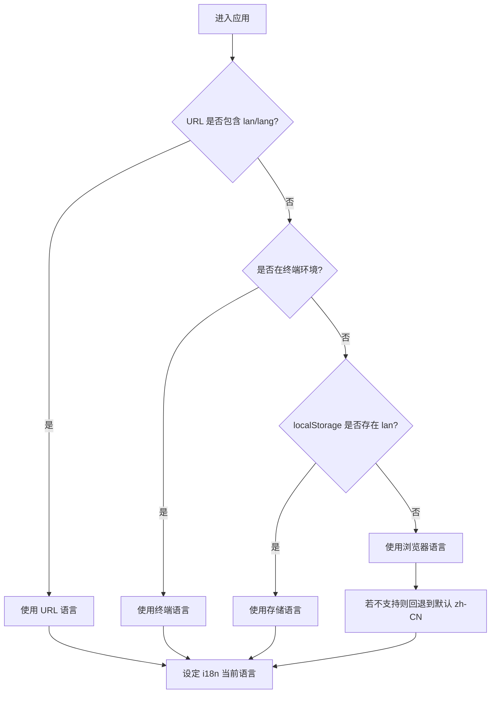
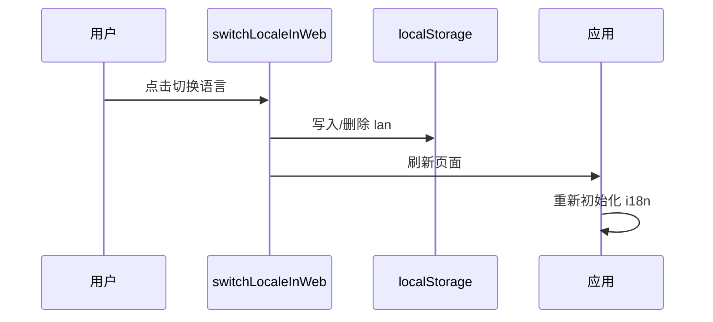

# 国际化需求说明（intl）

## 用户故事
- 作为访客，我希望应用自动使用我浏览器偏好的语言，以便即刻理解界面。
- 作为用户，我希望可以在页面中切换语言，并在后续访问保持该选择。
- 作为开发者，我希望以统一方式获取当前语言并渲染多语言文本，支持插值与 React 节点。
- 作为运维，我希望语言检测顺序、默认值与回退策略明确可控。

## 功能流程

## 语言切换流程（Web）

## 验收标准
| 功能点 | 验收标准 | 优先级 |
|---|---|---|
| 自动检测 | 按 URL > 终端 > localStorage > 浏览器 > 默认 的优先级选择语言 | 高 |
| 切换生效 | Web 点击后立即刷新，语言一致性正确 | 高 |
| 持久化 | 已选择语言在后续访问保持，直至手动切换或回退策略触发 | 高 |
| 插值渲染 | `t` 支持字符串与 React 节点插值，渲染正确、安全 | 高 |
| 回退策略 | 不支持的语言回退到 `zh-CN`，无报错 | 中 |

## 异常与边界
- URL 参数与浏览器语言冲突：以 URL 为准
- 切换到与浏览器默认相同语言：清除存储键 `lan`，回退到浏览器默认
- 终端环境语言不可获取：回退到浏览器语言

## 技术约束
- 仅支持 `zh-CN`、`en-US` 两种区域值
- 使用 `localStorage` 键名固定为 `lan`
- 遵循类型定义 `SupportedLocale`、`SupportedLang`，避免使用 any 类型

## 业务规则引用
- 企业名称展示与取值规则：`./company-name.md`
